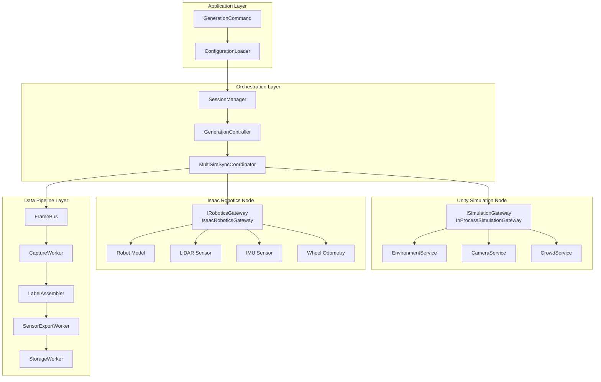
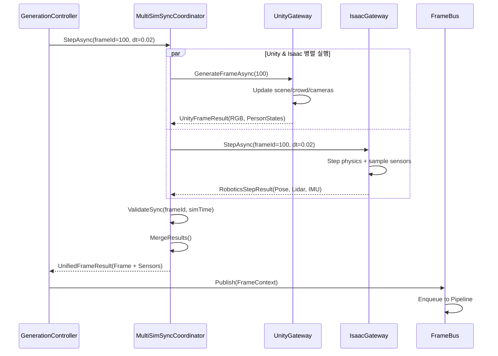

## 1. 목적 (Purpose)

**Phase 4의 목표**:

> 기존 Forge가 제공하는 **CCTV + Mobile RGB 중심 합성 데이터 엔진**을
> **로봇용 센서 Ground Truth (LiDAR, IMU, Wheel Odometry, Depth, Trajectory/SLAM GT)** 까지 확장해,
> "Full Robotics Perception Dataset Generator"로 업그레이드한다.

### 핵심 가치

**1. Indoor Robotics 업체 대상**:
- AMR/AGV/순찰 로봇/드론 개발사가 **CCTV + 로봇 시점 + 센서 GT**를 한 번에 획득
- Navigation/Localization/SLAM 알고리즘 검증용 완전한 GT 세트 제공

**2. 연구 기관 대상**:
- SLAM/VO/Multi-Sensor Fusion 연구자에게 **완벽한 Ground Truth** 제공
- Sim-to-Real transfer 연구용 고품질 합성 데이터

**3. 차별점**:
- 기존 도구 대비 **Unity(환경/사람) + Isaac Sim(로봇 물리/센서)**의 하이브리드 아키텍처
- **단일 FrameId 기준으로 CCTV + 로봇 센서 GT 완벽 동기화**
- **재현 가능한 센서 노이즈 모델** (seed 기반)

---

## 2. 범위 (Scope)

### 2.1 포함 (In Scope)

#### 센서 Ground Truth
| 센서 | 출력 형식 | Phase 4 우선순위 |
|------|----------|----------------|
| **LiDAR** | Point cloud (.pcd) or scan array | M1 (필수) |
| **IMU** | Accel(3D) + Gyro(3D) | M2 |
| **Wheel Odometry** | Left/Right ticks or v, ω | M2 |
| **Depth Camera** | Depth image (.png) or point cloud | M2 |
| **Robot Trajectory** | 6-DoF pose (x, y, z, qx, qy, qz, qw) | M1 (필수) |

#### SLAM/VO Export Formats
- TUM RGB-D format (필수)
- KITTI format (옵션)
- Custom Forge format (JSON + binary)

#### Unity–Isaac Hybrid Architecture
- **Unity**: Facility / People / CCTV / RGB
- **Isaac Sim**: Robot physics / Sensors / Noise models
- **Forge Orchestration**: Frame 동기화 + 통합 파이프라인

---

### 2.2 제외 (Out of Scope, Phase 5+)

- ❌ 고정밀 Contact Dynamics (manipulation 시뮬레이션)
- ❌ 복수 로봇 간 물리 상호작용
- ❌ SLAM 알고리즘 내장 (우리는 GT 엔진, SLAM solver 아님)
- ❌ Semantic Segmentation (Phase 4에서는 기본 bbox만)
- ❌ 실외 환경 (Phase 4는 Indoor 전용)

---

## 3. 요구사항 (Requirements)

### 3.1 기능 요구사항 (Functional Requirements)

#### FR-41: 센서 Ground Truth 출력

시스템은 각 FrameId에 대해 다음 센서 GT를 출력해야 한다:

| 센서 | 필수 필드 | 선택 필드 |
|------|----------|----------|
| `robot_pose` | `[x, y, z, qw, qx, qy, qz]` | velocity, acceleration |
| `lidar` | `ranges[]`, `angles[]` | intensity, ring_id |
| `imu` | `linear_accel[3]`, `angular_vel[3]` | temperature, calibration |
| `wheel_odom` | `left_ticks`, `right_ticks` or `v`, `ω` | slip_factor |
| `depth` | depth image or point cloud | confidence map |

**출력 형식**:
```
output/session_xxx/
├── sensors/
│   ├── lidar/
│   │   ├── frame_000000.pcd
│   │   ├── frame_000001.pcd
│   │   └── ...
│   ├── imu/
│   │   └── imu_data.csv
│   ├── odom/
│   │   └── odom_data.csv
│   ├── depth/
│   │   ├── frame_000000.png
│   │   └── ...
│   └── trajectory/
│       └── groundtruth.txt  # TUM format
```

---

#### FR-42: Frame 동기화

**요구사항**:
- `FrameContext` 단위로 CCTV/Unity RGB 라벨과 로봇 센서 GT를 **동일 FrameId/Timestamp 기준으로 정렬**
- Unity와 Isaac Sim의 시뮬레이션 시간이 **동일 step**으로 진행
- 센서마다 다른 샘플링 주파수를 **Frame-aligned sampling**으로 통일

**구현 규칙**:
```csharp
// FrameContext 확장
public record FrameContext
{
    public int FrameId { get; init; }
    public double SimulationTime { get; init; }  // Unity/Isaac 동일

    // Unity 데이터
    public List<PersonState> PersonStates { get; init; }
    public List<CameraPose> CameraPoses { get; init; }

    // Isaac 데이터 (Phase 4)
    public RobotPose? RobotPose { get; init; }
    public SensorMeta? Sensors { get; init; }
}
```

---

#### FR-43: Config 기반 로봇/센서 정의

**요구사항**:
- Config에서 로봇 모델/센서 모델을 정의 가능
- 센서 노이즈 파라미터 config 기반 설정
- 센서 on/off 개별 제어 가능

**Config 예시**:
```json
{
  "robotics": {
    "enabled": true,
    "backend": "isaac",
    "syncPolicy": {
      "maxDelayMs": 100,
      "timeoutMs": 5000,
      "onTimeout": "skip"
    },
    "robotModel": {
      "type": "differential_drive",
      "urdfPath": "robots/indoor_bot.urdf",
      "initialPose": {"x": 0, "y": 0, "z": 0, "yaw": 0}
    },
    "lidar": {
      "enabled": true,
      "model": "VLP-16",
      "minRange": 0.1,
      "maxRange": 50.0,
      "verticalBeams": 16,
      "horizontalResolutionDeg": 0.2,
      "rotationRateHz": 10,
      "noise": {
        "rangeStd": 0.02,
        "intensityStd": 0.05
      }
    },
    "imu": {
      "enabled": true,
      "updateRateHz": 100,
      "noise": {
        "accelStd": 0.02,
        "gyroStd": 0.001,
        "biasDriftStd": 0.0001
      }
    },
    "wheelOdom": {
      "enabled": true,
      "ticksPerRevolution": 2048,
      "wheelRadius": 0.1,
      "baseWidth": 0.5,
      "noise": {
        "slipFactor": 0.05
      }
    },
    "depth": {
      "enabled": true,
      "resolution": {"width": 640, "height": 480},
      "maxDepth": 20.0,
      "fov": 90
    }
  }
}
```

---

#### FR-44: SLAM-friendly Export

**요구사항**:
- TUM RGB-D format 필수 지원
- KITTI format 선택 지원
- Forge custom format (JSON + binary) 지원

**TUM RGB-D Format 출력**:
```
output/session_xxx/slam_export/tum/
├── rgb.txt
│   # timestamp filename
│   # 0.000000 rgb/000000.png
│   # 0.033333 rgb/000001.png
├── depth.txt
│   # timestamp filename
│   # 0.000000 depth/000000.png
├── groundtruth.txt
│   # timestamp tx ty tz qx qy qz qw
│   # 0.000000 0.0 0.0 0.0 0.0 0.0 0.0 1.0
└── associations.txt
    # rgb_timestamp rgb_file depth_timestamp depth_file
```

**KITTI Format 출력**:
```
output/session_xxx/slam_export/kitti/
├── poses/
│   └── 00.txt  # 4x4 transformation matrix per line
├── velodyne/
│   ├── 000000.bin
│   └── ...
├── image_0/
│   ├── 000000.png
│   └── ...
├── calib.txt
└── times.txt
```

---

#### FR-45: Isaac 통신 장애 처리

**요구사항**:
- Isaac Sim 노드 통신 실패 시 재시도 정책
- 재시도 실패 시 Fallback 전략 제공
- 센서 누락 프레임은 manifest에 기록

**Fallback 전략**:

| 센서 | Fallback 동작 | manifest 기록 |
|------|-------------|--------------|
| LiDAR | 이전 프레임 복사 or null | `lidar_missing_count` |
| IMU | Linear interpolation or null | `imu_missing_count` |
| Odom | Dead reckoning or null | `odom_missing_count` |
| Depth | null | `depth_missing_count` |
| Robot Pose | Dead reckoning (위험) | `pose_missing_count` |

**품질 모드 연동**:
```json
{
  "session": {
    "qualityMode": "strict"  // or "relaxed"
  }
}
```

- **strict**: 센서 누락 발생 시 세션 실패
- **relaxed**: 센서 누락 허용, manifest에 기록

---

#### FR-46: Sensor Quality Metadata

**요구사항**:
- 각 센서 데이터에 품질 메타데이터 포함
- Validation 단계에서 센서 데이터 검증

**SensorQuality 구조**:
```csharp
public record SensorQuality(
    bool IsValid,           // 센서 데이터 유효 여부
    double Timestamp,       // 센서 샘플링 시각
    double Latency,         // 센서 데이터 지연 (ms)
    string? ErrorMessage    // 오류 메시지 (있을 경우)
);

public record SensorMeta
{
    public LidarScan? Lidar { get; init; }
    public ImuReading? Imu { get; init; }
    public WheelOdom? Odom { get; init; }
    public DepthImage? Depth { get; init; }

    // 센서별 품질 메타데이터
    public Dictionary<string, SensorQuality> Quality { get; init; }
}
```

---

### 3.2 비기능 요구사항 (Non-Functional Requirements)

#### NFR-41: 성능 목표

**요구사항**:
- Unity only pipeline 대비 **FPS 70% 이상 유지**
- Isaac Sim 통신 latency < 100ms (평균)

**측정 방법**:
```
Baseline (Unity only):     10 FPS
Target (Unity + Isaac):    ≥ 7 FPS
```

**최적화 전략**:
- Unity/Isaac 병렬 실행 (async/await)
- Isaac 센서 샘플링 최적화
- Back-pressure 기반 FPS 조절

---

#### NFR-42: Time Sync 정확도

**요구사항**:
- Unity와 Isaac의 시뮬레이션 시간 오차: `|t_unity - t_isaac| < 1 ms`
- 실질적으로는 "동일 step" 기준으로 동기화

**검증 방법**:
```csharp
[Fact]
public void UnityIsaac_SameFrame_TimeSyncError_LessThan1ms()
{
    var unityTime = unityGateway.GetSimulationTime();
    var isaacTime = isaacGateway.GetSimulationTime();

    var error = Math.Abs(unityTime - isaacTime);
    Assert.True(error < 0.001, $"Time sync error: {error * 1000}ms");
}
```

---

#### NFR-43: 재현성

**요구사항**:
- 동일한 Config + Seed → 동일한 센서 데이터 생성
- Trajectory drift, sensor drift는 Isaac의 센서 모델 파라미터로 통제

**재현성 보장 요소**:
```json
{
  "simulation": {
    "randomSeed": 42,
    "fixedDeltaTime": 0.02
  },
  "robotics": {
    "lidar": {
      "noise": {
        "seed": 1001,
        "rangeStd": 0.02
      }
    },
    "imu": {
      "noise": {
        "seed": 1002,
        "accelStd": 0.02
      }
    }
  }
}
```

---

#### NFR-44: 기존 Phase 호환성

**요구사항**:
- Phase 1~3 기능과 완전 호환
- Phase 4 기능은 **옵션** (robotics.enabled = false로 비활성화 가능)

**호환성 테스트**:
```csharp
[Fact]
public void Phase4Disabled_WorksAsPhase3()
{
    var config = new SessionConfig
    {
        Robotics = new RoboticsConfig { Enabled = false }
    };

    var session = new SessionManager(config);
    session.Run();

    // Phase 3 기능 모두 동작
    Assert.True(session.Success);
    Assert.Null(session.Manifest.Robotics);  // 로봇 데이터 없음
}
```

---

## 4. 아키텍처 (Architecture)

### 4.1 전체 구조

#### 책임 분리 (Separation of Concerns)

```
┌─────────────────────────────────────────────────────────┐
│                  Forge Orchestration                     │
│  (Frame Sync, Pipeline Coordination, Data Integration)  │
└────────────┬────────────────────────────────┬───────────┘
             │                                │
    ┌────────▼────────┐              ┌────────▼────────┐
    │  Unity Engine   │              │  Isaac Sim /    │
    │  (Simulation)   │              │  Omniverse      │
    └────────┬────────┘              └────────┬────────┘
             │                                │
    ┌────────▼────────┐              ┌────────▼────────┐
    │ "보이는 것"      │              │ "측정되는 것"    │
    │ - RGB 이미지     │              │ - LiDAR GT      │
    │ - 환경/사람      │              │ - IMU GT        │
    │ - CCTV 시점     │              │ - Wheel Odom    │
    │ - 조명/날씨     │              │ - Depth GT      │
    └─────────────────┘              │ - Robot Physics │
                                     └─────────────────┘
```

**핵심 원칙**:
1. Unity는 **시각적 환경 + 사람 + RGB 카메라** 담당
2. Isaac은 **로봇 물리 + 센서 GT** 담당
3. Forge는 **FrameId 기준 동기화 + 통합 파이프라인** 담당

---

### 4.2 Layer 구조



---

### 4.3 핵심 컴포넌트

#### 4.3.1 MultiSimSyncCoordinator

**역할**:
- Unity와 Isaac에게 **동일 FrameId/SimulationTime**으로 step 요청
- 두 시뮬레이션 결과를 하나의 `FrameContext`로 병합
- Time sync 검증 및 오차 처리

**구현**:
```csharp
public class MultiSimSyncCoordinator
{
    private readonly ISimulationGateway _unity;
    private readonly IRoboticsGateway _isaac;
    private readonly TimeSpan _maxSyncDelay;
    private readonly TimeSpan _timeout;
    private readonly MovingAverage _isaacLatency;

    public async Task<UnifiedFrameResult> StepAsync(long frameId, float deltaTime)
    {
        var stopwatch = Stopwatch.StartNew();

        // Unity & Isaac 병렬 실행
        var unityTask = _unity.GenerateFrameAsync((int)frameId);
        var isaacTask = _isaac.StepAsync(frameId, deltaTime);

        // Timeout 적용
        var timeout = Task.Delay(_timeout);
        var completed = await Task.WhenAny(
            Task.WhenAll(unityTask, isaacTask),
            timeout
        );

        if (completed == timeout)
        {
            _logger.LogError($"Frame {frameId} sync timeout");
            return HandleTimeout(frameId, unityTask, isaacTask);
        }

        stopwatch.Stop();

        // Sync 지연 모니터링
        var elapsedMs = stopwatch.Elapsed.TotalMilliseconds;
        _isaacLatency.Add(elapsedMs);
        if (elapsedMs > _maxSyncDelay.TotalMilliseconds)
        {
            _logger.LogWarning($"Frame {frameId} sync delay: {elapsedMs:F1}ms");
        }

        // FrameId 일관성 검증
        ValidateSync(frameId, unityTask.Result.Frame.FrameId, isaacTask.Result.FrameId);

        // 결과 병합
        return MergeResults(unityTask.Result, isaacTask.Result);
    }

    private UnifiedFrameResult MergeResults(
        UnityFrameResult unity,
        RoboticsStepResult isaac)
    {
        return new UnifiedFrameResult(
            Frame: unity.Frame with
            {
                RobotPose = isaac.Pose,
                Sensors = new SensorMeta
                {
                    Lidar = isaac.Lidar,
                    Imu = isaac.Imu,
                    Odom = isaac.Odom,
                    Depth = isaac.Depth,
                    Quality = BuildSensorQuality(isaac)
                }
            },
            Images: unity.Images
        );
    }

    public BackPressureLevel GetBackPressure()
    {
        var avgLatency = _isaacLatency.Average;

        if (avgLatency > _syncPolicy.CriticalLatencyMs) return BackPressureLevel.Critical;
        if (avgLatency > _syncPolicy.WarningLatencyMs) return BackPressureLevel.Warning;
        return BackPressureLevel.Normal;
    }
}
```

**Jitter/Latency 설정**:

- `RoboticsConfig.syncPolicy`에 다음 필드를 제공한다:
  ```json
  "syncPolicy": {
    "maxDelayMs": 80,
    "warningLatencyMs": 100,
    "criticalLatencyMs": 200,
    "maxJitterMs": 5,
    "timeoutMs": 5000,
    "onTimeout": "skip"
  }
  ```
- Unity와 Isaac의 timestamp 차이가 `maxJitterMs`보다 크면 `DiagnosticsService`가 `robotics_jitter` 이벤트를 생성하고, StageStatus에 `Sensors.JitterExceeded=true`를 기록한다.
- Timeout 발생 시 `onTimeout` 정책(`skip`/`pause`/`abort`)을 적용하여 GenerationController가 프레임을 drop하거나 일시정지할 수 있다. 기본값은 `pause`.

---

#### 4.3.2 IRoboticsGateway

**역할**:
- Isaac Sim과의 통신 추상화 인터페이스
- 센서 데이터 샘플링 및 로봇 상태 조회

**인터페이스 정의**:
```csharp
public interface IRoboticsGateway
{
    /// <summary>
    /// Isaac Sim 초기화
    /// </summary>
    Task InitializeAsync(RoboticsSimConfig config);

    /// <summary>
    /// Isaac Sim을 deltaTime만큼 진행하고 센서 데이터 샘플링
    /// </summary>
    /// <param name="frameId">Forge의 FrameId (동기화 기준)</param>
    /// <param name="deltaTime">시뮬레이션 time step (초)</param>
    /// <returns>로봇 pose + 센서 GT</returns>
    Task<RoboticsStepResult> StepAsync(long frameId, float deltaTime);

    /// <summary>
    /// 현재 시뮬레이션 시간 조회
    /// </summary>
    double GetSimulationTime();

    /// <summary>
    /// Isaac Sim 종료
    /// </summary>
    Task ShutdownAsync();
}

public record RoboticsStepResult(
    long FrameId,
    double SimulationTime,
    RobotPose Pose,
    LidarScan? Lidar,
    ImuReading? Imu,
    WheelOdom? Odom,
    DepthImage? Depth
);
```

---

#### 4.3.3 IsaacRoboticsGateway

**역할**:
- `IRoboticsGateway` 구현체
- Isaac Sim과 gRPC/REST로 통신

**구현 예시**:
```csharp
public class IsaacRoboticsGateway : IRoboticsGateway
{
    private readonly IsaacSimClient _client;  // gRPC client
    private readonly RoboticsSimConfig _config;
    private double _currentSimTime = 0.0;

    public async Task InitializeAsync(RoboticsSimConfig config)
    {
        _config = config;

        // Isaac Sim 연결
        await _client.ConnectAsync(config.IsaacEndpoint);

        // 로봇 모델 로드
        await _client.LoadRobotAsync(config.RobotModel.UrdfPath);

        // 센서 구성
        if (config.Lidar?.Enabled == true)
        {
            await _client.ConfigureLidarAsync(config.Lidar);
        }

        if (config.Imu?.Enabled == true)
        {
            await _client.ConfigureImuAsync(config.Imu);
        }

        // 초기 pose 설정
        await _client.SetRobotPoseAsync(config.RobotModel.InitialPose);
    }

    public async Task<RoboticsStepResult> StepAsync(long frameId, float deltaTime)
    {
        // Isaac Sim step 실행
        await _client.StepSimulationAsync(deltaTime);
        _currentSimTime += deltaTime;

        // 로봇 pose 조회
        var pose = await _client.GetRobotPoseAsync();

        // 센서 데이터 샘플링 (Frame-aligned)
        var lidar = _config.Lidar?.Enabled == true
            ? await _client.GetLidarScanAsync()
            : null;

        var imu = _config.Imu?.Enabled == true
            ? await _client.GetImuReadingAsync()
            : null;

        var odom = _config.WheelOdom?.Enabled == true
            ? await _client.GetWheelOdomAsync()
            : null;

        var depth = _config.Depth?.Enabled == true
            ? await _client.GetDepthImageAsync()
            : null;

        return new RoboticsStepResult(
            FrameId: frameId,
            SimulationTime: _currentSimTime,
            Pose: pose,
            Lidar: lidar?.WithFrameId(frameId, _currentSimTime),
            Imu: imu?.WithFrameId(frameId, _currentSimTime),
            Odom: odom?.WithFrameId(frameId, _currentSimTime),
            Depth: depth?.WithFrameId(frameId, _currentSimTime)
        );
    }

    public double GetSimulationTime() => _currentSimTime;

    public async Task ShutdownAsync()
    {
        await _client.DisconnectAsync();
    }
}
```

##### 통신 채널 및 프로토콜

- **gRPC** (권장): Isaac Sim은 `RoboticsSim` gRPC 서비스를 노출한다.
  ```protobuf
  service RoboticsSim {
      rpc Connect(ConnectRequest) returns (ConnectResponse);
      rpc LoadRobot(RobotModelRequest) returns (Ack);
      rpc ConfigureSensor(SensorConfigRequest) returns (Ack);
      rpc StepSimulation(StepRequest) returns (StepResponse); // 포함된 센서 payload
      rpc GetPose(google.protobuf.Empty) returns (RobotPose);
      rpc Shutdown(google.protobuf.Empty) returns (Ack);
  }
  message StepResponse {
      int64 frame_id = 1;
      double simulation_time = 2;
      RobotPose pose = 3;
      bytes lidar_bytes = 4;
      ImuReading imu = 5;
      WheelOdom odom = 6;
      DepthImage depth = 7;
  }
  ```
- **REST 대체 경로** (디버그/Mock 용):
  - `POST /api/robotics/connect`
  - `POST /api/robotics/step` → JSON 응답에 Pose/IMU/Odom, LiDAR/Depth는 Signed URL 또는 chunked 바디
  - `GET /api/robotics/pose`
  - REST 호출 역시 HTTPS + API Key/mTLS를 강제한다.
- **대용량 센서 데이터**:
  - LiDAR/Depth 데이터는 Base64 인코딩 대신 gRPC 스트리밍이나 Zero-copy 공유 메모리(Isaac Native handle)를 사용해 성능을 확보한다.
  - Worker가 다수 존재하는 분산 모드에서는 ZMQ/UDP 기반 데이터 채널을 추가하고 `IRoboticsGateway`가 `ISensorStreamProvider`로부터 pull하도록 확장할 수 있다.
- **네트워크/보안**:
  - 기본 포트: gRPC `6006`, REST `6080`. Config로 override.
  - 서버는 TLS 인증서를 로드하고 `allowedClients` IP 목록으로 접근을 제한한다.
  - 10GbE 이상의 네트워크 환경을 권장하며, WAN 시나리오에서는 latency 모니터링(§4.3.1)과 Retry 정책을 강화한다.

---

#### 4.3.4 SensorExportWorker

**역할**:
- 센서 GT를 SLAM-friendly 포맷으로 export
- TUM RGB-D / KITTI / Custom format 지원

**구현**:
```csharp
public class SensorExportWorker
{
    private readonly string _outputDir;
    private readonly SensorExportConfig _config;

    public async Task ExportAsync(FrameContext frame)
    {
        if (frame.Sensors == null) return;

        // TUM RGB-D format
        if (_config.Formats.Contains("tum"))
        {
            await ExportTumFormatAsync(frame);
        }

        // KITTI format
        if (_config.Formats.Contains("kitti"))
        {
            await ExportKittiFormatAsync(frame);
        }

        // Forge custom format
        if (_config.Formats.Contains("forge"))
        {
            await ExportForgeFormatAsync(frame);
        }
    }

    private async Task ExportTumFormatAsync(FrameContext frame)
    {
        var tumDir = Path.Combine(_outputDir, "slam_export", "tum");

        // rgb.txt
        await AppendLineAsync(
            Path.Combine(tumDir, "rgb.txt"),
            $"{frame.SimulationTime:F6} rgb/{frame.FrameId:D6}.png"
        );

        // groundtruth.txt
        var pose = frame.RobotPose!;
        await AppendLineAsync(
            Path.Combine(tumDir, "groundtruth.txt"),
            $"{frame.SimulationTime:F6} {pose.X} {pose.Y} {pose.Z} " +
            $"{pose.Qx} {pose.Qy} {pose.Qz} {pose.Qw}"
        );

        // depth.txt (if available)
        if (frame.Sensors.Depth != null)
        {
            await AppendLineAsync(
                Path.Combine(tumDir, "depth.txt"),
                $"{frame.SimulationTime:F6} depth/{frame.FrameId:D6}.png"
            );
        }
    }
}
```

**SLAM 포맷 세부 규칙**:

- **TUM RGB-D**  
  - `rgb.txt`: `<timestamp> rgb/<frame>.png`  
  - `depth.txt`: `<timestamp> depth/<frame>.png`  
  - `groundtruth.txt`: `<timestamp> tx ty tz qx qy qz qw`  
  - timestamp는 `FrameContext.SimulationTime`을 사용하고 소수점 6자리까지 기록한다.  
  - RGB/Depth 파일 경로는 StorageWorker가 생성한 구조(`images/cam01/frame_xxx.png`)를 재사용한다.

- **KITTI Odometry**  
  - `poses/XX.txt`: 각 라인이 12개 float(3x4 matrix). RobotPose를 회전행렬로 변환해 기록.  
  - `times.txt`: 초 단위 timestamp 리스트.  
  - LiDAR는 `velodyne/XXXXXX.bin` (float32 x,y,z,intensity) 형식으로 저장하고, IMU/Odom은 `oxts/data/XXXXXX.txt` 규격을 따른다.  
  - Camera/LiDAR extrinsic은 `calib.txt`에 기록.

- **Forge Custom**  
  - `sensors/forge/frame_<id>.json`에 Pose/LiDAR/IMU/Odom/Depth 메타데이터를 JSON으로 묶는다.  
  - 대용량 배열은 `sensors/forge/frame_<id>.bin`으로 분리하고 JSON에는 오프셋/길이를 기록한다.  
  - `sensorQuality.json`에는 frame별 quality score, jitter, drift 정보를 누적하여 ValidationService가 활용한다.

- 포맷별 활성화는 `sensorExport.formats[]`로 제어하며, 특정 센서가 비활성화된 경우 해당 포맷 항목을 건너뛴다.

---

### 4.4 Frame 동기화 시퀀스



**핵심 포인트**:
1. Unity와 Isaac이 **병렬 실행** (성능 최적화)
2. 동일한 FrameId/deltaTime으로 step
3. 결과를 하나의 `FrameContext`로 병합
4. 기존 Pipeline은 변경 없이 확장된 데이터 처리

---

## 5. 데이터 모델 (Data Model)

### 5.1 FrameContext 확장

```csharp
public record FrameContext
{
    // 기존 필드 (Phase 1~3)
    public int FrameId { get; init; }
    public double SimulationTime { get; init; }
    public string SceneName { get; init; }
    public List<PersonState> PersonStates { get; init; }
    public List<CameraPose> CameraPoses { get; init; }

    // Phase 4 추가
    public RobotPose? RobotPose { get; init; }
    public SensorMeta? Sensors { get; init; }
}
```

---

### 5.2 RobotPose

```csharp
public record RobotPose(
    double X,
    double Y,
    double Z,
    double Qw,
    double Qx,
    double Qy,
    double Qz,
    Vector3? LinearVelocity = null,
    Vector3? AngularVelocity = null
);
```

---

### 5.3 SensorMeta

```csharp
public record SensorMeta
{
    public LidarScan? Lidar { get; init; }
    public ImuReading? Imu { get; init; }
    public WheelOdom? Odom { get; init; }
    public DepthImage? Depth { get; init; }

    // 센서 품질 메타데이터
    public Dictionary<string, SensorQuality> Quality { get; init; }
}

public record SensorQuality(
    bool IsValid,
    double Timestamp,
    double Latency,
    string? ErrorMessage
);
```

---

### 5.4 LidarScan

```csharp
public record LidarScan(
    long FrameId,
    double Timestamp,
    float[] Ranges,        // 거리 배열 (m)
    float[] Angles,        // 각도 배열 (rad)
    float[]? Intensities,  // 강도 (optional)
    int[]? RingIds         // Ring ID (multi-beam)
)
{
    public LidarScan WithFrameId(long frameId, double timestamp)
        => this with { FrameId = frameId, Timestamp = timestamp };
}
```

---

### 5.5 ImuReading

```csharp
public record ImuReading(
    long FrameId,
    double Timestamp,
    Vector3 LinearAcceleration,   // m/s²
    Vector3 AngularVelocity        // rad/s
)
{
    public ImuReading WithFrameId(long frameId, double timestamp)
        => this with { FrameId = frameId, Timestamp = timestamp };
}
```

---

### 5.6 WheelOdom

```csharp
public record WheelOdom(
    long FrameId,
    double Timestamp,
    long LeftTicks,
    long RightTicks,
    double LinearVelocity,   // m/s
    double AngularVelocity   // rad/s
)
{
    public WheelOdom WithFrameId(long frameId, double timestamp)
        => this with { FrameId = frameId, Timestamp = timestamp };
}
```

---

### 5.7 DepthImage

```csharp
public record DepthImage(
    long FrameId,
    double Timestamp,
    int Width,
    int Height,
    float[] DepthData,      // depth in meters (W * H)
    float MaxDepth
)
{
    public DepthImage WithFrameId(long frameId, double timestamp)
        => this with { FrameId = frameId, Timestamp = timestamp };
}
```

---

## 6. Isaac Sim 통합

### 6.1 Isaac Sim 실행 모드

#### Mode 1: Embedded (Phase 4 초기, M0~M2)

**구성**:
```
Same Machine
├── Unity (Port 8080)
└── Isaac Sim (Port 9090)
    └── gRPC Server
```

**통신**:
```csharp
var config = new RoboticsSimConfig
{
    IsaacEndpoint = "localhost:9090",
    Transport = "grpc"
};
```

**장점**:
- ✅ 설정 간단 (localhost)
- ✅ Latency 최소 (< 1ms)

**단점**:
- ❌ GPU/CPU 자원 경쟁
- ❌ Unity와 Isaac이 동시에 GPU 사용 시 성능 저하

**권장 환경**:
- 개발/테스트
- GPU 2개 이상 (Unity 전용 1개, Isaac 전용 1개)

---

#### Mode 2: Remote (Phase 4 후기, M3~M4)

**구성**:
```
Machine 1: Unity (Orchestration)
    └── gRPC Client

Machine 2: Isaac Sim Node
    └── gRPC Server (Public IP)
```

**통신**:
```csharp
var config = new RoboticsSimConfig
{
    IsaacEndpoint = "192.168.1.100:9090",
    Transport = "grpc",
    Auth = new AuthConfig
    {
        CertPath = "/path/to/cert.pem",
        KeyPath = "/path/to/key.pem"
    }
};
```

**장점**:
- ✅ 성능 분리 (각자 독립 GPU)
- ✅ 확장 가능 (다수 Isaac 노드)

**단점**:
- ❌ 네트워크 latency (1~10ms)
- ❌ 설정 복잡도 증가

**권장 환경**:
- 프로덕션
- 대규모 생성 (100k+ 프레임)

---

#### Mode 3: Cloud (Phase 5+)

**구성**:
```
Local: Unity
    └── gRPC Client

Cloud: Omniverse Nucleus + Isaac Sim
    └── gRPC Server (HTTPS)
```

**장점**:
- ✅ 무한 확장 가능
- ✅ 인프라 관리 불필요

**단점**:
- ❌ 비용
- ❌ Latency (50~200ms)

**권장 환경**:
- 클라우드 네이티브 환경
- 대규모 분산 처리

---

### 6.2 Isaac Sim gRPC 프로토콜

**proto 정의 예시**:
```protobuf
syntax = "proto3";

service RoboticsSimulation {
    rpc Initialize(InitRequest) returns (InitResponse);
    rpc Step(StepRequest) returns (StepResponse);
    rpc GetSensors(GetSensorsRequest) returns (SensorsResponse);
    rpc Shutdown(ShutdownRequest) returns (ShutdownResponse);
}

message InitRequest {
    string urdf_path = 1;
    Pose initial_pose = 2;
    SensorConfigs sensor_configs = 3;
}

message StepRequest {
    int64 frame_id = 1;
    float delta_time = 2;
}

message StepResponse {
    int64 frame_id = 1;
    double simulation_time = 2;
    Pose robot_pose = 3;
}

message GetSensorsRequest {
    int64 frame_id = 1;
}

message SensorsResponse {
    LidarScan lidar = 1;
    ImuReading imu = 2;
    WheelOdom odom = 3;
    DepthImage depth = 4;
}
```

---

## 7. 로드맵 (Roadmap)

### M0: Isaac 연동 검증 (2주)

**목표**: Isaac Sim 기본 통신 성공

**작업**:
- [ ] Isaac Sim 2023.1+ 설치
- [ ] 샘플 로봇 모델 로드 (TurtleBot3 or Carter)
- [ ] gRPC 서버 구현 (Python)
- [ ] C# gRPC 클라이언트 구현
- [ ] 단일 프레임 step 테스트
- [ ] LiDAR 1회 샘플링 성공

**산출물**:
- Isaac Sim 실행 가이드 문서
- gRPC proto 정의
- `IsaacSimClient.cs` (기본 통신)

---

### M1: 최소 통합 (3~4주)

**목표**: Unity + Isaac 10 프레임 동기화 성공

**작업**:
- [ ] `IRoboticsGateway` 인터페이스 정의
- [ ] `IsaacRoboticsGateway` 구현 (Step + LiDAR만)
- [ ] `MultiSimSyncCoordinator` 구현
- [ ] `FrameContext` 확장 (RobotPose, SensorMeta)
- [ ] Unity + Isaac 10 프레임 생성
- [ ] LiDAR scan export (.pcd)
- [ ] Trajectory export (TUM format)

**테스트**:
```csharp
[Fact]
public async Task UnityIsaac_10Frames_SyncSuccess()
{
    var config = LoadConfig("test_config.json");
    var session = new SessionManager(config);

    await session.GenerateFramesAsync(10);

    // 10 프레임 모두 센서 데이터 존재
    var frames = session.GetFrames();
    Assert.All(frames, f => Assert.NotNull(f.Sensors));
    Assert.All(frames, f => Assert.NotNull(f.Sensors.Lidar));
}
```

**산출물**:
- 기본 통합 완료
- 10 프레임 샘플 데이터셋

---

### M2: 센서 확장 (3~4주)

**목표**: 전체 센서 스택 통합

**작업**:
- [ ] IMU 센서 추가
- [ ] Wheel Odometry 추가
- [ ] Depth Camera 추가
- [ ] Config 기반 센서 on/off
- [ ] 센서 노이즈 모델 적용
- [ ] 1,000 프레임 생성 테스트

**Config 예시**:
```json
{
  "robotics": {
    "enabled": true,
    "lidar": {"enabled": true, "model": "VLP-16"},
    "imu": {"enabled": true, "updateRateHz": 100},
    "wheelOdom": {"enabled": true},
    "depth": {"enabled": true, "resolution": "640x480"}
  }
}
```

**산출물**:
- 전체 센서 통합 완료
- 1,000 프레임 샘플 데이터셋

---

### M3: Export & 안정성 (4주)

**목표**: SLAM export + 안정성 확보

**작업**:
- [ ] TUM RGB-D format export
- [ ] KITTI format export (옵션)
- [ ] `SensorExportWorker` 구현
- [ ] Back-pressure 정책 구현
- [ ] Timeout/Retry 처리
- [ ] Sensor fallback 정책
- [ ] 10,000 프레임 안정성 테스트

**테스트**:
```csharp
[Fact]
public async Task UnityIsaac_10kFrames_StableRun()
{
    var config = LoadConfig("large_session.json");
    config.TotalFrames = 10000;

    var session = new SessionManager(config);
    await session.RunAsync();

    // 세션 성공
    Assert.True(session.Success);

    // 센서 누락률 < 1%
    var manifest = session.Manifest;
    var missingRate = manifest.Robotics.SensorMissingCount / 10000.0;
    Assert.True(missingRate < 0.01);
}
```

**산출물**:
- TUM/KITTI export 완료
- 10,000 프레임 데이터셋

---

### M4: 성능 & 제품화 (4주)

**목표**: 프로덕션 준비 완료

**작업**:
- [ ] Remote Isaac 모드 지원
- [ ] FPS 최적화 (Unity only 대비 70% 이상)
- [ ] 병원/물류 시나리오 preset
- [ ] 샘플 데이터셋 공개
- [ ] Phase 4 문서 완성
- [ ] 100,000 프레임 벤치마크

**성능 목표**:
```
Unity only:         10 FPS
Unity + Isaac:      ≥ 7 FPS (70%)
```

**산출물**:
- Phase 4 제품 릴리스
- 공개 샘플 데이터셋 (TUM/KITTI format)
- 완전한 문서화

---

## 8. 리스크 & 대응

### 리스크 1: Isaac Sim 변경/버전업

**위험도**: 중간

**영향**:
- Isaac Sim API 변경 시 `IsaacRoboticsGateway` 수정 필요
- Omniverse 버전 업데이트 시 호환성 문제

**대응**:
1. `IRoboticsGateway`로 격리 → Isaac 의존성 최소화
2. Adapter 패턴으로 버전별 구현체 분리
   ```csharp
   public class IsaacRoboticsGateway_2023_1 : IRoboticsGateway { }
   public class IsaacRoboticsGateway_2024_1 : IRoboticsGateway { }
   ```
3. Isaac Sim 버전을 Config에 명시
   ```json
   "robotics": {
     "isaac": {
       "version": "2023.1.1",
       "adapter": "auto"
     }
   }
   ```

---

### 리스크 2: 성능 병목

**위험도**: 높음

**영향**:
- Isaac 센서/물리 시뮬 느려서 FPS 급격히 하락
- Unity only 10 FPS → Unity+Isaac 3 FPS (70% 미달)

**대응**:
1. **병렬 실행**: Unity/Isaac async 호출
2. **선택적 센서**: 모든 프레임이 아닌 N 프레임마다 센서 샘플링
   ```json
   "robotics": {
     "sensorStepEveryNFrames": 5  // 5 프레임마다만 센서 GT
   }
   ```
3. **Remote 모드**: Isaac을 별도 고성능 머신에 배치
4. **센서 최적화**: LiDAR 해상도/범위 축소
   ```json
   "lidar": {
     "maxRange": 20.0,  // 50m → 20m
     "horizontalResolutionDeg": 1.0  // 0.2° → 1.0°
   }
   ```

---

### 리스크 3: 팀 역량 부족

**위험도**: 중간

**영향**:
- Isaac Sim/Omniverse 경험자 없으면 러닝커브
- gRPC/Protobuf 미숙 시 통신 구현 지연

**대응**:
1. **점진적 확장**: M0에서 LiDAR만, M2에서 전체 센서
2. **Isaac 튜토리얼 활용**:
   - [NVIDIA Isaac Sim Tutorials](https://docs.omniverse.nvidia.com/isaacsim/latest/index.html)
   - [ROS Bridge 예제](https://github.com/NVIDIA-Omniverse/IsaacSim-ros_workspaces)
3. **gRPC 샘플 코드**: Microsoft gRPC 예제 활용
4. **외부 컨설팅**: 필요 시 NVIDIA Omniverse 파트너 지원

---

### 리스크 4: Time Sync 오차

**위험도**: 중간

**영향**:
- Unity/Isaac 시뮬레이션 시간 불일치
- SLAM 알고리즘에서 센서 융합 실패

**대응**:
1. **Lockstep 강제**: Unity/Isaac 모두 동일 deltaTime 사용
2. **Validation**: 매 프레임 시간 오차 검증
   ```csharp
   ValidateSync(frameId, unityTime, isaacTime);
   Assert.True(Math.Abs(unityTime - isaacTime) < 0.001);
   ```
3. **Timestamp 통일**: FrameId 기반으로 Timestamp 강제 동기화
   ```csharp
   var timestamp = frameId * deltaTime;
   ```

---

## 9. 테스트 전략

### 9.1 단위 테스트

```csharp
[Fact]
public async Task IsaacGateway_Step_ReturnsSensorData()
{
    var gateway = new IsaacRoboticsGateway(config);
    await gateway.InitializeAsync(config);

    var result = await gateway.StepAsync(frameId: 0, deltaTime: 0.02f);

    Assert.Equal(0, result.FrameId);
    Assert.NotNull(result.Lidar);
    Assert.True(result.Lidar.Ranges.Length > 0);
}

[Fact]
public void MultiSimSync_ValidateSync_ThrowsOnMismatch()
{
    var sync = new MultiSimSyncCoordinator(unityGW, isaacGW, config);

    Assert.Throws<SyncException>(() =>
    {
        sync.ValidateSync(frameId: 100, unityFrameId: 100, isaacFrameId: 101);
    });
}
```

---

### 9.2 통합 테스트

```csharp
[Fact]
public async Task UnityIsaac_100Frames_AllSensorsValid()
{
    var config = LoadTestConfig();
    config.Robotics.Enabled = true;
    config.TotalFrames = 100;

    var session = new SessionManager(config);
    await session.RunAsync();

    // 모든 프레임에 센서 데이터 존재
    var frames = session.GetFrames();
    Assert.All(frames, f =>
    {
        Assert.NotNull(f.Sensors);
        Assert.NotNull(f.Sensors.Lidar);
        Assert.NotNull(f.Sensors.Imu);
        Assert.NotNull(f.RobotPose);
    });
}
```

---

### 9.3 성능 테스트

```csharp
[Fact]
public async Task Performance_UnityIsaac_MaintainsFPS()
{
    // Baseline: Unity only
    var baselineConfig = LoadTestConfig();
    baselineConfig.Robotics.Enabled = false;
    var baselineSession = new SessionManager(baselineConfig);
    var baselineFps = await MeasureFps(baselineSession, frames: 1000);

    // With Isaac
    var roboticsConfig = LoadTestConfig();
    roboticsConfig.Robotics.Enabled = true;
    var roboticsSession = new SessionManager(roboticsConfig);
    var roboticsFps = await MeasureFps(roboticsSession, frames: 1000);

    // FPS 70% 이상 유지
    var fpsRatio = roboticsFps / baselineFps;
    Assert.True(fpsRatio >= 0.7,
        $"FPS degradation: {baselineFps:F1} → {roboticsFps:F1} ({fpsRatio:P0})");
}
```

---

## 10. 참고 자료

### Isaac Sim / Omniverse
- [NVIDIA Isaac Sim Documentation](https://docs.omniverse.nvidia.com/isaacsim/latest/index.html)
- [Isaac Sim ROS Bridge](https://github.com/NVIDIA-Omniverse/IsaacSim-ros_workspaces)
- [Omniverse Python API](https://docs.omniverse.nvidia.com/py/isaacsim/index.html)

### gRPC
- [gRPC C# Quick Start](https://grpc.io/docs/languages/csharp/quickstart/)
- [gRPC Best Practices](https://grpc.io/docs/guides/performance/)

### SLAM Datasets
- [TUM RGB-D Dataset](https://vision.in.tum.de/data/datasets/rgbd-dataset)
- [KITTI Dataset](http://www.cvlibs.net/datasets/kitti/)
- [EuRoC MAV Dataset](https://projects.asl.ethz.ch/datasets/doku.php?id=kmavvisualinertialdatasets)

---

**문서 작성일**: 2025-11-15
**다음 업데이트**: M0 완료 후 (Isaac 연동 검증)
