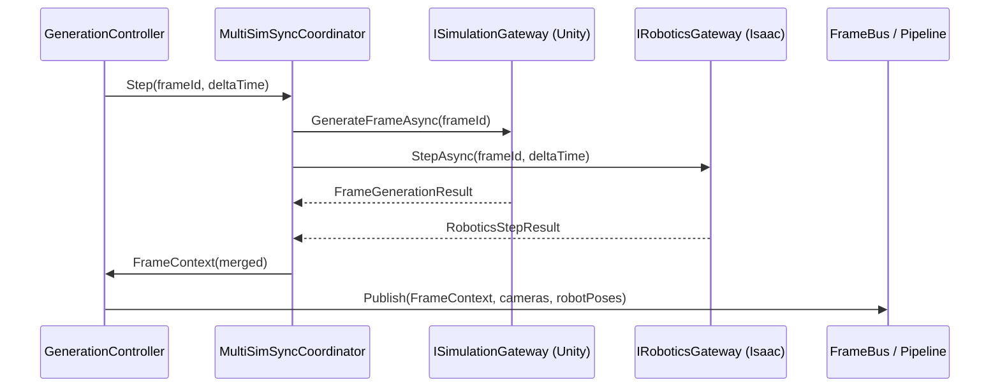

## 1. 목적 (Purpose)

본 문서는 Forge의 **전체 시스템 아키텍처**를 정의한다.

- 상위 요구사항 세트에서 정의한 기능·비기능 목표를 만족하는 구조를 제시한다.
- 계층(Layer), 주요 컴포넌트, 실행 흐름, 스레드 모델, 데이터 흐름, 오류 처리, 확장 전략을 기술한다.
- 구현 시 “무엇을 어디에 넣을지”에 대한 기준점이 된다. (단, 상세 메서드/클래스는 Class Design v2에서 정의)

---

## 2. 아키텍처 개요 (Architecture Overview)

시스템은 다음 **4개 레이어**로 구성된다.

1. Application Layer
2. Orchestration Layer
3. Simulation Layer
4. Data Pipeline Layer (+ QA/Export)

각 레이어는 **Config 기반**으로 느슨하게 결합되며,
Unity 메인 스레드 제약을 고려하여 Simulation과 Pipeline의 경계를 명확히 한다.

> 분산(distributed) 모드에서 Worker/Master 상호작용, Global ID 할당, Failover 전략은 `docs/design/13_Distributed_Architecture.md`를 참조한다.

### 시스템 아키텍처 다이어그램

```mermaid
graph TB
    subgraph Application["Application Layer"]
        AppCmd[GenerationCommand]
        ConfigLoader[ConfigurationLoader]
        Progress[ProgressReporter]
    end

    subgraph Orchestration["Orchestration Layer"]
        Session[SessionManager]
        Scenario[ScenarioManager]
        EnvCoord[EnvironmentCoordinator]
        GenCtrl[GenerationController]
        PipeCoord[PipelineCoordinator]
    end

    subgraph Bridge["Simulation Gateway"]
        SimGateway[SimulationGateway<br/>(InProcess/HTTP)]
    end

    subgraph Simulation["Simulation Layer (Unity)"]
        EnvSvc[EnvironmentService]
        CamSvc[CameraService]
        CrowdSvc[CrowdService]
        Behavior[BehaviorSystem]
        TimeWeather[TimeWeatherService]
        Visibility[VisibilityService]
    end

    subgraph Pipeline["Data Pipeline Layer"]
        Bus[FrameBus]
        Capture[CaptureWorker]
        Detection[AnnotationWorker]
        Tracking[TrackingWorker]
        Occlusion[OcclusionWorker]
        Assembler[LabelAssembler]
        Encode[EncodeWorker]
        Storage[StorageWorker]
        ReIDExport[ReIDExportWorker<br/>Phase 2+]
        EdgeExport[EdgeExportWorker<br/>Phase 3+]
    end

    subgraph Services["Services"]
        Validation[ValidationService]
        Stats[StatsService]
        Manifest[ManifestService]
        EdgeSvc[EdgeExportService<br/>Phase 3+]
    end

    AppCmd --> ConfigLoader
    AppCmd --> Session
    ConfigLoader --> Session
    Progress <--> PipeCoord

    Session --> Scenario
    Session --> GenCtrl
    Scenario --> EnvCoord
    GenCtrl --> Bus
    GenCtrl <--> PipeCoord

    GenCtrl --> SimGateway
    SimGateway --> EnvSvc
    SimGateway --> CamSvc
    SimGateway --> CrowdSvc
    SimGateway --> Behavior
    SimGateway --> TimeWeather
    SimGateway --> Visibility

    Bus --> Capture
    Capture --> Detection
    Detection --> Tracking
    Tracking --> Occlusion
    Tracking --> Assembler
    Occlusion --> Assembler
    Assembler --> Encode
    Encode --> Storage
    Encode -.-> EdgeExport
    Capture -.-> ReIDExport
    Tracking -.-> ReIDExport

    Session --> Validation
    Session --> Stats
    Session --> Manifest
    Session --> EdgeSvc

    PipeCoord -.monitor.-> Capture
    PipeCoord -.monitor.-> Detection
    PipeCoord -.monitor.-> Tracking
    PipeCoord -.monitor.-> Storage
    PipeCoord -.monitor.-> EdgeExport

    style ReIDExport fill:#f9f,stroke:#333,stroke-width:2px
    style EdgeExport fill:#f9f,stroke:#333,stroke-width:2px
    style EdgeSvc fill:#f9f,stroke:#333,stroke-width:2px
```

---

## 3. 레이어별 구조 (Layer Architecture)

### 3.1 Application Layer

역할:  
- 사용자 입력(UI/CLI/Config 파일)을 받아 세션 실행을 시작/중단/재시작하는 상위 계층
- 진행률 및 로그를 사용자에게 전달

주요 컴포넌트:

- `GenerationCommand`  
  - 실행 인자/Config 파일 경로를 받아 Session 실행을 시작/중단/재시작
- `ConfigurationLoader`  
  - Config 파일(JSON 등)을 읽고 유효성 검사
  - `SessionConfig` 객체 생성 후 Orchestration Layer에 전달
- `ProgressReporter`  
  - Orchestration/Data Pipeline에서 전달받은 진행률, 오류, 통계를 UI/CLI에 표시

책임:

- Config 로드 및 검증 (형식/필수 필드)
- 세션 시작/종료/중단 명령 처리
- 진행률/로그 출력

---

### 3.2 Orchestration Layer

역할:  
- Session 단위의 전체 실행 흐름 제어
- Scene / Scenario / Environment / Simulation Loop / Pipeline 간 조율

주요 컴포넌트:

- `SessionManager`
- `ScenarioManager`
- `EnvironmentCoordinator`
- `GenerationController`
- `PipelineCoordinator`

#### 3.2.1 SessionManager

- `SessionConfig`를 입력 받아 `SessionContext` 생성
- 세션 디렉토리(출력 경로) 생성
- Checkpoint 파일 관리 (Phase 2+)
- Session 상태 관리 (Running / Paused / Stopped / Error)

#### 3.2.2 ScenarioManager

- Scene + Domain Randomization + Crowd/Camera 설정 조합으로 `ScenarioContext` 리스트 생성
- 시나리오 순회(iterator) 제공:
  - 예: Factory → Office → Warehouse … (Phase 2+)
- 각 Scenario에 대해 실행 프레임 범위/조건 정의

#### 3.2.3 EnvironmentCoordinator

- Unity Scene 관리 컴포넌트와 연동
- Scene Pooling 전략에 따라:
  - 초기 로딩: 필요한 Scene들을 Additive Load
  - 전환: Enable/Disable로 활성 Scene 전환
- 환경 변경 시 Camera/Crowd 설정 업데이트 트리거

#### 3.2.3-A SceneTransitionService (책임 분리)

- `ScenarioManager`가 다음 Scenario로 이동할 때 호출되는 전환 서비스.
- 책임:
  - Scene 활성화/비활성화
  - Crowd/PersonState 마이그레이션(Global ID 유지)
  - NavMesh/조명/시간대/랜덤화 파라미터 적용
- GenerationController는 이 서비스를 호출만 하고, 전환 세부 로직은 알지 않는다.

**개념 시퀀스:**
```
ScenarioManager → SceneTransitionService → EnvironmentService: ActivateScene()
                                   → CrowdService: Migrate(GlobalID 유지)
                                   → TimeWeatherService: Apply(time/weather)
                                   → CameraService: ReconfigureIfNeeded()
```

#### 3.2.4 GenerationController

- **메인 프레임 루프** 담당
- **Unity 독립성**: Unity API에 직접 의존하지 않고, `ISimulationGateway`/`IFrameProvider` 추상화를 통해 프레임 틱을 수신
- 각 프레임마다 다음을 수행(핵심 책임만):
  1. 활성 `ScenarioContext`에 맞춰 SimulationLayer 업데이트 요청
  2. `FrameContext` 생성 (frame_id, timestamp, scenario 정보)
  3. `FrameBus`를 통해 Data Pipeline Layer로 Frame 이벤트 전달
- PipelineCoordinator의 back-pressure 신호와 `IFrameRatePolicy` 결과를 확인하여:
  - 프레임 생성/skip/일시정지 여부 결정
  - FPS 조절 적용
- **주의**: Scene 전환 + Crowd migration 로직은 `ScenarioManager` 혹은 별도 `SceneTransitionService`에서 수행하여 GenerationController의 책임을 최소화한다.
- **시간축 정의**: `FrameContext.timestamp`는 시뮬레이션 월드 시간(Scenario/TimeWeather 기준)을 사용한다. 재현성 기준은 frame_id/frame_index이며, wall-clock 지연과 무관하게 frame_id 순서를 신뢰한다.

**주요 메서드:**
```csharp
class GenerationController {
    private readonly IFrameProvider _frameProvider;
    private readonly IScenarioManager _scenarioManager;
    private readonly IFrameBus _frameBus;
    private readonly IPipelineCoordinator _pipelineCoordinator;

    // Unity 독립적인 프레임 틱 처리
    public void OnFrameTick(float deltaTime) {
        var backPressure = _pipelineCoordinator.GetBackPressureSignal();

        if (backPressure == BackPressureLevel.PAUSE) {
            HandlePause(deltaTime);
            return;
        }

        if (backPressure == BackPressureLevel.SLOW) {
            AdjustFrameRate(0.7f); // 30% 감속
        }

        // Scene 전환 체크 (Phase 2+)
        var scenario = _scenarioManager.GetCurrent();
        if (_currentFrame >= scenario.EndFrame && _scenarioManager.MoveNext()) {
            // Scene/Crowd 전환 책임은 SceneTransitionService가 담당
            scenario = _scenarioManager.GetCurrent();
            _sceneTransitionService.TransitionTo(scenario);
        }

        // 프레임 생성
        var cameras = _frameProvider.GetActiveCameras();

        // PersonState 포함 (Tracking/ReID에서 사용)
        var personStates = _frameProvider.GetCurrentSceneState().Persons;
        var frameContext = CreateFrameContext(scenario, personStates);

        _frameBus.Publish(frameContext, cameras);
        _currentFrame++;
    }

    private void HandlePause(float deltaTime) {
        _pausedDuration += TimeSpan.FromSeconds(deltaTime);

        // Deadlock 방지: 최대 5분 후 강제 재개
        if (_pausedDuration > TimeSpan.FromMinutes(5)) {
            _logger.LogWarning("Force resume after 5min pause");
            _pausedDuration = TimeSpan.Zero;
            _pipelineCoordinator.RequestForceResume();
        }
    }
}
```

#### 3.2.4-A FrameRatePolicy (정책 분리)

- 역할: Back-pressure, 사용자 설정(quality-first / speed-first / balanced) 등을 종합해 프레임 생성/skip/일시정지를 결정.
- 인터페이스 예시:
```csharp
public interface IFrameRatePolicy {
    FrameGenerationDecision Decide(BackPressureLevel level, SessionConfig config, long currentFrame);
}

public enum FrameGenerationDecision {
    Generate,
    Skip,
    Pause
}
```
- GenerationController는 정책 객체 결과만 반영하여 if/else 증가를 피한다.
- 정책 로더(`FrameRatePolicyFactory`)는 Config에 정의된 `frameRatePolicy.id`를 기반으로 적절한 구현체를 주입하며, 파라미터와 threshold는 `frameRatePolicy.options` 섹션을 통해 전달한다.
- Config에서 정책을 선택할 수 있도록 확장 (예: `frameRatePolicy.id: "quality_first"`). 정책 정의는 `config/schema/frame_rate_policy.schema.json`에 단일 소스로 관리하고, Application Layer의 `ConfigurationLoader`와 Orchestration Layer의 `SessionManager`가 동일 스키마를 참조한다.

**정책 프리셋**

| 정책 ID | BackPressureLevel → FrameGenerationDecision | 설명 | 대표 시나리오 |
|---------|--------------------------------------------|------|----------------|
| `quality_first` | OK→Generate / CAUTION→Generate / SLOW→Skip(1 of N, N=3) / PAUSE→Pause | 라벨 품질을 우선하여 skip 빈도를 최소화하고, Pause 상태에서도 최대 30초마다 health ping을 발생시켜 Deadlock 탐지 | 연구/검증 세션, Robotics 동기화 |
| `throughput_first` | OK→Generate / CAUTION→Skip(1 of N, N=2) / SLOW→Skip(1 of N, N=1) / PAUSE→Force resume(최대 30s 후) | 프레임 수를 극대화하기 위해 BackPressureLevel에 바로 frame drop을 적용 | Edge 대량 생성, Synthetic pre-train |
| `balanced` | OK→Generate / CAUTION→Skip(1 of N, N=4) / SLOW→Pause(최대 10s) / PAUSE→Pause | 기본 정책. pipe drain 여부와 CPU/GPU utilization을 MetricsEmitter에서 확인해 auto-switch 조건을 충족하면 품질/처리량 간 동적 전환 | 일반 배포, QA 세션 |

- 운영자는 Config에서 `frameRatePolicy.profileOverrides`를 통해 특정 BackPressureLevel에 대한 커스텀 매핑을 선언할 수 있고, PipelineCoordinator는 `/status`의 `frameRatePolicySummary` 필드로 활성 정책과 최근 전환 결과를 노출한다. Metrics/Tracing은 §3.5 Cross-cutting Services 섹션의 `MetricsEmitter`에 위임한다.

#### 3.2.5 PipelineCoordinator

- Data Pipeline Layer의 각 Worker Queue 상태를 모니터링
- Back-pressure 정책 적용:
  - Queue 길이가 threshold 초과 시 GenerationController에 속도 조절 신호 전달
  - 심각한 경우 frame 생성 일시 중단
- Worker 장애(에러) 집계:
  - 재시도/skip/세션 중단 결정
- 진행률 계산:
  - 처리된 frame 수 / 목표 frame 수 / 예상 완료 시간 → ProgressReporter로 전달
  - `/status` API에서 수집한 `engineVersion`, `supportedVersions`, `authMode`를 함께 노출하여 모니터링/운영 대시보드가 버전 불일치나 인증 모드를 즉시 파악할 수 있도록 한다. 이때 `/status`는 다른 엔드포인트와 동일한 인증을 강제하고 워커별 큐 깊이 대신 요약값(최대 큐 사용률)을 반환해 내부 토폴로지 노출을 최소화한다.
- 구현 체크리스트:
  - 인증 미들웨어가 `/status`에도 적용되는지 통합 테스트로 확보한다.
  - `/status`는 내부 Liveness/Readiness/Prometheus pull 용도로 사용하고, UI는 Grafana 등 대시보드 경유로 본다.
  - 상태 응답은 요약 지표만 제공하고 내부 큐 상세·경로·호스트 정보를 포함하지 않는다.
  - `allowedHosts`/바인딩 범위 설정이 적용되어 원격 접근이 제한되는지 운영 구성에서 검증한다.

**Back-pressure 알고리즘 (구체화):**
```csharp
class PipelineCoordinator {
    public BackPressureLevel GetBackPressureSignal() {
        var maxQueueRatio = _workers.Max(w => w.QueueLength / (float)w.QueueCapacity);

        if (maxQueueRatio >= 1.0f) {
            // 100%: 큐 풀, 프레임 생성 일시정지
            return BackPressureLevel.PAUSE;
        }
        else if (maxQueueRatio >= 0.9f) {
            // 90%: 위험, 속도 대폭 감소 (30%)
            return BackPressureLevel.SLOW;
        }
        else if (maxQueueRatio >= 0.7f) {
            // 70%: 주의, 속도 소폭 감소 (10%)
            return BackPressureLevel.CAUTION;
        }

        return BackPressureLevel.OK;
    }
}

public enum BackPressureLevel {
    OK,        // 정상 (큐 < 70%)
    CAUTION,   // 주의 (큐 70-90%, FPS 10% 감소)
    SLOW,      // 위험 (큐 90-100%, FPS 30% 감소)
    PAUSE      // 풀 (큐 100%, 생성 일시정지)
}
```

---

### 3.3 Simulation Layer (Unity World)

역할:
- 실제 3D 환경에서 사람/카메라/조명/날씨를 시뮬레이션
- 각 프레임에 대해 ground truth 상태를 생성
- Unity 메인 스레드에서 실행되며, **ISimulationGateway를 통해 Orchestration Layer와 통신**

주요 컴포넌트:

- `ISimulationGateway` (Unity ↔ Orchestration 인터페이스 추상화)
- `EnvironmentService`
- `CameraService`
- `CrowdService`
- `BehaviorSystem` (모듈 집합)
- `TimeWeatherService`
- `VisibilityService` (Phase 2+의 Occlusion 등 일부 기능만)

#### 3.3.0 SimulationGateway (ISimulationGateway 인터페이스)

**역할:**
- Orchestration Layer가 Simulation Layer에 접근하는 표준 인터페이스.
- 모드에 따라 `UnitySimulationGateway`(Unity와 동일 프로세스) 또는 `HttpSimulationGateway`(별도 프로세스/노드)를 선택한다.
- `ISimulationGateway` 인터페이스를 통해 GenerationController는 통신 방식과 무관하게 동일한 계약을 사용한다.

**인터페이스 정의:**
```csharp
public interface ISimulationGateway
{
    Task InitializeAsync(SessionConfig config);
    Task<FrameGenerationResult> GenerateFrameAsync(int frameId);
    Task<SceneState> GetCurrentSceneStateAsync();
    IReadOnlyList<CameraMeta> GetActiveCameras();
    IReadOnlyList<CameraPose> GetCameraPoses();
    void Shutdown();
}
```

**모드별 구현:**

| 모드 | 구현 클래스 | 설명 | 보안 기본값(NFR-12) | 적용 Phase |
|------|------------|------|--------------------|------------|
| InProcess | `UnitySimulationGateway` | Unity가 동일 프로세스에서 실행되며 MonoBehaviour가 직접 메서드 호출 | 프로세스 내부, 별도 인증 불필요 | Phase 1 기본 |
| HTTP | `HttpSimulationGateway` | Unity가 별도 프로세스/노드로 `/api/simulation` HTTP 서버 제공, Orchestration은 REST 클라이언트로 제어 | 기본 바인딩 `127.0.0.1`; 분산 시 mTLS/API Key 필수 | Phase 2+ (원격/분산) |
| Mock | `MockSimulationGateway` | 테스트용 구현체, Unity 없이 테스트 데이터 반환 | N/A | 테스트 전용 |

**UnitySimulationGateway 예시:**
```csharp
public class UnitySimulationGateway : MonoBehaviour, ISimulationGateway {
    private CameraService _cameraService;
    private CrowdService _crowdService;
    private EnvironmentService _environmentService;
    private KinectPoseProvider _cameraPoseProvider; // 카메라 pose 제공 (예시)

    public async Task InitializeAsync(SessionConfig config) {
        // Scene 로드, 카메라 초기화, Crowd 생성
        await _environmentService.LoadSceneAsync(config.Scenes[0].Name);
        _cameraService.InitializeCameras(config.Cameras);
        _crowdService.SpawnInitialCrowd(config.Crowd);
    }

    public async Task<FrameGenerationResult> GenerateFrameAsync(int frameId) {
        // Unity Update() 루프에서 호출
        var personStates = _crowdService.GetAgents()
            .Select(a => a.ToPersonState())
            .ToList();

        var frameContext = new FrameContext {
            FrameId = frameId,
            Timestamp = _timeWeatherService.GetSimulationTime(), // 시뮬레이션 월드 시간
            SceneName = UnityEngine.SceneManagement.SceneManager.GetActiveScene().name,
            PersonStates = personStates
        };

        var images = _cameraService.CaptureAllCameras();
        return new FrameGenerationResult(frameContext, images);
    }

    public IReadOnlyList<CameraMeta> GetActiveCameras() =>
        _cameraService.GetActiveCameras()
            .Select(cam => cam.GetMetadata())
            .ToList();

    public IReadOnlyList<CameraPose> GetCameraPoses() =>
        _cameraPoseProvider?.GetCurrentPoses() ?? Array.Empty<CameraPose>();

    public async Task<SceneState> GetCurrentSceneStateAsync() => new SceneState {
        SceneName = UnityEngine.SceneManagement.SceneManager.GetActiveScene().name,
        Persons = _crowdService.GetAgents().Select(a => a.ToPersonState()).ToList()
    };

    public void Shutdown() {
        _crowdService.DespawnAll();
        _cameraService.Cleanup();
    }
}
```

**HttpSimulationGateway 개념:**
- Orchestration Layer는 `HttpSimulationGateway` 클라이언트를 통해 API Specification 문서에 정의된 REST 엔드포인트(`/session/init`, `/session/start`, `/status` 등)를 호출한다.
- Unity 측은 동일 엔드포인트를 노출하는 WebHost를 실행하며, 인증/바인딩 설정은 Config(`simulation.gateway.mode=remote`)에 포함한다.
- HTTP 모드에서도 동일한 `ISimulationGateway` 계약을 유지하며, HTTP 호출을 내부적으로 처리한다.

**FrameGenerationResult(예시 DTO):**
```csharp
public record FrameGenerationResult(
    FrameContext Frame,
    IReadOnlyList<RawImageData> Images
);

public record CameraPose(
    string CameraId,
    Matrix4x4 Extrinsic,
    Vector3 Position,
    Quaternion Rotation,
    float Timestamp
);
```

**장점:**
- ✅ GenerationController를 Unity 없이 단위 테스트 가능
- ✅ Mock 구현으로 빠른 통합 테스트
- ✅ Unity 버전 업그레이드 시 영향 최소화


#### 3.3.1 Unity Main Thread Execution Model

- PlayerLoop 순서(PreUpdate → Update → LateUpdate → Rendering → AsyncGPUReadback)를 기준으로 FrameContext, Capture, Label 단계의 실행 타이밍을 정의한다.
- FrameContext는 `Update()` 종료 직전에 Crowd/Cameras 상태를 스냅샷하고 frame_id/timestamp를 결정한다. Remote/HTTP Gateway도 동일 타이밍에 `GenerateFrameAsync`를 호출하도록 coroutine 기반 스케줄러를 사용한다.
- Capture는 Main Thread/LateUpdate에서 수행하며, AsyncGPUReadback을 사용할 경우 요청 프레임과 완료 프레임을 `captureSequenceId`로 매핑해 지연을 보정한다.
- Script Execution Order를 `EnvironmentService → CrowdService → CameraService → CaptureBridge` 순으로 고정해 Scene 전환과 pose 기록이 deterministic 하게 유지되도록 한다.
- FixedUpdate 주기가 Update보다 촘촘하더라도 FrameContext.timestamp는 `Time.time`(시뮬레이션 월드 시간)을 사용하며, Config/Checkpoint에 `time.fixedDeltaTime`을 기록해 Resume 시 동일 주기를 강제한다.

자세한 PlayerLoop 다이어그램은 `docs/design/11_Unity_Integration_Guide.md` “Execution Timeline” 절을 참조한다.

#### 3.3.2 EnvironmentService

- Scene Pool 관리 (Scene 로딩/활성화/비활성화)
- 활성 Scene의 메타데이터 제공:
  - Scene 이름, 좌표계, NavMesh 영역 등
- 사용자 정의 Scene Asset 등록:
  - `SceneAssetRegistry`가 업로드된 `.fbx/.obj/.unitypackage/AssetBundle`을 검증·변환하여 Unity Addressables/AssetBundle로 등록
  - Manifest 기준 좌표계/단위/NavMesh/조명 데이터를 `SceneMetadataStore`에 기록
  - 등록 실패 시 Diagnostics 이벤트 발행 및 사용자에게 피드백
  - 전체 워크플로우와 메타데이터 스키마는 `docs/design/14_Scene_Asset_Registry.md`를 참조한다.

#### 3.3.3 CameraService

- 카메라 등록/해제, Config 기반 초기화
- 카메라 위치/FOV/해상도 상태 유지
- 각 프레임마다 “활성 카메라 목록 + 카메라 메타데이터” 제공
- 카메라별 `camera_id` 관리
- 이동형 카메라 pose 업데이트: `MobileCameraController`와 협력하여 경로/속도/pose 적용, `CameraPoseProvider`를 통해 프레임별 pose 기록

#### 3.3.4 CrowdService

- 인물(Pawn/Agent) 생성/제거
- 인원 수 범위를 상위 요구사항에서 정의한 값으로 유지
- 각 인물의 상태(위치/속도/외형/행동) 관리
- **Global Person ID 할당**: Agent 생성 시점에 Session 전역에서 고유한 ID 부여
- **Scene 전환 시 PersonState 마이그레이션** (Phase 2+): Global ID 및 Appearance 보존

**Global Person ID 할당 흐름:**
```csharp
class CrowdService : MonoBehaviour {
    private int _nextGlobalPersonId = 1;
    private List<PersonAgent> _activeAgents = new List<PersonAgent>();

    public PersonAgent SpawnPerson(Vector3 position) {
        var agent = new PersonAgent {
            GlobalPersonId = _nextGlobalPersonId++,  // ← 여기서 할당
            Position = position,
            Velocity = Vector3.zero,
            Behavior = "walk",
            SpawnedAt = Time.frameCount
        };

        _activeAgents.Add(agent);
        _logger.LogDebug($"Person spawned: GlobalID={agent.GlobalPersonId}");

        return agent;
    }

    public List<PersonState> GetPersonStates() {
        // Detection/Tracking에서 사용할 수 있도록 GlobalPersonId 포함
        return _activeAgents.Select(a => new PersonState {
            GlobalPersonId = a.GlobalPersonId,
            Position = a.Position,
            Velocity = a.Velocity,
            BoundingBox = CalculateBoundingBox(a)
        }).ToList();
    }
}
```

**주의사항:**
- GlobalPersonId는 **세션 시작 시 1부터 시작**
- Agent 삭제 후 재생성 시 **새로운 ID 부여** (재사용 안 함)
- Checkpoint 저장 시 `_nextGlobalPersonId` 포함 필수

#### 3.3.4 BehaviorSystem

- 행동 모듈 집합:
  - Phase 1: Walk, Idle
  - Phase 2+: GroupMove, 속도/경로 다양화
  - Phase 3+: 넘어짐/싸움/상호작용 등
- 각 프레임마다 개별 인물의 행동 상태 업데이트

#### 3.3.5 TimeWeatherService

- 시간대(주간/야간), 조명 밝기/색온도, 날씨 효과 제어
- Domain Randomization 파라미터를 적용할 수 있는 인터페이스 제공 (Phase 2+)

#### 3.3.6 VisibilityService (Phase 2+)

- 각 인물과 카메라의 상대 위치/가시성 정보 계산 준비
- Occlusion/Visibility 위한 기초 정보 (예: 시야에 있는지 여부)만 Simulation에서 계산
- 구체적인 ratio 계산은 Data Pipeline 레벨에서 수행 가능하도록 메타만 제공

#### 3.3.4 MobileCameraController

역할:
- 이동형 카메라(로봇/AGV/드론 장착 카메라)의 경로 추종 및 포즈 업데이트를 담당.
- CameraService와 협력하여 FrameContext/CameraPose 데이터를 최신 상태로 유지.

주요 책임:
- Config 기반 경로(waypoints) 파싱 및 PathPlanner 실행
- 속도/가속도/회전 제약 적용 (maxSpeed, maxAngularSpeed)
- NavMesh/Collision 시스템과 연동해 충돌 회피 (옵션)
- Simulation Tick마다 카메라 포즈 업데이트 및 Sensor noise(rolling shutter/motion blur) 적용
- PoseRecorder를 통해 프레임별 pose(t, position, rotation, extrinsic) 기록 → `CameraPoseProvider`

구성 요소:
- PathPlanner: Waypoints → 연속 경로(Spline/Bezier/Catmull-Rom) 생성
- MotionController: PID/보간 알고리즘으로 위치·회전 제어
- PoseRecorder: CameraPose 데이터를 FrameContext/manifest로 전달

Config 필드 예시:
```json
"cameras": [
  {
    "id": "bot_cam_01",
    "type": "mobile",
    "path": {
      "waypoints": [
        {"position": [0, 1.5, 0], "waitSeconds": 0},
        {"position": [5, 1.5, 3], "waitSeconds": 1}
      ],
      "loop": true,
      "maxSpeed": 1.5,
      "maxAngularSpeed": 45
    },
    "sensor": {
      "rollingShutter": true,
      "motionBlur": {"exposureMs": 16.7}
    }
  }
]
```

Simulation 흐름:
`GenerationController` → `MobileCameraController.Update(deltaTime)` → `CameraService` pose 반영 → FrameBus Publish 시 `CameraPose` 포함

---

#### 3.3.7 MultiSimSyncCoordinator & IRoboticsGateway (Phase 4+)

Phase 4에서 로봇 센서/SLAM을 통합하려면 Unity Simulation과 Isaac Sim(또는 동등한 로봇 백엔드)을 동시에 구동해야 한다. MultiSimSyncCoordinator는 `ISimulationGateway`(Unity)와 `IRoboticsGateway`(Isaac) 사이의 중재자 역할을 하며 다음 책임을 가진다.

- 동일 FrameId/deltaTime으로 두 엔진에 Step 요청
- `syncPolicy`(maxDelayMs, timeoutMs, onTimeout)를 적용해 Isaac 지연을 처리
- 반환된 `FrameGenerationResult` + `RoboticsStepResult`를 병합해 `FrameContext`에 `RobotPose`, `SensorMeta` 추가
- Time Sync 오차가 허용치를 넘으면 품질 모드에 따라 경고/세션 중단

구현 개념:
```csharp
public class MultiSimSyncCoordinator
{
    private readonly ISimulationGateway _unity;
    private readonly IRoboticsGateway _isaac;

    public async Task<FrameContext> StepAsync(long frameId, float deltaTime)
    {
        var unityTask = _unity.GenerateFrameAsync((int)frameId);
        var isaacTask = _isaac.StepAsync(frameId, deltaTime);
        await Task.WhenAll(unityTask, isaacTask);

        return FrameContextExtensions.Merge(unityTask.Result, isaacTask.Result);
    }
}
```

`IRoboticsGateway`는 Isaac RPC/REST/gRPC를 캡슐화하며 Pose/LiDAR/IMU/Odom/Depth 데이터를 Frame-aligned 형태로 제공한다. 자세한 설계는 `docs/design/12_Robotics_Extension.md` 참고.

**Phase 4 시퀀스 다이어그램**



다이어그램처럼 MultiSimSyncCoordinator는 기존 GenerationController-FrameBus 루프 사이에 삽입된다. Back-pressure 신호는 여전히 PipelineCoordinator → GenerationController 경로를 따르지만, Robotics latency가 timeout 임계치를 넘으면 DiagnosticsService(§3.5)가 이벤트를 기록하고 FrameRatePolicy가 `quality_first` 프로파일일 경우에는 Pause 대신 Skip으로 완화하도록 정책을 전환한다.

---

### 3.4 Data Pipeline Layer

역할:  
- SimulationLayer에서 전달된 FrameContext + 카메라 이미지에 대해
  라벨 생성, 인코딩, 저장, 검증까지 수행하는 병렬 파이프라인
- AnnotationWorker는 Unity에서 전달된 GT를 카메라별 라벨 포맷으로 변환하는 전용 Stage로 구성되어 있으며, 필요 시 별도 모델 Stage를 추가해 비교/검증할 수 있다.

핵심 개념:  
- **FrameBus**: Frame 이벤트 전달 허브  
- **Raw → Labeled → Encoded** 3단 데이터 모델  
- **Worker 분리**: Capture / Annotation / Tracking / ReID / Occlusion / Encode / Storage

주요 컴포넌트:

- `FrameBus`
- `CaptureWorker`
- `AnnotationWorker`
- `TrackingWorker`
- `ReIDWorker`
- `OcclusionWorker` (Phase 2+)
- `LabelAssembler`
- `EncodeWorker`
- `StorageWorker`
- `SensorExportWorker` (Phase 4+, robotics.enabled 시)
- `ValidationService`, `StatsService`, `ManifestService`

#### 3.4.1 FrameBus

- 입력: `FrameContext`, `CameraService`에서 가져온 active camera 리스트
- 역할:
  - SimulationLayer(Main Thread)에서 파이프라인 시작점으로 Frame 단위 이벤트를 push
  - CaptureWorker가 이 이벤트를 구독해 처리 시작
- 구현 제약:
  - Unity 메인 스레드에서 FrameBus에 push
  - Worker 쓰레드는 FrameBus로부터 thread-safe하게 read

#### 3.4.2 CaptureWorker

- 역할:
  - 각 카메라에 대해 이미지 캡처
- 입력:
  - `FrameContext`
  - Camera 메타데이터 목록
- 출력:
  - `RawImageData[]` (카메라별 이미지 + camera_id + frame_id)
- Phase별:
  - Phase 1: 동기 캡처 (간단 구현)
  - Phase 2+: 비동기 캡처 + Worker Queue

#### 3.4.3 AnnotationWorker

- 역할:
  - Unity Simulation Layer에서 전달한 PersonState/Visibility 정보를 카메라별 bbox/score로 투영해 DetectionData를 생성
  - 실제 신경망 추론을 수행하지 않으며, 모든 라벨은 GT 기반 계산
- 입력:
  - `RawImageData[]` (이미지 크기/카메라 메타 확인용)
  - `FrameContext` (PersonState, Global ID, Visibility)
- 출력: `DetectionData` 리스트 (camera_id별 bbox/visibility/confidence)
- 내부 로직:
  - 카메라 intrinsic/extrinsic과 인물 3D 좌표를 이용해 2D bbox 계산
  - VisibilityService가 계산한 occlusion 값을 DetectionData에 포함
  - 이미지 경계 밖 bbox는 clip/drop 정책에 따라 처리

#### 3.4.4 TrackingWorker

- 역할:
  - Detection 결과를 기반으로 frame 간 Tracking
- 입력:
  - `DetectionData` + 이전 frame의 Tracking 상태
- 출력:
  - `TrackingData` (track_id per camera)
- 특징:
  - 카메라별 track_id를 관리하고, Global ID와 매칭

#### 3.4.5 ReIDWorker (Phase 2+)

- 역할:
  - 인물별 Appearance Embedding 생성
- 입력:
  - `RawImageData` + Detection bbox
- 출력:
  - `ReIDData` (person_id, embedding)

#### 3.4.6 OcclusionWorker (Phase 2+)

- 역할:
  - 각 bbox에 대한 occlusion/visibility 계산
- 입력:
  - Simulation에서 온 meta(VisibilityService output) + Detection/Tracking 결과
- 출력:
  - occlusion/visibility 값이 포함된 라벨 메타

#### 3.4.7 LabelAssembler

- 역할:
  - Detection/Tracking/ReID/Occlusion 정보를 합쳐 `CameraLabelData` / `LabeledFrame` 생성
- 입력:
  - `DetectionData`, `TrackingData`, `ReIDData`, occlusion meta, `FrameContext`
- 출력:
  - `LabeledFrame` (Frame 단위 라벨 묶음)

#### 3.4.8 EncodeWorker

- 역할:
  - 이미지 인코딩(JPG/PNG)
  - 라벨 포맷 변환(JSON/YOLO/COCO)
- 입력:
  - `LabeledFrame`
- 출력:
  - `EncodedFrame` (image bytes, label text, 파일명 정보)

#### 3.4.9 StorageWorker

- 역할:
  - EncodedFrame들을 파일 시스템에 기록
- 입력:
  - `EncodedFrame`
- 출력:
  - 실제 파일(이미지/라벨), 경로
- 정책:
  - 세션 단위 디렉토리 구조 준수
  - 동시 쓰기 제한 (구체 정책은 Pipeline Spec v2에서 정의)

#### 3.4.10 EdgeExportWorker (Phase 3+)

- 역할:
  - Edge-NPU 학습/추론 파이프라인이 요구하는 형식(TFLite/ONNX/Custom Binary)을 생성한다.
  - EncodeWorker로부터 전달받은 EncodedFrame 및 Label 정보를 사용해 `.record`, `.npz`, `.bin` 등 Config에서 지정한 출력물을 만든다.
- 입력:
  - `EncodedFrame`(이미지 bytes) + `LabeledFrame` 메타 (Zero-copy 모드에서는 컨텍스트 공유).
- 출력:
  - `EdgeExportArtifact` (실제 파일 경로, 포맷, 버전) → `EdgeExportService`.
- 특징:
  - 세션 실행 중 실시간으로 Edge-friendly 포맷을 생성할 수도 있고, 세션 종료 시 일괄 실행하도록 설정 가능.
  - 각 포맷은 독립적으로 Enable/Disable할 수 있으며 실패 시 다른 포맷에는 영향을 주지 않는다.
- Back-pressure:
  - Queue 크기는 기본 1024, 임계치 초과 시 PipelineCoordinator가 GenerationController에 속도 감소 신호 전달.
- 보안/무결성:
  - Custom binary 라벨 구조 생성 시 manifest에 checksum을 기록해 배포 중 손상 여부를 검증한다.
- `EdgeExportService`:
  - EdgeExportWorker가 생성한 아티팩트를 집계하여 `edge_packages/` 디렉터리에 저장하고 manifest `edgeArtifacts[]` 섹션을 갱신한다.
  - CLI/Tools(export_tflite.py/export_onnx.py)에서 재사용할 수 있도록 버전/포맷명을 기록한다.

#### 3.4.11 Validation / Stats / Manifest

- `ValidationService`
  - 이미지-라벨 매칭, 값 범위, 파일 손상 등 기본 검증
- `StatsService`
  - frame 수, detection 수, occlusion histogram, bbox histogram 등 통계 계산
- `ManifestService`
  - `manifest.json` 생성 (SessionConfig, Stats, Validation 결과 포함)

### 3.5 Cross-cutting Services (Config / Metrics / Diagnostics)

레이어별 책임을 유지하면서 **Config 일관성·관측성·운영 진단**을 공통 모듈로 통합한다.

| 컴포넌트 | 역할 | 주요 연동 지점 | 산출물/인터페이스 |
|----------|------|----------------|------------------|
| `ConfigSchemaRegistry` | Config 스키마 단일 소스(Schema.json) 관리, 버전 태깅, 마이그레이션 규칙 제공 | Application Layer의 `ConfigurationLoader`, Orchestration Layer의 `SessionManager`, Simulation/Data Pipeline 단계별 Config 파서 | `schemaVersion`, `breakingChanges[]`, `defaults` |
| `MetricsEmitter` | Prometheus/Grafana, CloudWatch 등으로 내보낼 공통 메트릭 정의 (`frame_generate_fps`, `queue_ratio`, `sim_time_offset_ms`, `policy_switch_total`) | GenerationController, PipelineCoordinator, MultiSimSyncCoordinator, StorageWorker, `/status` 핸들러 | `/metrics`, OTLP exporter, `/status.metricsSummary` |
| `DiagnosticsService` | Health check, heartbeat, structured logging, anomaly rule 평가 | Application Layer 로그 파이프, Worker Heartbeat, SceneTransitionService, Robotics gateway | `diagnostics.log`, alert hooks(Slack/Webhook), `diagnosticsReport` |

- `ConfigSchemaRegistry`는 `config/schema/forge.schema.json` 파일을 기준으로 모든 문서/서비스가 참조할 수 있는 ID·필드 정의를 제공하며, Phase 2부터는 `forge schema diff` CLI를 통해 변경 알림을 생성한다.
- `MetricsEmitter`는 FrameBus 이벤트 수신 시점, PipelineCoordinator BackPressureLevel 산출 시점, MultiSimSyncCoordinator Step 결과 등 핵심 지표를 표준 라벨(`session_id`, `scenario`, `policy_id`)과 함께 수집한다. `/status`는 이 값을 요약해 `metricsSummary` 필드로 내보내고, Prometheus는 `/metrics` 엔드포인트를 pull한다.
- `DiagnosticsService`는 Scene 전환/Back-pressure/Robotics timeout 이벤트를 공통 포맷(`diagnostic_event.jsonl`)으로 기록하며, Deadlock 탐지나 강제 Resume 같은 자동 조치 결과를 `ProgressReporter`와 Slack/Webhook으로 동시에 전송한다. Phase 3부터는 Diagnostics 이벤트를 `Test Strategy` 문서의 Chaos 테스트에 재사용한다.
- 로그·메트릭·Config 변경 정보를 한 곳에서 관리함으로써, 아키텍처 문서상 “상태를 어디서 어떻게 노출할지”를 명확히 정의하고, 보안 정책(인증·allowedHosts) 역시 Cross-cutting 레이어에서 일관되게 적용한다.

---

## 4. 실행 흐름 (Execution Flow)

### 4.1 전체 플로우 요약

1. **Application Layer**
   - GenerationCommand → ConfigurationLoader → SessionConfig 로드
   - SessionManager에 세션 시작 요청

2. **Orchestration Layer**
   - SessionManager: SessionContext 생성, 디렉토리 준비
   - ScenarioManager: ScenarioContext iterator 생성
   - EnvironmentCoordinator: 첫 Scene 활성화
   - GenerationController: 프레임 루프 시작

3. **Simulation Layer**
   - 매 프레임:
     - CrowdService/BehaviorSystem/TimeWeatherService 업데이트
     - CameraService 상태 업데이트
     - FrameContext 생성

4. **FrameBus**
   - FrameContext + 활성 카메라 정보를 파이프라인으로 전달

5. **Data Pipeline Layer**
   - CaptureWorker → AnnotationWorker → TrackingWorker → ReIDWorker → OcclusionWorker → LabelAssembler → EncodeWorker → StorageWorker
   - 세션 종료 후 Validation/Stats/Manifest 실행

6. **Application Layer**
   - ProgressReporter: 진행률/검증 결과/에러를 사용자에게 표시
   - 세션 완료/실패 상태 보고

---

## 5. 스레드/동시성 모델 (Threading / Concurrency Model)

### 5.1 Unity 메인 스레드

- SimulationLayer(환경/카메라/군중/행동/시간/날씨)는 **Unity 메인 스레드**에서만 동작
- FrameBus에 FrameContext를 push하는 작업도 메인 스레드에서 수행

### 5.2 Pipeline Worker 스레드

- Data Pipeline Layer는 별도의 Worker 스레드 풀에서 동작
- 각 Worker는 자신만의 입력 Queue를 가지며, Frame 단위 데이터를 가져와 처리
- Unity API 호출 금지 (이미 SimulationLayer에서 생성한 데이터만 사용)

### 5.3 Back-pressure 모델

- PipelineCoordinator가 각 Queue 길이/처리 속도를 모니터링
- Queue 길이가 threshold를 넘으면:
  - GenerationController에게 “속도 저하 또는 일부 frame skip” 요청
  - 상태에 따라 일시정지/재개 결정

---

## 6. 오류 처리 및 복구 전략 (Error Handling & Recovery)

### 6.1 오류 레벨

- Level 1: 경고 (Warning) – 개별 frame skip 가능
- Level 2: 회복 가능 오류 (Recoverable) – 재시도 후 실패 시 frame skip
- Level 3: 치명적 오류 (Fatal) – 세션 중단 + checkpoint 화 후 복구 시도

### 6.2 재시도 정책 (Retry Policy)

**기본 재시도 전략 (Exponential Backoff):**

```csharp
public class RetryPolicy {
    // 재시도 횟수
    public int MaxAttempts { get; set; } = 3;

    // 초기 대기 시간
    public TimeSpan InitialDelay { get; set; } = TimeSpan.FromMilliseconds(100);

    // Backoff 배율 (지수 증가)
    public double BackoffMultiplier { get; set; } = 2.0;

    // 최대 대기 시간 (무한 증가 방지)
    public TimeSpan MaxDelay { get; set; } = TimeSpan.FromSeconds(5);

    public TimeSpan GetDelay(int attemptNumber) {
        var delay = InitialDelay * Math.Pow(BackoffMultiplier, attemptNumber - 1);
        return delay > MaxDelay ? MaxDelay : delay;
    }
}

// 사용 예시
async Task<bool> ExecuteWithRetry<T>(Func<Task<T>> operation, RetryPolicy policy) {
    for (int attempt = 1; attempt <= policy.MaxAttempts; attempt++) {
        try {
            await operation();
            return true;
        }
        catch (Exception ex) when (attempt < policy.MaxAttempts) {
            var delay = policy.GetDelay(attempt);
            _logger.LogWarning($"Attempt {attempt} failed, retrying after {delay.TotalMilliseconds}ms: {ex.Message}");
            await Task.Delay(delay);
        }
    }
    return false;
}
```

### 6.3 Stage별 재시도 정책

| Stage | MaxAttempts | InitialDelay | BackoffMultiplier | MaxDelay | 실패 시 동작 |
|-------|-------------|--------------|-------------------|----------|------------|
| **CaptureWorker** | 3 | 100ms | 2.0 | 5s | Frame skip |
| **AnnotationWorker** | 2 | 50ms | 1.5 | 2s | 빈 Detection 반환 |
| **TrackingWorker** | 1 (재시도 없음) | - | - | - | 이전 상태 유지 |
| **StorageWorker** | 5 | 200ms | 2.0 | 10s | 세션 중단 |
| **EncodeWorker** | 3 | 100ms | 2.0 | 5s | Frame skip |

**재시도 불가 오류 (Immediate Fail):**
- 디스크 풀 (StorageWorker)
- 메모리 부족 (OutOfMemoryException)
- 설정 오류 (ConfigurationException)
- 인증 실패 (UnauthorizedException)

### 6.4 연속 실패 감지 (Circuit Breaker 패턴)

```csharp
public class CircuitBreaker {
    private int _consecutiveFailures = 0;
    private const int FAILURE_THRESHOLD = 10; // 연속 10회 실패 시 차단
    private const int HALF_OPEN_AFTER_FRAMES = 50; // 50 프레임 후 재시도

    public enum State { Closed, Open, HalfOpen }
    public State CurrentState { get; private set; } = State.Closed;

    public bool AllowRequest() {
        if (CurrentState == State.Open) {
            // 일정 시간 후 Half-Open으로 전환
            if (_framesSinceOpen >= HALF_OPEN_AFTER_FRAMES) {
                CurrentState = State.HalfOpen;
                return true;
            }
            return false;
        }
        return true;
    }

    public void RecordSuccess() {
        _consecutiveFailures = 0;
        if (CurrentState == State.HalfOpen) {
            CurrentState = State.Closed;
            _logger.LogInfo("Circuit breaker closed (recovered)");
        }
    }

    public void RecordFailure() {
        _consecutiveFailures++;

        if (_consecutiveFailures >= FAILURE_THRESHOLD) {
            CurrentState = State.Open;
            _logger.LogError($"Circuit breaker opened after {FAILURE_THRESHOLD} failures");
            OnCircuitOpen?.Invoke(); // 세션 일시정지 트리거
        }
    }
}
```

### 6.5 예시 처리 정책

- **Capture 실패**:
  - 최대 3회 재시도 (100ms → 200ms → 400ms 대기)
  - 실패 시 해당 frame skip, 로그 기록
  - 연속 10회 실패 시 Circuit Breaker 발동 → 세션 일시정지

- **Label/Encode 실패**:
  - 최대 3회 재시도
  - 해당 frame skip, Session은 계속 진행

- **Storage 디스크 풀**:
  - 재시도 없이 즉시 세션 중단
  - 상태 "Disk Full"로 기록, 사용자에게 명시적 알림

- **Unity Crash/예상치 못한 종료**:
  - 다음 실행 시 SessionManager가 마지막 checkpoint에서 재시작 옵션 제공

- **Network 장애 (Phase 3 분산 모드)**:
  - Worker → Master 통신 실패: 최대 5회 재시도 (200ms 시작, 최대 10s)
  - 재시도 실패 시 해당 Worker를 Offline 상태로 마킹, 다른 Worker에 작업 재할당

---

## 7. 성능 및 확장 전략 (Performance & Scalability)

### 7.1 Phase별 복잡도 제어

- Phase 1:
  - 단일 Scene, 3대 이하 카메라
  - 동기 캡처 + 단일 Worker 파이프라인(간단 구조)
  - Labeling: Detection + Tracking + Global ID만
- Phase 2:
  - Multi-Scene + Async 캡처 + 분리된 Label Worker 구조
  - Domain Randomization, ReID, Occlusion 도입
- Phase 3:
  - 대규모 Session, Validation/Stats 자동화
  - Multi-session / Multi-GPU 등 확장 전략 적용

### 7.2 메모리/I/O 최적화 방향 (상세는 Pipeline Spec에서)

- Frame buffer 재사용
- 이미지 인코딩/쓰기 batch 처리
- directory depth 최소화, manifest 중심 메타 관리
- session 단위 압축/아카이빙 옵션(Phase 3+)

---

## 8. 분산 아키텍처 설계 (Phase 3)

### 8.1 개요

대규모 데이터 생성 (1M+ 프레임) 시 단일 노드의 한계를 극복하기 위한 분산 처리 아키텍처.

**목표:**
- 여러 Worker Node가 병렬로 프레임 생성
- Master Node가 작업 분배 및 결과 집계
- Global ID 충돌 방지
- 선형 확장성 (노드 2배 → 처리 속도 2배)

### 8.2 아키텍처 구조

```
                    ┌──────────────────┐
                    │   Master Node    │
                    │ ───────────────  │
                    │ TaskDistributor  │
                    │ ResultAggregator │
                    │ IDRangeAllocator │
                    └─────────┬────────┘
                              │
              ┌───────────────┼───────────────┐
              │               │               │
       ┌──────▼─────┐  ┌─────▼──────┐  ┌────▼───────┐
       │  Worker 1  │  │  Worker 2  │  │  Worker N  │
       │ ─────────  │  │ ─────────  │  │ ─────────  │
       │Unity Engine│  │Unity Engine│  │Unity Engine│
       │  Pipeline  │  │  Pipeline  │  │  Pipeline  │
       └────────────┘  └────────────┘  └────────────┘
```

### 8.3 Master Node 컴포넌트

#### 8.3.1 TaskDistributor

**역할:** Scenario를 Worker Node에 분배

```csharp
class TaskDistributor {
    private List<WorkerNode> _availableWorkers;
    private Queue<ScenarioTask> _pendingTasks;

    public void DistributeScenarios(List<ScenarioContext> scenarios) {
        foreach (var scenario in scenarios) {
            var task = new ScenarioTask {
                Scenario = scenario,
                FrameRange = (scenario.StartFrame, scenario.EndFrame),
                AssignedWorker = null
            };
            _pendingTasks.Enqueue(task);
        }

        AssignTasksToWorkers();
    }

    private void AssignTasksToWorkers() {
        while (_pendingTasks.Count > 0 && _availableWorkers.Any()) {
            var task = _pendingTasks.Dequeue();
            var worker = SelectLeastBusyWorker();

            worker.AssignTask(task);
            task.AssignedWorker = worker;
        }
    }

    private WorkerNode SelectLeastBusyWorker() {
        return _availableWorkers
            .OrderBy(w => w.CurrentLoad)
            .First();
    }
}
```

#### 8.3.2 IDRangeAllocator

**역할:** Global Person ID 범위를 Worker별로 할당하여 충돌 방지

**핵심 원칙**:
- Global ID는 **Session 전역**에서 유일하며 **Scene에 독립적**
- Scene 전환 시에도 Person의 Global ID는 변경되지 않음 (Cross-scene ReID 지원)

```csharp
class IDRangeAllocator {
    private int _nextRangeStart = 1;
    private const int RANGE_SIZE = 10000; // Worker당 10,000개 ID

    public IDRange AllocateRange(string workerId) {
        var range = new IDRange {
            WorkerId = workerId,
            Start = _nextRangeStart,
            End = _nextRangeStart + RANGE_SIZE - 1
        };

        _nextRangeStart += RANGE_SIZE;

        _logger.LogInfo($"Allocated ID range to {workerId}: {range.Start}-{range.End}");
        return range;
    }
}

// Worker에서 사용
class CrowdService {
    private IDRange _idRange;
    private int _currentId;

    public void Initialize(IDRange idRange) {
        _idRange = idRange;
        _currentId = idRange.Start;
    }

    public PersonAgent SpawnPerson(Vector3 position) {
        if (_currentId > _idRange.End) {
            throw new Exception($"ID range exhausted for worker {_idRange.WorkerId}");
        }

        var agent = new PersonAgent {
            GlobalPersonId = _currentId++,  // 할당된 범위 내에서만 증가
            // ...
        };
        return agent;
    }
}
```

#### 8.3.3 ResultAggregator

**역할:** Worker들이 생성한 결과를 통합

```csharp
class ResultAggregator {
    public AggregatedResult Aggregate(List<WorkerResult> workerResults) {
        var result = new AggregatedResult {
            TotalFrames = workerResults.Sum(r => r.FrameCount),
            TotalDetections = workerResults.Sum(r => r.DetectionCount),
            OutputDirectories = workerResults.Select(r => r.OutputDirectory).ToList()
        };

        // Manifest 통합
        result.CombinedManifest = MergeManifests(workerResults.Select(r => r.Manifest));

        // Global Person ID 중복 검증
        ValidateGlobalIDUniqueness(workerResults);

        return result;
    }

    private void ValidateGlobalIDUniqueness(List<WorkerResult> results) {
        var allPersonIds = results
            .SelectMany(r => r.PersonIds)
            .ToList();

        var duplicates = allPersonIds
            .GroupBy(id => id)
            .Where(g => g.Count() > 1)
            .Select(g => g.Key)
            .ToList();

        if (duplicates.Any()) {
            throw new Exception($"Duplicate Global Person IDs detected: {string.Join(", ", duplicates)}");
        }
    }
}
```

#### 8.3.4 Persistence (Worker / Job Tracking)

- Master Node는 Worker 등록 정보를 `worker_node` 테이블에 기록한다. Worker가 세션에 참여할 때 `status='ready'`, 작업 중에는 `status='busy'`로 갱신하며, IDRangeAllocator가 부여한 `assigned_id_range_start/end`도 동일 테이블에 보관한다.
- ScenarioTask를 생성할 때 `job_queue`에 `(session_id, start_frame, end_frame, type='scenario', status='pending')`를 삽입하고, TaskDistributor가 Worker에 배정하면 `worker_id`와 `status='assigned'`로 업데이트한다.
- Worker에서 Heartbeat가 도착하면 `worker_heartbeat`에 CPU/GPU/queue_ratio를 기록하고, 최근 Heartbeat 시각을 통해 장애 감지 로직(§8.6)에서 참고한다.
- Database Schema Specification §4.5~4.7에서 정의한 테이블과 API를 Master Node 서비스(`WorkerNodeRepository`, `JobQueueRepository`)가 직접 사용한다.

### 8.4 Worker Node 구조

```csharp
class WorkerNode {
    private string _workerId;
    private UnityEngine _unity;
    private PipelineCoordinator _pipeline;
    private IDRange _assignedIdRange;

    public async Task ProcessScenario(ScenarioTask task) {
        // 1. ID 범위 받기
        _assignedIdRange = await _masterNode.RequestIDRange(_workerId);

        // 2. Unity 환경 초기화
        await _unity.InitializeScene(task.Scenario.SceneName);

        // 3. CrowdService에 ID 범위 설정
        _crowdService.Initialize(_assignedIdRange);

        // 4. 독립적으로 프레임 생성
        for (int frame = task.FrameRange.Start; frame <= task.FrameRange.End; frame++) {
            var frameContext = CreateFrameContext(frame, task.Scenario);
            await _pipeline.ProcessFrame(frameContext);
        }

        // 5. 결과 Master로 전송
        var result = new WorkerResult {
            WorkerId = _workerId,
            FrameCount = task.FrameRange.End - task.FrameRange.Start + 1,
            OutputDirectory = _sessionContext.OutputDirectory,
            PersonIds = _crowdService.GetAllPersonIds()
        };

        await _masterNode.ReportResult(result);
    }
}
```

### 8.5 통신 프로토콜

**gRPC 기반 Master-Worker 통신:**

```protobuf
service DistributedGeneration {
    // Master → Worker: 작업 할당
    rpc AssignTask(ScenarioTask) returns (TaskAck);

    // Worker → Master: ID 범위 요청
    rpc RequestIDRange(WorkerInfo) returns (IDRange);

    // Worker → Master: 진행률 보고
    rpc ReportProgress(ProgressUpdate) returns (Ack);

    // Worker → Master: 결과 전송
    rpc ReportResult(WorkerResult) returns (Ack);
}
```

### 8.6 장애 처리

**Worker 장애 시:**
```csharp
class TaskDistributor {
    private Dictionary<string, DateTime> _workerHeartbeats;
    private TimeSpan _heartbeatTimeout = TimeSpan.FromMinutes(2);

    public void MonitorWorkers() {
        var now = DateTime.UtcNow;
        var failedWorkers = _workerHeartbeats
            .Where(kvp => now - kvp.Value > _heartbeatTimeout)
            .Select(kvp => kvp.Key)
            .ToList();

        foreach (var workerId in failedWorkers) {
            _logger.LogError($"Worker {workerId} failed (heartbeat timeout)");

            // 실패한 Worker의 작업을 다른 Worker에 재할당
            var failedTasks = _assignedTasks
                .Where(t => t.AssignedWorker.Id == workerId)
                .ToList();

            foreach (var task in failedTasks) {
                task.AssignedWorker = null;
                _pendingTasks.Enqueue(task);

                // DB 연동: job_queue.status를 'pending'으로 롤백하고 worker_id를 NULL로 설정
                _jobQueueRepository.MarkPending(task.JobId);
            }

            _workerNodeRepository.UpdateStatus(workerId, "offline");
            ReassignPendingTasks();
        }
    }
}
```

### 8.7 성능 예측

| Worker 수 | 예상 처리 시간 (1M 프레임) | 선형 확장성 |
|----------|--------------------------|------------|
| 1 (단일)  | 25시간 @ 11 FPS          | 100% |
| 2        | 13시간                   | 96% |
| 4        | 7시간                    | 89% |
| 8        | 4시간                    | 78% |

**비선형 요인:**
- Master Node 오버헤드 (Task 분배, 결과 집계)
- 네트워크 통신 지연
- Worker 간 부하 불균형

### 8.8 적용 시점

**Phase 3에서 구현 권장:**
- Phase 1-2: 단일 노드로 충분 (100K-500K 프레임)
- Phase 3: 1M+ 프레임 또는 다중 사용자 환경

**판단 기준:**
```
IF (목표 프레임 수 > 1,000,000 OR 동시 사용자 > 5)
THEN 분산 아키텍처 도입 고려
ELSE 단일 노드 유지
```
