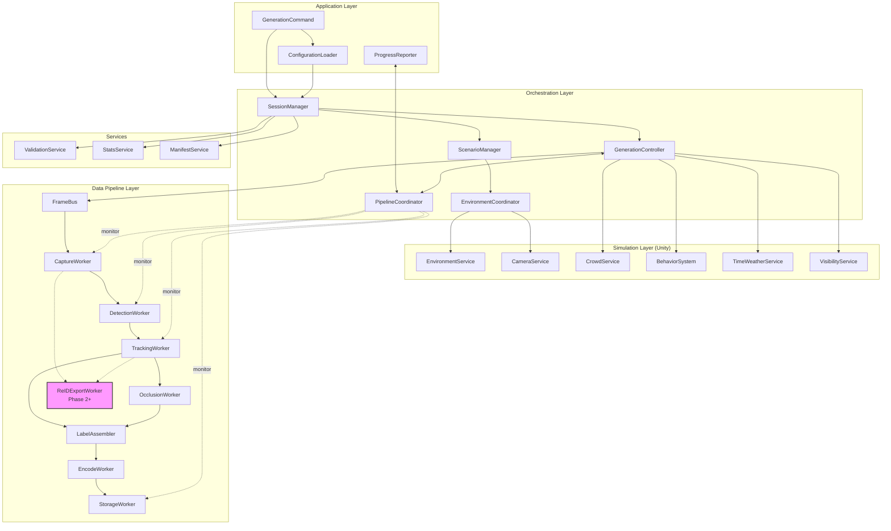

CCTV Synthetic Data Generation Engine

---

> **문서 버전:** v1.1 (2025-02-14)  
> **변경 이력:**  
> - v1.1 (2025-02-14): `/status` 버전/인증 노출 및 PipelineCoordinator 모니터링 지침 추가  
> - v1.0 (2024-12-01): 초기 작성

## 1. 목적 (Purpose)

본 문서는 CCTV Synthetic Data Generation Engine의 **전체 시스템 아키텍처**를 정의한다.

- URS v2, SRS v2에서 정의한 요구사항을 만족하는 구조를 제시한다.
- 계층(Layer), 주요 컴포넌트, 실행 흐름, 스레드 모델, 데이터 흐름, 오류 처리, 확장 전략을 기술한다.
- 구현 시 “무엇을 어디에 넣을지”에 대한 기준점이 된다. (단, 상세 메서드/클래스는 Class Design v2에서 정의)

---

## 2. 아키텍처 개요 (Architecture Overview)

시스템은 다음 **4개 레이어**로 구성된다.

1. Application Layer
2. Orchestration Layer
3. Simulation Layer
4. Data Pipeline Layer (+ QA/Export)

각 레이어는 **Config 기반**으로 느슨하게 결합되며,
Unity 메인 스레드 제약을 고려하여 Simulation과 Pipeline의 경계를 명확히 한다.

### 시스템 아키텍처 다이어그램

---

## 3. 레이어별 구조 (Layer Architecture)

### 3.1 Application Layer

역할:  
- 사용자 입력(UI/CLI/Config 파일)을 받아 세션 실행을 시작/중단/재시작하는 상위 계층
- 진행률 및 로그를 사용자에게 전달

주요 컴포넌트:

- `GenerationCommand`  
  - 실행 인자/Config 파일 경로를 받아 Session 실행을 시작/중단/재시작
- `ConfigurationLoader`  
  - Config 파일(JSON 등)을 읽고 유효성 검사
  - `SessionConfig` 객체 생성 후 Orchestration Layer에 전달
- `ProgressReporter`  
  - Orchestration/Data Pipeline에서 전달받은 진행률, 오류, 통계를 UI/CLI에 표시

책임:

- Config 로드 및 검증 (형식/필수 필드)
- 세션 시작/종료/중단 명령 처리
- 진행률/로그 출력

---

### 3.2 Orchestration Layer

역할:  
- Session 단위의 전체 실행 흐름 제어
- Scene / Scenario / Environment / Simulation Loop / Pipeline 간 조율

주요 컴포넌트:

- `SessionManager`
- `ScenarioManager`
- `EnvironmentCoordinator`
- `GenerationController`
- `PipelineCoordinator`

#### 3.2.1 SessionManager

- `SessionConfig`를 입력 받아 `SessionContext` 생성
- 세션 디렉토리(출력 경로) 생성
- Checkpoint 파일 관리 (Phase 2+)
- Session 상태 관리 (Running / Paused / Stopped / Error)

#### 3.2.2 ScenarioManager

- Scene + Domain Randomization + Crowd/Camera 설정 조합으로 `ScenarioContext` 리스트 생성
- 시나리오 순회(iterator) 제공:
  - 예: Factory → Office → Warehouse … (Phase 2+)
- 각 Scenario에 대해 실행 프레임 범위/조건 정의

#### 3.2.3 EnvironmentCoordinator

- Unity Scene 관리 컴포넌트와 연동
- Scene Pooling 전략에 따라:
  - 초기 로딩: 필요한 Scene들을 Additive Load
  - 전환: Enable/Disable로 활성 Scene 전환
- 환경 변경 시 Camera/Crowd 설정 업데이트 트리거

#### 3.2.4 GenerationController

- **메인 프레임 루프** 담당 (Unity 메인 스레드에서 실행)
- 각 프레임마다 다음을 수행:
  1. 활성 `ScenarioContext`에 맞춰 SimulationLayer 업데이트 요청
  2. `FrameContext` 생성 (frame_id, timestamp, scenario 정보)
  3. `FrameBus`를 통해 Data Pipeline Layer로 Frame 이벤트 전달
- PipelineCoordinator의 back-pressure 신호를 확인하여:
  - 프레임 생성 속도 조절 (FPS 감소, frame skip 등)
  - Session 일시정지/중단 처리

#### 3.2.5 PipelineCoordinator

- Data Pipeline Layer의 각 Worker Queue 상태를 모니터링
- Back-pressure 정책 적용:
  - Queue 길이가 threshold 초과 시 GenerationController에 속도 조절 신호 전달
  - 심각한 경우 frame 생성 일시 중단
- Worker 장애(에러) 집계:
  - 재시도/skip/세션 중단 결정
- 진행률 계산:
  - 처리된 frame 수 / 목표 frame 수 / 예상 완료 시간 → ProgressReporter로 전달
  - `/status` API에서 수집한 `engineVersion`, `supportedVersions`, `authMode`를 함께 노출하여 모니터링/운영 대시보드가 버전 불일치나 인증 모드를 즉시 파악할 수 있도록 한다.

---

### 3.3 Simulation Layer (Unity World)

역할:  
- 실제 3D 환경에서 사람/카메라/조명/날씨를 시뮬레이션
- 각 프레임에 대해 ground truth 상태를 생성

주요 컴포넌트:

- `EnvironmentService`
- `CameraService`
- `CrowdService`
- `BehaviorSystem` (모듈 집합)
- `TimeWeatherService`
- `VisibilityService` (Phase 2+의 Occlusion 등 일부 기능만)

#### 3.3.1 EnvironmentService

- Scene Pool 관리 (Scene 로딩/활성화/비활성화)
- 활성 Scene의 메타데이터 제공:
  - Scene 이름, 좌표계, NavMesh 영역 등

#### 3.3.2 CameraService

- 카메라 등록/해제, Config 기반 초기화
- 카메라 위치/FOV/해상도 상태 유지
- 각 프레임마다 “활성 카메라 목록 + 카메라 메타데이터” 제공
- 카메라별 `camera_id` 관리

#### 3.3.3 CrowdService

- 인물(Pawn/Agent) 생성/제거
- 인원 수 범위 유지 (UR/SR 기준)
- 각 인물의 상태(위치/속도/외형/행동) 관리

#### 3.3.4 BehaviorSystem

- 행동 모듈 집합:
  - Phase 1: Walk, Idle
  - Phase 2+: GroupMove, 속도/경로 다양화
  - Phase 3+: 넘어짐/싸움/상호작용 등
- 각 프레임마다 개별 인물의 행동 상태 업데이트

#### 3.3.5 TimeWeatherService

- 시간대(주간/야간), 조명 밝기/색온도, 날씨 효과 제어
- Domain Randomization 파라미터를 적용할 수 있는 인터페이스 제공 (Phase 2+)

#### 3.3.6 VisibilityService (Phase 2+)

- 각 인물과 카메라의 상대 위치/가시성 정보 계산 준비
- Occlusion/Visibility 위한 기초 정보 (예: 시야에 있는지 여부)만 Simulation에서 계산
- 구체적인 ratio 계산은 Data Pipeline 레벨에서 수행 가능하도록 메타만 제공

---

### 3.4 Data Pipeline Layer

역할:  
- SimulationLayer에서 전달된 FrameContext + 카메라 이미지에 대해
  라벨 생성, 인코딩, 저장, 검증까지 수행하는 병렬 파이프라인

핵심 개념:  
- **FrameBus**: Frame 이벤트 전달 허브  
- **Raw → Labeled → Encoded** 3단 데이터 모델  
- **Worker 분리**: Capture / Detection / Tracking / ReID / Occlusion / Encode / Storage

주요 컴포넌트:

- `FrameBus`
- `CaptureWorker`
- `DetectionWorker`
- `TrackingWorker`
- `ReIDWorker`
- `OcclusionWorker` (Phase 2+)
- `LabelAssembler`
- `EncodeWorker`
- `StorageWorker`
- `ValidationService`, `StatsService`, `ManifestService`

#### 3.4.1 FrameBus

- 입력: `FrameContext`, `CameraService`에서 가져온 active camera 리스트
- 역할:
  - SimulationLayer(Main Thread)에서 파이프라인 시작점으로 Frame 단위 이벤트를 push
  - CaptureWorker가 이 이벤트를 구독해 처리 시작
- 구현 제약:
  - Unity 메인 스레드에서 FrameBus에 push
  - Worker 쓰레드는 FrameBus로부터 thread-safe하게 read

#### 3.4.2 CaptureWorker

- 역할:
  - 각 카메라에 대해 이미지 캡처
- 입력:
  - `FrameContext`
  - Camera 메타데이터 목록
- 출력:
  - `RawImageData[]` (카메라별 이미지 + camera_id + frame_id)
- Phase별:
  - Phase 1: 동기 캡처 (간단 구현)
  - Phase 2+: 비동기 캡처 + Worker Queue

#### 3.4.3 DetectionWorker

- 역할:
  - 각 이미지에 대해 Bounding box + confidence 생성
- 입력: `RawImageData[]`
- 출력: `DetectionData` 리스트 (camera_id, person candidate별 bbox/score)

#### 3.4.4 TrackingWorker

- 역할:
  - Detection 결과를 기반으로 frame 간 Tracking
- 입력:
  - `DetectionData` + 이전 frame의 Tracking 상태
- 출력:
  - `TrackingData` (track_id per camera)
- 특징:
  - 카메라별 track_id를 관리하고, Global ID와 매칭

#### 3.4.5 ReIDWorker (Phase 2+)

- 역할:
  - 인물별 Appearance Embedding 생성
- 입력:
  - `RawImageData` + Detection bbox
- 출력:
  - `ReIDData` (person_id, embedding)

#### 3.4.6 OcclusionWorker (Phase 2+)

- 역할:
  - 각 bbox에 대한 occlusion/visibility 계산
- 입력:
  - Simulation에서 온 meta(VisibilityService output) + Detection/Tracking 결과
- 출력:
  - occlusion/visibility 값이 포함된 라벨 메타

#### 3.4.7 LabelAssembler

- 역할:
  - Detection/Tracking/ReID/Occlusion 정보를 합쳐 `CameraLabelData` / `LabeledFrame` 생성
- 입력:
  - `DetectionData`, `TrackingData`, `ReIDData`, occlusion meta, `FrameContext`
- 출력:
  - `LabeledFrame` (Frame 단위 라벨 묶음)

#### 3.4.8 EncodeWorker

- 역할:
  - 이미지 인코딩(JPG/PNG)
  - 라벨 포맷 변환(JSON/YOLO/COCO)
- 입력:
  - `LabeledFrame`
- 출력:
  - `EncodedFrame` (image bytes, label text, 파일명 정보)

#### 3.4.9 StorageWorker

- 역할:
  - EncodedFrame들을 파일 시스템에 기록
- 입력:
  - `EncodedFrame`
- 출력:
  - 실제 파일(이미지/라벨), 경로
- 정책:
  - 세션 단위 디렉토리 구조 준수
  - 동시 쓰기 제한 (구체 정책은 Pipeline Spec v2에서 정의)

#### 3.4.10 Validation / Stats / Manifest

- `ValidationService`
  - 이미지-라벨 매칭, 값 범위, 파일 손상 등 기본 검증
- `StatsService`
  - frame 수, detection 수, occlusion histogram, bbox histogram 등 통계 계산
- `ManifestService`
  - `manifest.json` 생성 (SessionConfig, Stats, Validation 결과 포함)

---

## 4. 실행 흐름 (Execution Flow)

### 4.1 전체 플로우 요약

1. **Application Layer**
   - GenerationCommand → ConfigurationLoader → SessionConfig 로드
   - SessionManager에 세션 시작 요청

2. **Orchestration Layer**
   - SessionManager: SessionContext 생성, 디렉토리 준비
   - ScenarioManager: ScenarioContext iterator 생성
   - EnvironmentCoordinator: 첫 Scene 활성화
   - GenerationController: 프레임 루프 시작

3. **Simulation Layer**
   - 매 프레임:
     - CrowdService/BehaviorSystem/TimeWeatherService 업데이트
     - CameraService 상태 업데이트
     - FrameContext 생성

4. **FrameBus**
   - FrameContext + 활성 카메라 정보를 파이프라인으로 전달

5. **Data Pipeline Layer**
   - CaptureWorker → DetectionWorker → TrackingWorker → ReIDWorker → OcclusionWorker → LabelAssembler → EncodeWorker → StorageWorker
   - 세션 종료 후 Validation/Stats/Manifest 실행

6. **Application Layer**
   - ProgressReporter: 진행률/검증 결과/에러를 사용자에게 표시
   - 세션 완료/실패 상태 보고

---

## 5. 스레드/동시성 모델 (Threading / Concurrency Model)

### 5.1 Unity 메인 스레드

- SimulationLayer(환경/카메라/군중/행동/시간/날씨)는 **Unity 메인 스레드**에서만 동작
- FrameBus에 FrameContext를 push하는 작업도 메인 스레드에서 수행

### 5.2 Pipeline Worker 스레드

- Data Pipeline Layer는 별도의 Worker 스레드 풀에서 동작
- 각 Worker는 자신만의 입력 Queue를 가지며, Frame 단위 데이터를 가져와 처리
- Unity API 호출 금지 (이미 SimulationLayer에서 생성한 데이터만 사용)

### 5.3 Back-pressure 모델

- PipelineCoordinator가 각 Queue 길이/처리 속도를 모니터링
- Queue 길이가 threshold를 넘으면:
  - GenerationController에게 “속도 저하 또는 일부 frame skip” 요청
  - 상태에 따라 일시정지/재개 결정

---

## 6. 오류 처리 및 복구 전략 (Error Handling & Recovery)

### 6.1 오류 레벨

- Level 1: 경고 (Warning) – 개별 frame skip 가능
- Level 2: 회복 가능 오류 (Recoverable) – 재시도 후 실패 시 frame skip
- Level 3: 치명적 오류 (Fatal) – 세션 중단 + checkpoint 화 후 복구 시도

### 6.2 예시 처리 정책

- Capture 실패:
  - N회 재시도 → 실패 시 해당 frame skip, 로그 기록
- Label/Encode 실패:
  - 해당 frame skip, Session은 계속 진행
- Storage 디스크 풀:
  - 즉시 세션 중단, 상태 “Disk Full”로 기록, 사용자에게 명시적 알림
- Unity Crash/예상치 못한 종료:
  - 다음 실행 시 SessionManager가 마지막 checkpoint에서 재시작 옵션 제공

---

## 7. 성능 및 확장 전략 (Performance & Scalability)

### 7.1 Phase별 복잡도 제어

- Phase 1:
  - 단일 Scene, 3대 이하 카메라
  - 동기 캡처 + 단일 Worker 파이프라인(간단 구조)
  - Labeling: Detection + Tracking + Global ID만
- Phase 2:
  - Multi-Scene + Async 캡처 + 분리된 Label Worker 구조
  - Domain Randomization, ReID, Occlusion 도입
- Phase 3:
  - 대규모 Session, Validation/Stats 자동화
  - Multi-session / Multi-GPU 등 확장 전략 적용

### 7.2 메모리/I/O 최적화 방향 (상세는 Pipeline Spec에서)

- Frame buffer 재사용
- 이미지 인코딩/쓰기 batch 처리
- directory depth 최소화, manifest 중심 메타 관리
- session 단위 압축/아카이빙 옵션(Phase 3+)
