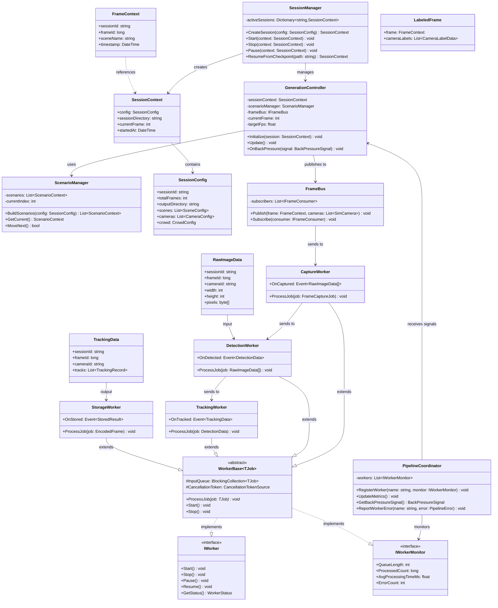

CCTV Synthetic Data Generation Engine

---

> **문서 버전:** v1.1 (2025-02-14)  
> **변경 이력:**  
> - v1.1 (2025-02-14): 데이터 모델/Worker 설명 정리, 버전 섹션 추가  
> - v1.0 (2024-12-01): 초기 작성

## 1. 문서 목적

본 문서는 System Architecture v2를 기반으로  
CCTV Synthetic Data Generation Engine의 **클래스 구조, 책임, 주요 메서드, 관계**를 정의한다.

- 네임스페이스 단위로 클래스 그룹을 정의한다.
- 각 클래스는 책임(Single Responsibility)에 따라 설계한다.
- 스레드/라이프사이클 제약(Unity Main Thread vs Worker Thread)을 명시한다.
- 필드/메서드는 “구현 가이드” 수준까지만 정의한다.

---

## 2. 네임스페이스 개요

- CCTVSim.Application
- CCTVSim.Orchestration
- CCTVSim.Simulation
- CCTVSim.DataPipeline
- CCTVSim.DataModel
- CCTVSim.Services

### 클래스 다이어그램



---

## 3. CCTVSim.Application

### 3.1 GenerationCommand

역할:  
- CLI/UI에서 전달된 실행 명령을 받아 세션을 시작/중단/재시작하는 엔트리 포인트.

주요 책임:
- 인자 파싱 (config 경로, 세션 옵션 등)
- ConfigurationLoader 호출
- SessionManager에 세션 시작/종료 요청
- ProgressReporter와 연결

주요 메서드(예시):
- Run(string[] args)
- StartSession(string configPath)
- StopSession()
- ResumeSession(string sessionId)

관계:
- ConfigurationLoader, SessionManager, ProgressReporter 사용.

---

### 3.2 ConfigurationLoader

역할:  
- Config 파일을 읽고, 유효성 검증 후 SessionConfig 객체 생성.

주요 책임:
- JSON/YAML 등 Config 파일 파싱
- 필수 필드 존재 여부, 값 범위 검증
- 기본값 채우기

주요 메서드:
- `SessionConfig Load(string path)`
- `bool Validate(SessionConfig config, out List<string> errors)`

관계:
- SessionConfig (DataModel) 생성.
- GenerationCommand에서 사용.

---

### 3.3 ProgressReporter

역할:  
- 시스템 내부의 진행률/상태/로그를 UI/CLI 또는 로그로 출력.

주요 책임:
- 현재 frame / 총 frame
- FPS, 예상 종료 시간
- 오류/경고 메시지 출력
- Validation/Stats 결과 요약 표시

주요 메서드:
- void UpdateProgress(ProgressInfo info)
- void ReportWarning(string message)
- void ReportError(string message)
- void ReportSummary(SessionSummary summary)

관계:
- PipelineCoordinator, ValidationService, StatsService에서 ProgressInfo/요약 전달.

---

## 4. CCTVSim.Orchestration

### 4.1 SessionManager

역할:  
- 세션 생명주기(Lifecycle) 관리.

주요 책임:
- SessionContext 생성 및 초기화
- 출력 디렉토리 생성
- Checkpoint 파일 관리 (Phase 2+)
- 세션 상태 관리 (Running/Paused/Stopped/Error)

주요 메서드:
- SessionContext CreateSession(SessionConfig config)
- void Start(SessionContext context)
- void Stop(SessionContext context)
- void Pause(SessionContext context)
- SessionContext ResumeFromCheckpoint(string checkpointPath)

필드(예시):
- Dictionary<string, SessionContext> activeSessions

관계:
- GenerationController, PipelineCoordinator, Validation/Stats/Manifest 호출.

---

### 4.2 ScenarioManager

역할:  
- SessionConfig를 바탕으로 Scenario 시퀀스 정의 및 순회.

주요 책임:
- Scene + Camera + Crowd + Randomization 조합으로 ScenarioContext 리스트 생성
- ScenarioContext iterator 제공
- 각 Scenario의 프레임 범위 관리

주요 메서드:
- `List<ScenarioContext> BuildScenarios(SessionConfig config)`
- `ScenarioContext GetCurrent()`
- `bool MoveNext()`

관계:
- EnvironmentCoordinator, GenerationController와 협력.

---

### 4.3 EnvironmentCoordinator

역할:  
- Unity Scene Pool 관리 및 활성 Scene 전환.

주요 책임:
- 초기 Scene 로드 (Additive)
- Scene 활성화/비활성화
- Scene 전환시 EnvironmentService/CameraService/CrowdService 재설정 트리거

주요 메서드:
- void Initialize(ScenePoolConfig poolConfig)
- void ActivateScene(string sceneName)
- string GetActiveScene()

관계:
- SimulationLayer(EnvironmentService, CameraService, CrowdService)와 직접 상호작용.

---

### 4.4 GenerationController

역할:  
- Unity 메인 스레드에서 프레임 루프를 실행하는 핵심 컨트롤러.

주요 책임:
- 각 프레임마다 SimulationLayer 업데이트 호출
- FrameContext 생성
- FrameBus에 FrameContext push
- PipelineCoordinator의 back-pressure 신호 반영 (FPS 조정, frame skip 등)

주요 메서드:
- void Initialize(SessionContext session, ScenarioManager scenarioManager)
- void Update()  // Unity Update에서 호출
- void OnBackPressure(BackPressureSignal signal)

필드(예시):
- int currentFrame
- float targetFps
- SessionContext sessionContext
- ScenarioManager scenarioManager

스레드 제약:
- Unity Main Thread에서만 실행.

---

### 4.5 PipelineCoordinator

역할:  
- DataPipeline 전체 상태 모니터링 및 back-pressure 관리.

주요 책임:
- 각 WorkerQueue 길이/FPS 모니터링
- frame 생성 속도 제어 (GenerationController에 신호)
- 에러 집계 및 세션 중단/계속 결정
- ProgressInfo 계산 및 ProgressReporter로 전달

주요 메서드:
- void RegisterWorker(string name, IWorkerMonitor monitor)
- void UpdateMetrics()
- BackPressureSignal GetBackPressureSignal()
- void ReportWorkerError(string workerName, PipelineError error)

관계:
- GenerationController, ProgressReporter, 각 Worker와 연결.

---

## 5. CCTVSim.Simulation

모든 클래스는 **Unity Main Thread**에서만 동작해야 한다.

### 5.1 EnvironmentService

역할:  
- 활성 Scene의 환경 상태 관리.

주요 책임:
- Scene 로딩/언로딩
- Scene 메타데이터 제공 (Scene 이름, NavMesh 영역 등)

주요 메서드:
- void LoadScene(string sceneName)
- void UnloadScene(string sceneName)
- SceneMeta GetSceneMeta()

관계:
- EnvironmentCoordinator에서 호출.

---

### 5.2 CameraService

역할:  
- 시뮬레이션 내 카메라 객체 관리.

주요 책임:
- 카메라 생성/제거
- Config 기반 카메라 설정 적용 (위치/FOV/해상도)
- 활성 카메라 목록 제공
- camera_id 할당/유지

주요 메서드:
- `void InitializeCameras(List<CameraConfig> configs)`
- `List<SimCamera> GetActiveCameras()`
- CameraMeta GetCameraMeta(string cameraId)

자료구조 예시:
- SimCamera (Unity Camera 참조 + cameraId + meta)

관계:
- CaptureWorker가 CameraService에서 카메라 메타/렌더 타겟 참조.

---

### 5.3 CrowdService

역할:  
- 인물(Agent) 생성/삭제/위치 관리.

주요 책임:
- 인원 수 관리 (최소/최대)
- Agent 생성/Pool 관리
- Agent의 위치/상태 업데이트 (BehaviorSystem과 협력)

주요 메서드:
- void Initialize(CrowdConfig config)
- void Update(float deltaTime)
- `List<PersonAgent> GetAgents()`

---

### 5.4 BehaviorSystem

역할:  
- 각 Agent의 행동 상태 업데이트.

주요 책임:
- 행동 preset 로직 (Walk, Idle, GroupMove 등)
- Phase별로 행동 모듈 확장
- CrowdService의 Agent 리스트와 협력

주요 메서드:
- void Initialize(BehaviorConfig config)
- `void UpdateAgents(List<PersonAgent> agents, float deltaTime)`

---

### 5.5 TimeWeatherService

역할:  
- 시간/조명/날씨 상태 관리.

주요 책임:
- 시간대(주간/야간) 설정
- 밝기/색온도/환경 조명 변화
- 비/안개 등의 날씨 효과 반영

주요 메서드:
- void ApplyConfig(TimeWeatherConfig config)
- void Update(float deltaTime)

관계:
- Domain Randomization이 적용된 파라미터를 반영.

---

### 5.6 VisibilityService (Phase 2+)

역할:  
- 각 Agent와 카메라 간의 기본 가시성 정보 수집.

주요 책임:
- Agent가 카메라 시야 내에 있는지 여부 계산
- Occlusion/Visibility Worker가 사용할 수 있는 meta 제공

주요 메서드:
- `void Update(List<PersonAgent> agents, List<SimCamera> cameras)`
- `List<VisibilityMeta> GetVisibilityMeta(FrameContext frame)`

주의:
- 정확한 pixel-level ratio 계산은 Pipeline 쪽에서 수행 가능.

---

## 6. CCTVSim.DataModel

주요 데이터 모델 클래스 정의.

### 6.1 SessionConfig

필드(예시):
- string sessionId
- string outputDirectory
-` List<SceneConfig> scenes`
- `List<CameraConfig> cameras`
- CrowdConfig crowd
- TimeWeatherConfig timeWeather
- OutputConfig output
- RandomizationConfig randomization
- int totalFrames

### 6.2 SessionContext

- SessionConfig config
- string sessionDirectory
- int currentFrame
- DateTime startedAt

### 6.3 ScenarioContext

- string sceneName
- int startFrame
- int endFrame
- SceneConfig sceneConfig (조명/랜덤화 설정 포함)

---

### 6.4 FrameContext

필드:
- string sessionId
- long frameId
- string sceneName
- DateTime timestamp
- int frameIndexInSession

---

### 6.5 RawImageData

필드:
- string sessionId
- long frameId
- string cameraId
- int width
- int height
- byte[] pixels  (RGB or BGR)
- CameraMeta cameraMeta (옵션)

---

### 6.6 DetectionData

필드:
- string sessionId
- long frameId
- string cameraId
- `List<DetectionRecord> detections`

DetectionRecord:
- int detectionId
- int globalPersonId (optional at this 단계)
- Rect bbox (x, y, w, h)
- float confidence

---

### 6.7 TrackingData

필드:
- string sessionId
- long frameId
- string cameraId
- `List<TrackingRecord> tracks`

TrackingRecord:
- int trackId
- int globalPersonId
- Rect bbox
- float confidence

---

### 6.8 ReIDExportResult (Phase 2+)

역할:
- ReID crop export 결과를 나타내는 데이터 모델

필드:
- string sessionId
- long frameId
- string cameraId
- int globalPersonId
- string exportedFilePath
- bool success

---

### 6.9 OcclusionData (Phase 2+)

필드:
- string sessionId
- long frameId
- string cameraId
- int globalPersonId
- float occlusionRatio  (0~1)
- float visibilityRatio (0~1)

---

### 6.10 CameraLabelData

필드:
- string cameraId
- `List<TrackingRecord> tracking`
- `List<OcclusionData> occlusion (optional)`

---

### 6.11 LabeledFrame

필드:
- FrameContext frame
- `List<CameraLabelData> cameraLabels`

---

### 6.12 EncodedFrame

필드:
- FrameContext frame
- `List<EncodedImage> images`
-  `List<EncodedLabel> labels

EncodedImage:
- string cameraId
- string filePath (또는 파일명)
- byte[] imageBytes

EncodedLabel:
- string cameraId
- string format (JSON/YOLO/COCO)
- string filePath
- string content

---

## 7. CCTVSim.DataPipeline

모든 Worker는 Worker Thread에서 동작하며, Unity API 사용 금지.

각 Worker는 공통 인터페이스를 따른다:

- IWorker  
  - void Start()  
  - void Stop()  

- IWorkerMonitor  
  - int GetQueueLength()  
  - float GetAvgProcessingTime()  
  - long GetProcessedCount()

---

### 7.1 FrameBus

역할:
- FrameContext + ActiveCameras를 Pipeline으로 전달하는 허브.

주요 메서드:
- `void Publish(FrameContext frame, List<SimCamera> cameras)`
- void Subscribe(IFrameConsumer consumer)

스레드:
- Publish: Main Thread
- Consume: Worker Thread

---

### 7.2 CaptureWorker

입력:
- FrameContext + camera list (FrameBus 통해 전달)

출력:
- RawImageData[]

주요 메서드:
- `void Enqueue(FrameContext frame, List<CameraMeta> cameras)`
- event OnCaptured(RawImageData[] images)

---

### 7.3 DetectionWorker

입력:
- RawImageData[]

출력:
- DetectionData

주요 메서드:
- void Enqueue(RawImageData[] images)
- event OnDetected(DetectionData result)

---

### 7.4 TrackingWorker

입력:
- DetectionData

출력:
- TrackingData

주요 메서드:
- void Enqueue(DetectionData detections)
- event OnTracked(TrackingData result)

---

### 7.5 ReIDExportWorker (Phase 2+)

역할:
- ReID 학습용 person crop dataset을 export하는 Worker

입력:
- RawImageData + TrackingData

출력:
- ReIDExportResult (저장된 crop 파일 정보)

주요 메서드:
- void Enqueue(RawImageData image, TrackingData tracking)
- event OnCropExported(ReIDExportResult result)

Export 구조:
```
/output/reid_dataset/
  person_0001/
    cam01_frame_000123.jpg
    cam02_frame_000456.jpg
  person_0002/
    ...
```

---

### 7.6 OcclusionWorker (Phase 2+)

입력:
- VisibilityMeta(시뮬레이션에서 온 기본 정보) + TrackingData

출력:
- OcclusionData 리스트

주요 메서드:
- void Enqueue(VisibilityMeta meta, TrackingData tracking)
- `event OnOcclusionComputed(List<OcclusionData> result)`

---

### 7.7 LabelAssembler

입력:
- TrackingData
- OcclusionData (optional)

출력:
- LabeledFrame

주요 메서드:
- `void Enqueue(TrackingData tracking, List<OcclusionData> occ)`
- event OnLabeled(LabeledFrame frame)

---

### 7.8 EncodeWorker

입력:
- LabeledFrame + RawImageData

출력:
- EncodedFrame

주요 메서드:
- void Enqueue(LabeledFrame frame, RawImageData[] images)
- event OnEncoded(EncodedFrame encoded)

---

### 7.9 StorageWorker

입력:
- EncodedFrame

출력:
- 파일 시스템에 실제 저장

주요 메서드:
- void Enqueue(EncodedFrame encoded)
- event OnStored(StoredResult result)

---

## 8. CCTVSim.Services

### 8.1 ValidationService

역할:
- 세션 종료 후 파일/라벨 무결성 검증.

주요 메서드:
- ValidationReport Run(SessionContext session)

ValidationReport 필드:
- int totalFrames
- int missingFrames
- int corruptedImages
- int invalidLabels
- `List<string> errorMessages`

---

### 8.2 StatsService

역할:
- 세션 전체 통계 계산.

주요 메서드:
- DatasetStatistics Run(SessionContext session)

DatasetStatistics 필드:
- long totalFrames
- long totalDetections
- int uniquePersons
- Histogram occlusionHistogram
- Histogram bboxSizeHistogram

---

### 8.3 ManifestService

역할:
- manifest.json 생성.

주요 메서드:
- Manifest Build(SessionContext session, DatasetStatistics stats, ValidationReport validation)
- void Save(Manifest manifest, string path)

필드(Manifest):
- version
- session info
- environment info
- cameras
- frames stats
- labels info
- quality info
