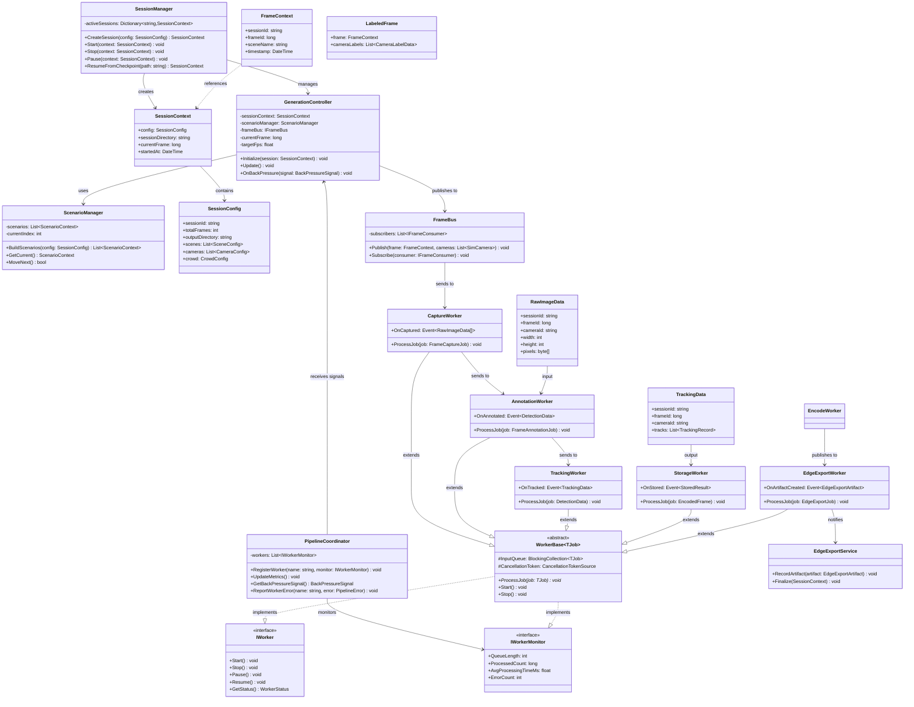

## 1. 문서 목적

본 문서는 System Architecture v2를 기반으로  
Forge의 **클래스 구조, 책임, 주요 메서드, 관계**를 정의한다.

- 네임스페이스 단위로 클래스 그룹을 정의한다.
- 각 클래스는 책임(Single Responsibility)에 따라 설계한다.
- 스레드/라이프사이클 제약(Unity Main Thread vs Worker Thread)을 명시한다.
- 필드/메서드는 “구현 가이드” 수준까지만 정의한다.

---

## 2. 네임스페이스 개요

- Forge.Application
- Forge.Orchestration
- Forge.Simulation
- Forge.DataPipeline
- Forge.DataModel
- Forge.Services

### 클래스 다이어그램



---

## 3. Forge.Application

### 3.1 GenerationCommand

역할:  
- CLI/UI에서 전달된 실행 명령을 받아 세션을 시작/중단/재시작하는 엔트리 포인트.

주요 책임:
- 인자 파싱 (config 경로, 세션 옵션 등)
- ConfigurationLoader 호출
- SessionManager에 세션 시작/종료 요청
- ProgressReporter와 연결

주요 메서드(예시):
- Run(string[] args)
- StartSession(string configPath)
- StopSession()
- ResumeSession(string sessionId)

관계:
- ConfigurationLoader, SessionManager, ProgressReporter 사용.

---

### 3.2 ConfigurationLoader

역할:  
- Config 파일을 읽고, 유효성 검증 후 SessionConfig 객체 생성.

주요 책임:
- JSON/YAML 등 Config 파일 파싱
- 필수 필드 존재 여부, 값 범위 검증
- 기본값 채우기
- 민감 필드(API Key/Token/사용자 경로) 필터링/마스킹 후 `config_json` 등으로 저장되도록 Sanitizer 호출

주요 메서드:
- `SessionConfig Load(string path)`
- `bool Validate(SessionConfig config, out List<string> errors)`

관계:
- SessionConfig (DataModel) 생성.
- GenerationCommand에서 사용.

#### 3.2.1 ConfigSanitizer

역할:
- Config 직렬화/저장/로그 이전에 민감 정보를 제거 또는 마스킹한다.

주요 메서드:
- `SessionConfig Sanitize(SessionConfig rawConfig)`
- `SanitizedConfigSnapshot ToSnapshot(SessionConfig config)` // 저장/DB 기록용

책임/규칙:
- API Key/Bearer Token → `***` 마스킹
- 사용자 홈 경로 → `/home/***` 등 일반화
- 라이선스/비밀키 파일 경로 → 경로 저장 금지, 참조 ID만 유지
- `docs/design/10_Security_and_Compliance.md` 필터링 표를 단일 소스로 사용
- CLI/서버 구현 가이드에 Config 직렬화/저장/로그 경로마다 Sanitizer 호출을 필수 단계로 명시 (누락 시 테스트 실패 유도)

#### 3.2.2 ConfigSchemaRegistry (Cross-cutting)

역할:
- JSON Schema / YAML 스키마 / CLI validation 규칙을 **단일 소스**로 관리하고, `ConfigurationLoader`, SessionManager, Simulation/Data Pipeline 각 계층이 동일 정의를 사용하도록 한다.

주요 책임:
- `forge.schema.json` 로딩 및 버전 태깅 (`schemaVersion`, `minimumEngineVersion`)
- `IEnumerable<SchemaDiff> Diff(string currentVersion, string targetVersion)` 제공해 Config 변경 알림/마이그레이션 표시
- `SchemaValidationResult Validate(JObject config)`를 통해 Architecture 문서에서 요구한 필수 필드/enum 범위를 일관되게 검증
- `ConfigSanitizer`와 공유하는 필드 메타데이터(API Key/Path 타입 여부) 노출

주요 메서드:
```csharp
public interface IConfigSchemaRegistry {
    string CurrentVersion { get; }
    SchemaValidationResult Validate(JsonNode configNode);
    IReadOnlyList<SchemaDiff> Diff(string baseVersion, string targetVersion);
    SchemaMetadata GetFieldMetadata(string path);
}
```

운영/문서 연계:
- `docs/design/2_System_Architecture.md` §3.5 Cross-cutting Services와 동일 컴포넌트.
- CLI(`forge validate-config`)와 서버 부팅 시 사전 검증에 사용, 실패 시 상세 사유/문서 링크 출력.
- Schema 파일 위치: `docs/config/schema/forge.schema.json` (Git 관리) → build 시 코드로 embed.
- Test Strategy 문서의 Config 회귀 테스트가 이 Registry를 직접 호출해 일관성 검증.

---

### 3.3 ProgressReporter

역할:  
- 시스템 내부의 진행률/상태/로그를 UI/CLI 또는 로그로 출력.

주요 책임:
- 현재 frame / 총 frame
- FPS, 예상 종료 시간
- 오류/경고 메시지 출력
- Validation/Stats 결과 요약 표시

주요 메서드:
- void UpdateProgress(ProgressInfo info)
- void ReportWarning(string message)
- void ReportError(string message)
- void ReportSummary(SessionSummary summary)

관계:
- PipelineCoordinator, ValidationService, StatsService에서 ProgressInfo/요약 전달.

---

## 4. Forge.Orchestration

### 4.0 HttpAuthMiddleware (API 모드)

역할:
- Orchestration HTTP 서버(분산/remote 모드)의 모든 엔드포인트에 인증/허용 호스트 정책을 적용하며 `/status`도 동일하게 보호한다.

주요 책임:
- API Key / Bearer Token 검증
- mTLS 인증서 검증(옵션)
- `allowedHosts`/바인딩 IP 확인
- 인증 실패 시 401/403 반환, 상세 원인 로그는 민감 정보 제거 후 기록

구현 체크리스트:
- `/status` 포함 전 엔드포인트에 미들웨어가 실행되는지 통합 테스트로 보증
- 상태 응답은 요약 지표만 포함하는지 계약 테스트로 검증
- 필터링 규칙은 `ConfigSanitizer`/보안 가이드와 동일 소스 사용
- CLI/서버 구현 가이드에 미들웨어 등록을 필수 단계로 명시 (누락 시 빌드/테스트 실패하도록 체크)

### 4.1 SessionManager

역할:
- 세션 생명주기(Lifecycle) 관리 **만** 담당 (책임 분리)

주요 책임:
- SessionContext 생성 및 초기화
- 출력 디렉토리 생성
- 세션 상태 관리 (Running/Paused/Stopped/Error)

주요 메서드:
- SessionContext CreateSession(SessionConfig config)
- void Start(SessionContext context)
- void Stop(SessionContext context)
- void Pause(SessionContext context)

필드(예시):
- Dictionary<string, SessionContext> activeSessions
- ICheckpointManager checkpointManager
- ISessionFinalizationService finalizationService

관계:
- CheckpointManager, SessionFinalizationService에 위임
- GenerationController, PipelineCoordinator와 협력

---

### 4.1-A CheckpointManager (신규 - 책임 분리)

역할:
- Checkpoint 저장/복구 전담

주요 책임:
- Checkpoint 파일 저장
- Checkpoint 복구
- 오래된 Checkpoint 정리

주요 메서드:
```csharp
interface ICheckpointManager {
    void SaveCheckpoint(SessionContext session, long currentFrame);
    SessionContext LoadCheckpoint(string checkpointPath);
    void CleanupOldCheckpoints(string sessionDirectory, int keepCount = 3);
}

#### 4.1-A-1 Checkpoint 서브 컴포넌트

복잡도를 낮추기 위해 CheckpointManager는 다음 세 가지 협력 객체로 나뉜다.

| 컴포넌트 | 책임 | 주요 입력/출력 |
|----------|------|----------------|
| `CheckpointIntegrityValidator` | Checksum/엔진 버전/스키마 버전/파일 구조 검증. ConfigSchemaRegistry 메타데이터와 연동하여 Config 필드 상태를 확인 | `Checkpoint` DTO → `IntegrityReport` |
| `CheckpointStateRestorer` | Scenario/Pipeline/Tracking/Crowd/Stats 복원 로직을 캡슐화. 각 서브시스템의 `Restore(StateSnapshot)` 호출 순서를 보장 | `CheckpointState` → 성공 여부 |
| `CheckpointMigrationService` (Phase 2+) | 과거 버전 체크포인트를 최신 포맷으로 변환. 허용 가능한 버전 범위/필드 변환 규칙 관리 | (checkpoint, targetVersion) → bool (migration 수행 여부) |

구현 시퀀스:
```
SaveCheckpoint → IntegrityValidator.ComputeChecksum()
LoadCheckpoint → IntegrityValidator.Validate()
             → if (migrationNeeded) MigrationService.TryMigrate()
             → StateRestorer.RestoreAll()
```

이 구조를 통해 CheckpointManager 본체는 orchestration 로직과 파일 입출력에 집중하고, 검증/복원/마이그레이션 로직은 개별 클래스로 테스트가 가능하도록 한다. Phase 2에서 MigrationService가 도입되지 않았더라도 인터페이스/DI 콤포넌트를 미리 정의해둬 기술 부채를 최소화한다.

class CheckpointManager : ICheckpointManager {
    private const string CHECKPOINT_VERSION = "1.0.0";
    private const string ENGINE_VERSION = "0.1.0"; // 엔진 버전 추가

    public void SaveCheckpoint(SessionContext session, long currentFrame) {
        var checkpoint = new Checkpoint {
            CheckpointVersion = CHECKPOINT_VERSION,
            EngineVersion = ENGINE_VERSION,
            CreatedAt = DateTime.UtcNow,
            SessionId = session.Config.SessionId,
            CurrentFrame = currentFrame,  // long
            SessionContext = SerializeSessionContext(session),
            ScenarioState = _scenarioManager.GetCurrentState(),
            PipelineState = _pipelineCoordinator.GetState(),
            TrackingState = _trackingWorker.GetState(),
            CrowdState = _crowdService.GetState(),
            Statistics = _statsService.GetCurrentStats(),

            // 검증용 체크섬 추가
            Checksum = null // 계산 후 설정
        };

        // 체크섬 계산 (변조 방지)
        checkpoint.Checksum = ComputeChecksum(checkpoint);

        var tempPath = Path.Combine(_checkpointDir, $"checkpoint_temp_{currentFrame}.json");
        var finalPath = Path.Combine(_checkpointDir, $"checkpoint_frame_{currentFrame:D6}.json");

        File.WriteAllText(tempPath, JsonSerializer.Serialize(checkpoint, _jsonOptions));
        File.Move(tempPath, finalPath, overwrite: true);

        UpdateLatestLink(finalPath);
        CleanupOldCheckpoints(session.SessionDirectory);

        _logger.LogInformation($"Checkpoint saved: frame {currentFrame}");
    }

    public SessionContext LoadCheckpoint(string checkpointPath) {
        _logger.LogInformation($"Loading checkpoint from {checkpointPath}");

        // 1. 파일 존재 확인
        if (!File.Exists(checkpointPath)) {
            throw new CheckpointNotFoundException($"Checkpoint not found: {checkpointPath}");
        }

        // 2. JSON 파싱
        Checkpoint checkpoint;
        try {
            var json = File.ReadAllText(checkpointPath);
            checkpoint = JsonSerializer.Deserialize<Checkpoint>(json, _jsonOptions);
        }
        catch (Exception ex) {
            throw new CheckpointCorruptedException($"Failed to parse checkpoint: {ex.Message}", ex);
        }

        // 3. 버전 호환성 검증
        ValidateVersion(checkpoint);

        // 4. 체크섬 검증
        ValidateChecksum(checkpoint);

        // 5. 상태 정합성 검증
        ValidateStateConsistency(checkpoint);

        // 6. 상태 복구
        RestoreStates(checkpoint);

        _logger.LogInformation($"Checkpoint loaded successfully: frame {checkpoint.CurrentFrame}");

        return checkpoint.SessionContext;
    }

    private void ValidateVersion(Checkpoint checkpoint) {
        // Checkpoint 포맷 버전 검증
        if (checkpoint.CheckpointVersion != CHECKPOINT_VERSION) {
            // 마이그레이션 시도
            if (TryMigrateCheckpoint(checkpoint)) {
                _logger.LogWarning($"Checkpoint migrated from v{checkpoint.CheckpointVersion} to v{CHECKPOINT_VERSION}");
            } else {
                throw new CheckpointVersionMismatchException(
                    $"Incompatible checkpoint version: {checkpoint.CheckpointVersion} (expected {CHECKPOINT_VERSION})");
            }
        }

        // 엔진 버전 호환성 검증
        if (!IsEngineVersionCompatible(checkpoint.EngineVersion, ENGINE_VERSION)) {
            throw new EngineVersionMismatchException(
                $"Checkpoint created with engine v{checkpoint.EngineVersion}, current engine v{ENGINE_VERSION}");
        }
    }

    private void ValidateChecksum(Checkpoint checkpoint) {
        var storedChecksum = checkpoint.Checksum;
        checkpoint.Checksum = null; // 체크섬 계산 시 제외

        var computedChecksum = ComputeChecksum(checkpoint);
        checkpoint.Checksum = storedChecksum; // 복원

        if (storedChecksum != computedChecksum) {
            throw new CheckpointCorruptedException(
                $"Checksum mismatch: stored={storedChecksum}, computed={computedChecksum}");
        }
    }

    private void ValidateStateConsistency(Checkpoint checkpoint) {
        var errors = new List<string>();

        // 1. Frame ID 일관성
        if (checkpoint.CurrentFrame < 0 || checkpoint.CurrentFrame > checkpoint.SessionContext.Config.TotalFrames) {
            errors.Add($"Invalid frame ID: {checkpoint.CurrentFrame}");
        }

        // 2. Tracking State 검증
        if (checkpoint.TrackingState != null) {
            foreach (var (cameraId, tracks) in checkpoint.TrackingState.TracksByCameraId) {
                if (tracks.Any(t => t.LastSeen > checkpoint.CurrentFrame)) {
                    errors.Add($"Invalid tracking state for camera {cameraId}: track seen in future frame");
                }
            }
        }

        // 3. Crowd State 검증
        if (checkpoint.CrowdState != null) {
            var personCount = checkpoint.CrowdState.ActivePersons.Count;
            var config = checkpoint.SessionContext.Config.Crowd;

            if (personCount < config.MinPersons || personCount > config.MaxPersons) {
                errors.Add($"Invalid crowd size: {personCount} (expected {config.MinPersons}-{config.MaxPersons})");
            }

            // Global Person ID 중복 검증
            var personIds = checkpoint.CrowdState.ActivePersons.Select(p => p.GlobalPersonId).ToList();
            var duplicates = personIds.GroupBy(id => id).Where(g => g.Count() > 1).Select(g => g.Key).ToList();

            if (duplicates.Any()) {
                errors.Add($"Duplicate Global Person IDs: {string.Join(", ", duplicates)}");
            }
        }

        // 4. Pipeline State 검증
        if (checkpoint.PipelineState != null) {
            var totalPendingFrames = checkpoint.PipelineState.QueueLengths.Values.Sum();
            if (totalPendingFrames > 10000) { // 비정상적으로 많은 대기 작업
                errors.Add($"Suspicious pipeline state: {totalPendingFrames} pending frames");
            }
        }

        if (errors.Any()) {
            throw new CheckpointStateInconsistentException(
                $"State consistency validation failed:\n{string.Join("\n", errors)}");
        }
    }

    private void RestoreStates(Checkpoint checkpoint) {
        // 1. Scenario 복구
        _scenarioManager.RestoreState(checkpoint.ScenarioState);

        // 2. Pipeline 복구
        _pipelineCoordinator.RestoreState(checkpoint.PipelineState);

        // 3. Tracking 복구
        _trackingWorker.RestoreState(checkpoint.TrackingState);

        // 4. Crowd 복구 (Global Person ID 포함)
        _crowdService.RestoreState(checkpoint.CrowdState);

        _logger.LogInfo("All states restored successfully");
    }

    private bool IsEngineVersionCompatible(string checkpointVersion, string currentVersion) {
        // Semantic versioning: Major.Minor.Patch
        var checkpointVer = Version.Parse(checkpointVersion);
        var currentVer = Version.Parse(currentVersion);

        // Major 버전 불일치 → 불가
        if (checkpointVer.Major != currentVer.Major) {
            return false;
        }

        // Minor 버전: 하위 호환 (checkpoint가 낮으면 OK)
        return checkpointVer.Minor <= currentVer.Minor;
    }

    private bool TryMigrateCheckpoint(Checkpoint checkpoint) {
        // 버전별 마이그레이션 로직
        // 예: v0.9.0 → v1.0.0
        // (Phase 2+ 구현)
        return false;
    }

    private string ComputeChecksum(Checkpoint checkpoint) {
        // SHA256 체크섬 계산
        var json = JsonSerializer.Serialize(checkpoint, _jsonOptions);
        using var sha256 = SHA256.Create();
        var hash = sha256.ComputeHash(Encoding.UTF8.GetBytes(json));
        return Convert.ToBase64String(hash);
    }
}

// 예외 클래스
public class CheckpointNotFoundException : Exception {
    public CheckpointNotFoundException(string message) : base(message) { }
}

public class CheckpointCorruptedException : Exception {
    public CheckpointCorruptedException(string message, Exception inner = null) : base(message, inner) { }
}

public class CheckpointVersionMismatchException : Exception {
    public CheckpointVersionMismatchException(string message) : base(message) { }
}

public class EngineVersionMismatchException : Exception {
    public EngineVersionMismatchException(string message) : base(message) { }
}

public class CheckpointStateInconsistentException : Exception {
    public CheckpointStateInconsistentException(string message) : base(message) { }
}

// Checkpoint 데이터 모델
public class Checkpoint {
    public string CheckpointVersion { get; set; }
    public string EngineVersion { get; set; }
    public DateTime CreatedAt { get; set; }
    public string SessionId { get; set; }
    public long CurrentFrame { get; set; }  // long 통일

    public SessionContext SessionContext { get; set; }
    public ScenarioState ScenarioState { get; set; }
    public PipelineState PipelineState { get; set; }
    public TrackingState TrackingState { get; set; }
    public CrowdState CrowdState { get; set; }
    public DatasetStatistics Statistics { get; set; }

    public string Checksum { get; set; } // 검증용
}

public class CrowdState {
    public List<PersonSnapshot> ActivePersons { get; set; }
    public int NextGlobalPersonId { get; set; }
}

public class PersonSnapshot {
    public int GlobalPersonId { get; set; }
    public Vector3 Position { get; set; }
    public string Behavior { get; set; }
    public long SpawnedAtFrame { get; set; }
}

public class TrackingState {
    public Dictionary<string, List<TrackSnapshot>> TracksByCameraId { get; set; }
}

public class TrackSnapshot {
    public int TrackId { get; set; }
    public int GlobalPersonId { get; set; }
    public long FirstSeen { get; set; }
    public long LastSeen { get; set; }
}

public class PipelineState {
    public Dictionary<string, int> QueueLengths { get; set; } // Worker별 큐 길이
    public long LastProcessedFrame { get; set; }
}
```

**복구 시나리오 예시:**

1. **정상 복구**:
   - 버전 일치, 체크섬 유효, 상태 정합성 OK
   - → 모든 Worker 상태 복원, 세션 재개

2. **버전 불일치 (Minor)**:
   - Checkpoint v1.0.0, Engine v1.1.0
   - → 호환 가능, 경고 로그 출력

3. **버전 불일치 (Major)**:
   - Checkpoint v1.0.0, Engine v2.0.0
   - → 복구 실패, 사용자 알림

4. **체크섬 오류**:
   - 파일 변조 감지
   - → 복구 거부, 다른 Checkpoint 시도

5. **상태 불일치**:
   - Duplicate Global Person ID 발견
   - → 복구 거부 (데이터 무결성 손상)

---

### 4.1-B SessionFinalizationService (신규 - 책임 분리)

역할:
- 세션 종료 시 Validation/Stats/Manifest 생성 전담

주요 책임:
- Validation 실행
- Statistics 생성
- Manifest 빌드
- 결과 리포팅

주요 메서드:
```csharp
interface ISessionFinalizationService {
    Task<FinalizationResult> Finalize(SessionContext session);
}

class SessionFinalizationService : ISessionFinalizationService {
    private readonly IValidationService _validation;
    private readonly IStatsService _stats;
    private readonly IManifestService _manifest;

    public async Task<FinalizationResult> Finalize(SessionContext session) {
        _logger.LogInformation($"Finalizing session {session.Config.SessionId}");

        // 1. Validation
        var validationReport = await _validation.RunAsync(session);

        // 2. Statistics
        var statistics = await _stats.GenerateAsync(session);

        // 3. Manifest
        var manifest = _manifest.Build(session, statistics, validationReport);
        await _manifest.SaveAsync(manifest, session.SessionDirectory);

        // 4. 결과 요약
        var result = new FinalizationResult {
            ValidationReport = validationReport,
            Statistics = statistics,
            ManifestPath = Path.Combine(session.SessionDirectory, "meta", "manifest.json"),
            Success = validationReport.IsValid
        };

        _logger.LogInformation($"Session finalization complete: {result.Success}");
        return result;
    }
}
```

---

### 4.2 ScenarioManager

역할:  
- SessionConfig를 바탕으로 Scenario 시퀀스 정의 및 순회.

주요 책임:
- Scene + Camera + Crowd + Randomization 조합으로 ScenarioContext 리스트 생성
- ScenarioContext iterator 제공
- 각 Scenario의 프레임 범위 관리

주요 메서드:
- `List<ScenarioContext> BuildScenarios(SessionConfig config)`
- `ScenarioContext GetCurrent()`
- `bool MoveNext()`

관계:
- EnvironmentCoordinator, GenerationController와 협력.

---

### 4.3 EnvironmentCoordinator

역할:  
- Unity Scene Pool 관리 및 활성 Scene 전환.

주요 책임:
- 초기 Scene 로드 (Additive)
- Scene 활성화/비활성화
- Scene 전환시 EnvironmentService/CameraService/CrowdService 재설정 트리거

주요 메서드:
- void Initialize(ScenePoolConfig poolConfig)
- void ActivateScene(string sceneName)
- string GetActiveScene()

관계:
- SimulationLayer(EnvironmentService, CameraService, CrowdService)와 직접 상호작용.

---

### 4.3-A SceneTransitionService

역할:
- ScenarioManager가 다음 Scenario로 이동할 때 Scene/Crowd 전환을 전담.

주요 책임:
- Scene 활성화/비활성화, NavMesh 전환
- Crowd/PersonState 마이그레이션 (Global ID 유지)
- 시간/조명/랜덤화 파라미터 반영

주요 메서드:
- void TransitionTo(ScenarioContext scenario)

관계:
- ScenarioManager로부터 호출되고, EnvironmentCoordinator/CrowdService와 협력.

---

### 4.4 GenerationController

역할:  
- Unity 메인 스레드에서 프레임 루프를 실행하는 핵심 컨트롤러.

주요 책임:
- 각 프레임마다 SimulationLayer 업데이트 호출
- FrameContext 생성 (timestamp는 시뮬레이션 월드 시간 기준, 재현성은 frame_id 중심)
- FrameBus에 FrameContext push
- PipelineCoordinator의 back-pressure 신호 + IFrameRatePolicy 결과 반영 (FPS 조정, frame skip/일시정지 결정)
- Scene/Crowd 전환은 SceneTransitionService로 위임해 책임 최소화

주요 메서드:
- void Initialize(SessionContext session, ScenarioManager scenarioManager)
- void Update()  // Unity Update에서 호출
- void OnBackPressure(BackPressureSignal signal)

필드(예시):
- long currentFrame  // long 통일
- float targetFps
- SessionContext sessionContext
- ScenarioManager scenarioManager
- IFrameRatePolicy frameRatePolicy

스레드 제약:
- Unity Main Thread에서만 실행.

---

### 4.4-A FrameRatePolicy

역할:
- Back-pressure, 사용자 설정(quality-first/speed-first/balanced) 등을 종합해 프레임 생성/skip/일시정지를 결정하는 정책 객체.

주요 메서드:
- FrameGenerationDecision Decide(BackPressureLevel level, SessionConfig config, long currentFrame)

열거형:
- FrameGenerationDecision { Generate, Skip, Pause }

구현 지침:
- 정책을 교체 가능하게 하여 GenerationController의 조건문 복잡도를 줄인다.
- Config로 정책 선택 가능하도록 확장 (`frameRatePolicy: "quality-first"` 등).

---

### 4.4-B MultiSimSyncCoordinator (Phase 4+)

역할:
- Unity SimulationGateway와 Robotics Gateway(Isaac 등)를 동기화하고 FrameContext를 병합한다.

필드:
- `ISimulationGateway unityGateway`
- `IRoboticsGateway roboticsGateway`
- `SyncPolicy syncPolicy`

주요 메서드:
- `Task<FrameContext> StepAsync(long frameId, float deltaTime)` – 두 시뮬레이션 결과를 기다린 후 병합
- `void OnTimeout()` – syncPolicy.onTimeout 적용 (skip/abort)

관련 인터페이스:
```csharp
public interface IRoboticsGateway
{
    Task InitializeAsync(SessionConfig config);
    Task<RoboticsStepResult> StepAsync(long frameId, float deltaTime);
    Task ShutdownAsync();
    RoboticsStatus GetStatus();
}
```

병합 결과는 FrameBus로 전달되어 SensorExportWorker가 소비한다.

---

### 4.5 PipelineCoordinator

역할:  
- DataPipeline 전체 상태 모니터링 및 back-pressure 관리.

주요 책임:
- 각 WorkerQueue 길이/FPS 모니터링
- frame 생성 속도 제어 (GenerationController에 신호)
- 에러 집계 및 세션 중단/계속 결정
- ProgressInfo 계산 및 ProgressReporter로 전달

주요 메서드:
- void RegisterWorker(string name, IWorkerMonitor monitor)
- void UpdateMetrics()
- BackPressureSignal GetBackPressureSignal()
- void ReportWorkerError(string workerName, PipelineError error)

관계:
- GenerationController, ProgressReporter, 각 Worker와 연결.

---

### 4.6 ISimulationGateway

역할:
- Orchestration Layer가 Simulation Layer(또는 Mock)와 통신하기 위한 상위 추상화.

인터페이스:
```csharp
public interface ISimulationGateway
{
    Task InitializeAsync(SessionConfig config);
    Task<FrameGenerationResult> GenerateFrameAsync(int frameId);
    Task<SceneState> GetCurrentSceneStateAsync();
    IReadOnlyList<CameraMeta> GetActiveCameras();
    IReadOnlyList<CameraPose> GetCameraPoses(); // 이동형 카메라 pose 제공
    void Shutdown();
}
```

구현체:
- UnitySimulationGateway (InProcess, MonoBehaviour)
- HttpSimulationGateway (Remote/분산)
- MockSimulationGateway (테스트)

지침:
- Architecture 문서의 SimulationGateway 시그니처/보안 설정과 동일하게 유지한다.
- GenerationController는 `ISimulationGateway`만 알도록 하여 통신 방식 변경 시 영향 최소화.

---

## 5. Forge.Simulation

모든 클래스는 **Unity Main Thread**에서만 동작해야 한다.

### 5.1 EnvironmentService

역할:
- 활성 Scene의 환경 상태 관리.

주요 책임:
- Scene 로딩/언로딩
- Scene 메타데이터 제공 (Scene 이름, NavMesh 영역 등)
- Scene별 NavMesh 접근 (Phase 2+)

주요 메서드:
- void LoadScene(string sceneName)
- void UnloadScene(string sceneName)
- SceneMeta GetSceneMeta()
- **NavMesh GetNavMesh(string sceneName)** (Phase 2+)

**GetNavMesh() 동작** (Phase 2+):
```csharp
public NavMesh GetNavMesh(string sceneName)
{
    // Unity Scene에서 NavMeshSurface 컴포넌트 찾기
    var scene = UnityEngine.SceneManagement.SceneManager.GetSceneByName(sceneName);
    if (!scene.isLoaded)
    {
        throw new InvalidOperationException($"Scene '{sceneName}' is not loaded");
    }

    // Scene의 루트 GameObject에서 NavMeshSurface 검색
    var navMeshSurface = scene.GetRootGameObjects()
        .SelectMany(go => go.GetComponentsInChildren<NavMeshSurface>())
        .FirstOrDefault();

    if (navMeshSurface == null)
    {
        throw new InvalidOperationException($"NavMesh not found in scene '{sceneName}'");
    }

    return navMeshSurface.navMeshData;
}
```

관계:
- EnvironmentCoordinator에서 호출.
- CrowdService.MigrateToScene()에서 NavMesh 요청 시 사용.

---

### 5.2 CameraService

역할:  
- 시뮬레이션 내 카메라 객체 관리.

주요 책임:
- 카메라 생성/제거
- Config 기반 카메라 설정 적용 (위치/FOV/해상도)
- 활성 카메라 목록 제공
- camera_id 할당/유지

주요 메서드:
- `void InitializeCameras(List<CameraConfig> configs)`
- `List<SimCamera> GetActiveCameras()`
- CameraMeta GetCameraMeta(string cameraId)

자료구조 예시:
- SimCamera (Unity Camera 참조 + cameraId + meta)

관계:
- CaptureWorker가 CameraService에서 카메라 메타/렌더 타겟 참조.

---

### 5.2-A MobileCameraController

역할:  
- `type=mobile` 카메라의 경로 추종, 포즈 업데이트, 센서 노이즈 적용, pose 로깅을 담당하는 상위 조정자.

구성 요소:
- **PathPlanner**: Config의 waypoint 리스트를 spline/Bezier 경로로 변환, loop/대기시간 반영.
- **MotionController**: `maxSpeed`, `maxAngularSpeed`, PID gain을 적용해 위치/회전을 보간. NavMesh 충돌 회피 시 EnvironmentService에서 NavMesh 데이터를 주입받는다.
- **SensorNoiseModule**: rolling shutter, motion blur, 노이즈 파라미터를 CameraService에 전달.
- **PoseRecorder**: 각 프레임의 `CameraPose`(timestamp, position, rotation, velocity, sensor flags)를 버퍼링 후 `camera_poses/{cameraId}.csv` 및 manifest에 기록.
- **CameraPoseProvider**: FrameBus/FrameContext 생성 시 최신 pose를 제공해 라벨과 manifest가 동일한 포즈 정보를 참조하도록 한다.

주요 메서드:
- `void Initialize(List<CameraConfig> cameras, NavMesh navMesh)`
- `void Update(float deltaTime)` – GenerationController.Update() 내에서 호출, mobile 카메라 포즈 갱신
- `CameraPose GetPose(string cameraId)`
- `void FlushPoseLogs(SessionDirectory dir)` – 세션 종료/Checkpoint 시 호출, pose CSV 출력

스레드 제약:
- Unity Main Thread 전용. PoseRecorder의 디스크 flush만 별도 비동기로 수행 가능.

데이터 흐름:
1. ScenarioManager가 Scene 전환을 트리거하면 MobileCameraController가 해당 Scene NavMesh를 받아 PathPlanner를 재초기화.
2. GenerationController.Update → MobileCameraController.Update → CameraService.ApplyPose.
3. FrameBus Publish 시 FrameContext.cameraPoses = CameraPoseProvider.GetAll() 결과를 포함.
4. Session 종료 시 PoseRecorder.Flush 후 ManifestService가 pose 파일 메타데이터를 기록.

---

### 5.3 CrowdService

역할:
- 인물(Agent) 생성/삭제/위치 관리.

주요 책임:
- 인원 수 관리 (최소/최대)
- Agent 생성/Pool 관리
- Agent의 위치/상태 업데이트 (BehaviorSystem과 협력)
- **Scene 전환 시 PersonState 마이그레이션 (Phase 2+)**

주요 메서드:
- void Initialize(CrowdConfig config)
- void Update(float deltaTime)
- `List<PersonAgent> GetAgents()`
- **void MigrateToScene(string targetSceneName, NavMesh targetNavMesh)** (Phase 2+)

**MigrateToScene() 동작 방식** (Phase 2+):
```csharp
public void MigrateToScene(string targetSceneName, NavMesh targetNavMesh)
{
    // 1. 현재 활성 Agent 리스트 가져오기
    var activeAgents = GetAgents().Where(a => a.IsActive).ToList();

    // 2. 각 Agent를 새 Scene의 NavMesh에 재배치
    foreach (var agent in activeAgents)
    {
        // Global ID는 유지 (중요!)
        int globalId = agent.GlobalPersonId;

        // 새 Scene의 유효한 NavMesh 위치 찾기
        Vector3 newPosition = targetNavMesh.GetRandomValidPosition();

        // Agent 위치 재설정
        agent.SetPosition(newPosition);
        agent.SetCurrentScene(targetSceneName);

        // 외형(Appearance)은 유지 - ReID 연구를 위해 필수
        // Behavior 상태는 초기화 (새로운 환경에서 새로운 행동 시작)
        agent.ResetBehavior();
    }

    // 3. 새 Scene에서 추가 Agent가 필요하면 생성
    int currentCount = activeAgents.Count;
    if (currentCount < _config.MinPersonCount)
    {
        int toCreate = _config.MinPersonCount - currentCount;
        for (int i = 0; i < toCreate; i++)
        {
            CreateNewAgent(targetSceneName, targetNavMesh);
        }
    }

    // 4. Scene 전환 로그
    _logger.Info($"Migrated {activeAgents.Count} agents to scene '{targetSceneName}'");
}
```

**핵심 원칙**:
- ✅ **Global ID 보존**: Scene 전환 후에도 동일 인물은 동일 Global ID 유지
- ✅ **Appearance 보존**: 의상/체형/색상 유지 (Cross-scene ReID 학습에 필수)
- ✅ **위치 재배치**: 새 Scene의 NavMesh에 맞게 유효한 위치로 이동
- ✅ **Behavior 초기화**: 새로운 환경에서 자연스러운 행동 시작

---

### 5.4 BehaviorSystem

역할:  
- 각 Agent의 행동 상태 업데이트.

주요 책임:
- 행동 preset 로직 (Walk, Idle, GroupMove 등)
- Phase별로 행동 모듈 확장
- CrowdService의 Agent 리스트와 협력

주요 메서드:
- void Initialize(BehaviorConfig config)
- `void UpdateAgents(List<PersonAgent> agents, float deltaTime)`

---

### 5.5 TimeWeatherService

역할:  
- 시간/조명/날씨 상태 관리.

주요 책임:
- 시간대(주간/야간) 설정
- 밝기/색온도/환경 조명 변화
- 비/안개 등의 날씨 효과 반영

주요 메서드:
- void ApplyConfig(TimeWeatherConfig config)
- void Update(float deltaTime)

관계:
- RandomizationService에서 조명/날씨 파라미터 랜덤화 적용 (Phase 2+).

---

### 5.6 RandomizationService (Phase 2+)

역할:
- Domain Randomization 파라미터를 시뮬레이션에 적용하여 Sim-to-Real Gap 감소

주요 책임:
- 조명 랜덤화 (밝기, 색온도)
- 색감 랜덤화 (채도, 대비, 감마)
- 카메라 노이즈 추가
- 날씨 효과 (비, 안개)

주요 메서드:
- void Initialize(RandomizationConfig config)
- void ApplyRandomization()  // 매 프레임 또는 주기적으로 호출
- void Reset()  // Scene 전환 시 랜덤화 상태 초기화

**RandomizationConfig 구조**:
```csharp
public class RandomizationConfig
{
    // 조명 랜덤화
    public FloatRange BrightnessRange { get; set; } = new(0.8f, 1.2f);  // 0.8~1.2배
    public FloatRange ColorTempRange { get; set; } = new(4000f, 7000f); // Kelvin

    // 색감 랜덤화
    public FloatRange SaturationRange { get; set; } = new(0.9f, 1.1f);
    public FloatRange ContrastRange { get; set; } = new(0.95f, 1.05f);
    public FloatRange GammaRange { get; set; } = new(0.9f, 1.1f);

    // 카메라 노이즈
    public NoiseConfig Noise { get; set; } = new NoiseConfig
    {
        Type = NoiseType.Gaussian,  // Gaussian, SaltPepper, Poisson
        IntensityRange = new FloatRange(0.0f, 0.05f)  // 0~5%
    };

    // 날씨
    public WeatherConfig Weather { get; set; } = new WeatherConfig
    {
        RainProbability = 0.1f,      // 10% 확률로 비
        RainIntensityRange = new FloatRange(0.2f, 0.8f),
        FogProbability = 0.15f,      // 15% 확률로 안개
        FogDensityRange = new FloatRange(0.01f, 0.05f)
    };

    // 랜덤화 강도 (전체 on/off)
    public RandomizationIntensity Intensity { get; set; } = RandomizationIntensity.Medium;
}

public enum RandomizationIntensity
{
    None,    // 랜덤화 비활성
    Low,     // 범위 50% 축소
    Medium,  // 설정된 범위 그대로
    High     // 범위 150% 확대
}
```

**구현 전략** (Unity Post-Processing Stack 기반):
```csharp
public class RandomizationService : MonoBehaviour
{
    private PostProcessVolume _globalVolume;
    private RandomizationConfig _config;
    private System.Random _random;

    public void ApplyRandomization()
    {
        if (_config.Intensity == RandomizationIntensity.None) return;

        // 1. 조명 랜덤화
        float brightness = SampleRange(_config.BrightnessRange);
        float colorTemp = SampleRange(_config.ColorTempRange);
        ApplyLighting(brightness, colorTemp);

        // 2. 색감 랜덤화 (Post-Processing ColorGrading)
        if (_globalVolume.profile.TryGetSettings(out ColorGrading colorGrading))
        {
            colorGrading.saturation.value = SampleRange(_config.SaturationRange) * 100 - 100;
            colorGrading.contrast.value = (SampleRange(_config.ContrastRange) - 1) * 100;
            colorGrading.gamma.value = new Vector4(
                SampleRange(_config.GammaRange),
                SampleRange(_config.GammaRange),
                SampleRange(_config.GammaRange),
                1f
            );
        }

        // 3. 카메라 노이즈 (Post-Processing Grain)
        if (_globalVolume.profile.TryGetSettings(out Grain grain))
        {
            grain.intensity.value = SampleRange(_config.Noise.IntensityRange);
            grain.size.value = 1.0f;  // Grain 크기 고정
        }

        // 4. 날씨 효과
        ApplyWeather();
    }

    private void ApplyWeather()
    {
        // 비 효과
        if (_random.NextDouble() < _config.Weather.RainProbability)
        {
            float intensity = SampleRange(_config.Weather.RainIntensityRange);
            _rainParticleSystem.emission.rateOverTime = intensity * 1000;
            _rainParticleSystem.Play();
        }

        // 안개 효과
        if (_random.NextDouble() < _config.Weather.FogProbability)
        {
            float density = SampleRange(_config.Weather.FogDensityRange);
            RenderSettings.fogDensity = density;
            RenderSettings.fog = true;
        }
    }

    private float SampleRange(FloatRange range)
    {
        float multiplier = _config.Intensity switch
        {
            RandomizationIntensity.Low => 0.5f,
            RandomizationIntensity.High => 1.5f,
            _ => 1.0f
        };

        float center = (range.Min + range.Max) / 2f;
        float halfRange = (range.Max - range.Min) / 2f * multiplier;

        return center + ((float)_random.NextDouble() * 2 - 1) * halfRange;
    }
}
```

**핵심 원칙**:
- ✅ **Config 기반 제어**: 모든 파라미터는 RandomizationConfig에서 관리
- ✅ **재현 가능성**: Seed 기반 Random 사용으로 동일 Config = 동일 랜덤화
- ✅ **강도 조절**: Low/Medium/High로 Sim-to-Real 실험 설계 지원 (UC-03)
- ✅ **Unity 통합**: Post-Processing Stack 활용으로 성능 최적화

관계:
- TimeWeatherService와 협력하여 조명/날씨 효과 적용
- CameraService에 노이즈 파라미터 전달

---

### 5.7 VisibilityService (Phase 2+)

역할:  
- 각 Agent와 카메라 간의 기본 가시성 정보 수집.

주요 책임:
- Agent가 카메라 시야 내에 있는지 여부 계산
- Occlusion/Visibility Worker가 사용할 수 있는 meta 제공

주요 메서드:
- `void Update(List<PersonAgent> agents, List<SimCamera> cameras)`
- `List<VisibilityMeta> GetVisibilityMeta(FrameContext frame)`

주의:
- 정확한 pixel-level ratio 계산은 Pipeline 쪽에서 수행 가능.

---

## 6. Forge.DataModel

주요 데이터 모델 클래스 정의.

### 6.1 SessionConfig

필드(예시):
- string sessionId
- string outputDirectory
-` List<SceneConfig> scenes`
- `List<CameraConfig> cameras`
- CrowdConfig crowd
- TimeWeatherConfig timeWeather
- OutputConfig output
- RandomizationConfig randomization
- int totalFrames

### 6.2 SessionContext

- SessionConfig config
- string sessionDirectory
- long currentFrame  // long 통일
- DateTime startedAt

### 6.3 SceneConfig

역할:
- 개별 Scene의 설정 정의 (SessionConfig.scenes 리스트의 요소)

필드:
- string sceneName  // "Factory", "Office", "Warehouse" 등
- int startFrame    // 이 Scene이 시작되는 프레임 (inclusive)
- int endFrame      // 이 Scene이 끝나는 프레임 (inclusive), -1 = 세션 끝까지
- TimeWeatherConfig timeWeather  // Scene별 조명/날씨 설정
- RandomizationConfig randomization  // Scene별 랜덤화 강도 (Phase 2+)

사용 예시:
```json
{
  "scenes": [
    {
      "sceneName": "Office",
      "startFrame": 0,
      "endFrame": 49999,
      "timeWeather": { "timeOfDay": "Daytime", "brightness": 1.0 },
      "randomization": { "intensity": "Low" }
    },
    {
      "sceneName": "Warehouse",
      "startFrame": 50000,
      "endFrame": -1,
      "timeWeather": { "timeOfDay": "Night", "brightness": 0.3 },
      "randomization": { "intensity": "Medium" }
    }
  ]
}
```

---

### 6.4 ScenarioContext

역할:
- ScenarioManager가 생성한 실행 단위 (Scene + Camera + Crowd 조합)

필드:
- string sceneName
- int startFrame
- int endFrame
- SceneConfig sceneConfig  // 조명/랜덤화 설정 포함

관계:
- SessionConfig.scenes 리스트에서 SceneConfig를 읽어 ScenarioContext 리스트로 변환
- GenerationController가 현재 Scenario를 참조하여 프레임 생성

---

### 6.5 FrameContext

역할:
- Frame 단위 메타데이터 및 Simulation 상태를 Pipeline으로 전달

필드:
- string sessionId
- long frameId
- string sceneName
- DateTime timestamp
- int frameIndexInSession
- List\<PersonState\> personStates  // Tracking/ReID에서 사용

**PersonState (Simulation Layer에서 제공):**
- int globalPersonId
- Vector3 position
- Vector3 velocity
- Rect worldBoundingBox  // 월드 좌표계 bbox
- string behavior  // "walk", "idle" 등
- **string currentScene**  // 현재 어느 Scene에 있는지 (Phase 2+, Multi-Scene 지원)

---

### 6.6 RawImageData

역할:
- 풀링된 픽셀 버퍼를 안전하게 관리하는 불변 객체
- IDisposable 패턴으로 자동 메모리 반환

필드 (Public):
- string sessionId
- long frameId
- string cameraId
- int width
- int height
- ReadOnlySpan\<byte\> pixels  // 읽기 전용, 복사 방지
- CameraMeta cameraMeta (optional)

필드 (Internal):
- byte[] _pixels  // 실제 버퍼 (private)
- bool _isPooled  // ArrayPool에서 빌린 것인지
- bool _isDisposed  // Dispose 여부

메서드:
- void Dispose()  // 풀링된 버퍼 자동 반환

**상세 구현:**
- Section 7.2 CaptureWorker 참조
- ArrayPool\<byte\> 기반 메모리 풀링
- Using 패턴으로 자동 반환 보장
- GC 압력 70% 감소

---

### 6.7 DetectionData

필드:
- string sessionId
- long frameId
- string cameraId
- `List<DetectionRecord> detections`

DetectionRecord:
- int detectionId
- int globalPersonId (optional at this 단계)
- Rect bbox (x, y, w, h)
- float confidence

---

### 6.8 TrackingData (Rich Domain Model)

**역할:**
- Detection 결과를 기반으로 Tracking 상태 관리
- **도메인 로직을 포함하는 Rich Domain Model** (Anemic Model 탈피)

**필드:**
- string sessionId
- long frameId
- string cameraId
- Dictionary<int, Track> _activeTracks  // trackId → Track
- int _nextTrackId

**주요 메서드 (도메인 로직):**
```csharp
class TrackingData {
    private Dictionary<int, Track> _activeTracks = new Dictionary<int, Track>();
    private int _nextTrackId = 1;
    private const float IOU_THRESHOLD = 0.3f;

    // Detection 결과를 기반으로 Track 업데이트 (핵심 도메인 로직)
    public void UpdateTracksFromDetections(DetectionData detections, FrameContext frameContext) {
        var personStates = frameContext.PersonStates;
        var unassignedDetections = detections.Detections.ToList();
        var updatedTracks = new List<int>();

        // 1. 기존 Track과 Detection 매칭 (IoU 기반)
        foreach (var track in _activeTracks.Values.OrderBy(t => t.LastSeen)) {
            var bestMatch = FindBestMatch(track, unassignedDetections);

            if (bestMatch != null && ComputeIoU(track.BBox, bestMatch.BBox) > IOU_THRESHOLD) {
                track.Update(bestMatch, personStates);
                unassignedDetections.Remove(bestMatch);
                updatedTracks.Add(track.TrackId);
            }
        }

        // 2. 매칭 실패한 Track은 Lost 상태로 전환
        foreach (var track in _activeTracks.Values.Where(t => !updatedTracks.Contains(t.TrackId))) {
            track.MarkAsLost();
        }

        // 3. 새로운 Detection은 새 Track 생성
        foreach (var detection in unassignedDetections) {
            var globalPersonId = FindGlobalPersonId(detection, personStates);
            var newTrack = new Track {
                TrackId = _nextTrackId++,
                GlobalPersonId = globalPersonId,
                BBox = detection.BBox,
                Confidence = detection.Confidence,
                FirstSeen = frameId,
                LastSeen = frameId
            };
            _activeTracks[newTrack.TrackId] = newTrack;
        }

        // 4. 오래된 Lost Track 제거 (10 frame 이상)
        var toRemove = _activeTracks.Values
            .Where(t => t.IsLost && (frameId - t.LastSeen) > 10)
            .Select(t => t.TrackId)
            .ToList();

        foreach (var trackId in toRemove) {
            _activeTracks.Remove(trackId);
        }
    }

    private DetectionRecord FindBestMatch(Track track, List<DetectionRecord> detections) {
        return detections
            .OrderByDescending(d => ComputeIoU(track.BBox, d.BBox))
            .FirstOrDefault();
    }

    private float ComputeIoU(Rect a, Rect b) {
        var intersection = Rect.Intersect(a, b);
        if (intersection.IsEmpty) return 0f;

        var intersectionArea = intersection.Width * intersection.Height;
        var unionArea = a.Width * a.Height + b.Width * b.Height - intersectionArea;

        return intersectionArea / unionArea;
    }

    private int FindGlobalPersonId(DetectionRecord detection, List<PersonState> personStates) {
        // PersonState (Simulation에서 제공)와 매칭
        return personStates
            .OrderBy(p => Vector3.Distance(p.Position, detection.BBox.Center))
            .First()
            .GlobalPersonId;
    }

    public List<TrackingRecord> ToRecords() {
        return _activeTracks.Values
            .Where(t => !t.IsLost)
            .Select(t => new TrackingRecord {
                TrackId = t.TrackId,
                GlobalPersonId = t.GlobalPersonId,
                BBox = t.BBox,
                Confidence = t.Confidence
            })
            .ToList();
    }
}

// Track 엔티티
class Track {
    public int TrackId { get; set; }
    public int GlobalPersonId { get; set; }
    public Rect BBox { get; set; }
    public float Confidence { get; set; }
    public long FirstSeen { get; set; }
    public long LastSeen { get; set; }
    public bool IsLost { get; private set; }

    public void Update(DetectionRecord detection, List<PersonState> personStates) {
        BBox = detection.BBox;
        Confidence = detection.Confidence;
        LastSeen = frameId;
        IsLost = false;
    }

    public void MarkAsLost() {
        IsLost = true;
    }
}
```

---

### 6.8-A TrackingRecord (DTO)

역할:
- TrackingData의 외부 전달용 불변 DTO (Data Transfer Object)
- LabelAssembler, EncodeWorker에서 사용

필드:
- int trackId  // 카메라별 Track ID
- int globalPersonId  // Session 전역 Person ID
- Rect bbox  // Bounding Box (x, y, width, height)
- float confidence  // Detection confidence

관계:
- TrackingData.ToRecords()로 생성
- LabeledFrame → CameraLabelData에 포함

사용 예시:
```csharp
// TrackingWorker에서 생성
var trackingData = new TrackingData();
trackingData.UpdateTracksFromDetections(detections, frameContext);

// DTO로 변환 (외부 전달용)
var records = trackingData.ToRecords();  // List<TrackingRecord>

// LabelAssembler에서 사용
var labeledFrame = new LabeledFrame {
    CameraLabels = new List<CameraLabelData> {
        new CameraLabelData {
            Tracking = records  // TrackingRecord[] 전달
        }
    }
};
```

**TrackingData vs TrackingRecord:**

| 항목 | TrackingData (Domain Model) | TrackingRecord (DTO) |
|------|----------------------------|---------------------|
| **역할** | 내부 상태 관리 + 로직 | 외부 데이터 전달 |
| **가변성** | Mutable (상태 변경) | Immutable (읽기 전용) |
| **사용 위치** | TrackingWorker 내부 | Pipeline 간 전달 |
| **포함 정보** | Track 전체 상태 (Lost 포함) | 활성 Track만 |

**장점:**
- ✅ Tracking 로직이 TrackingData 내부에 캡슐화
- ✅ 단위 테스트가 용이 (도메인 객체 자체 테스트)
- ✅ OOP 원칙 준수 (데이터 + 행위)
- ✅ DTO로 외부 의존성 차단

---

### 6.9 ReIDExportResult (Phase 2+)

역할:
- ReID crop export 결과를 나타내는 데이터 모델

필드:
- string sessionId
- long frameId
- string cameraId
- int globalPersonId
- string exportedFilePath
- bool success

---

### 6.10 OcclusionData (Phase 2+)

필드:
- string sessionId
- long frameId
- string cameraId
- int globalPersonId
- float occlusionRatio  (0~1)
- float visibilityRatio (0~1)

---

### 6.11 CameraLabelData

필드:
- string cameraId
- `List<TrackingRecord> tracking`
- `List<OcclusionData> occlusion (optional)`

---

### 6.12 LabeledFrame

필드:
- FrameContext frame
- `List<CameraLabelData> cameraLabels`

---

### 6.13 EncodedFrame

필드:
- FrameContext frame
- `List<EncodedImage> images`
-  `List<EncodedLabel> labels

EncodedImage:
- string cameraId
- string filePath (또는 파일명)
- byte[] imageBytes

EncodedLabel:
- string cameraId
- string format (JSON/YOLO/COCO)
- string filePath
- string content

---

## 7. Forge.DataPipeline

모든 Worker는 Worker Thread에서 동작하며, Unity API 사용 금지.

각 Worker는 공통 인터페이스를 따른다:

- IWorker  
  - void Start()  
  - void Stop()  

- IWorkerMonitor  
  - int GetQueueLength()  
  - float GetAvgProcessingTime()  
  - long GetProcessedCount()

---

### 7.1 FrameBus

역할:
- FrameContext + ActiveCameras를 Pipeline으로 전달하는 허브.

주요 메서드:
- `void Publish(FrameContext frame, List<SimCamera> cameras)`
- void Subscribe(IFrameConsumer consumer)

스레드:
- Publish: Main Thread
- Consume: Worker Thread

---

### 7.2 CaptureWorker (메모리 풀링 적용)

입력:
- FrameContext + camera list (FrameBus 통해 전달)

출력:
- RawImageData[]

**메모리 풀링 적용 (생명주기 명확화):**

```csharp
// RawImageData - 풀링된 버퍼를 안전하게 관리하는 불변 객체
public class RawImageData : IDisposable {
    private byte[] _pixels;
    private bool _isDisposed = false;
    private readonly bool _isPooled;

    public string SessionId { get; init; }
    public long FrameId { get; init; }
    public string CameraId { get; init; }
    public int Width { get; init; }
    public int Height { get; init; }

    // ReadOnly access (방어적 복사 방지)
    public ReadOnlySpan<byte> Pixels => _pixels.AsSpan();

    internal RawImageData(byte[] pixels, bool isPooled) {
        _pixels = pixels;
        _isPooled = isPooled;
    }

    public void Dispose() {
        if (_isDisposed) return;

        if (_isPooled && _pixels != null) {
            ArrayPool<byte>.Shared.Return(_pixels, clearArray: true);
            _pixels = null;
        }

        _isDisposed = true;
    }
}

class CaptureWorker : WorkerBase<FrameCaptureJob> {
    private static readonly ArrayPool<byte> _pixelPool = ArrayPool<byte>.Shared;

    protected override void ProcessJob(FrameCaptureJob job) {
        var results = new List<RawImageData>();

        foreach (var camera in job.Cameras) {
            int size = camera.Width * camera.Height * 4; // RGBA
            byte[] pixels = _pixelPool.Rent(size);  // ← 풀에서 대여

            try {
                // ReadPixels 수행
                Array.Copy(camera.PixelData, pixels, size);

                var rawImage = new RawImageData(pixels, isPooled: true) {
                    SessionId = job.FrameContext.SessionId,
                    FrameId = job.FrameContext.FrameId,
                    CameraId = camera.Id,
                    Width = camera.Width,
                    Height = camera.Height
                };

                results.Add(rawImage);
            }
            catch (Exception ex) {
                _pixelPool.Return(pixels, clearArray: true);  // ← 오류 시 즉시 반환
                _logger.LogError($"Capture failed for camera {camera.Id}: {ex.Message}");
                throw;
            }
        }

        OnCaptured?.Invoke(results.ToArray());
    }
}

// AnnotationWorker - GT → bbox 투영
class AnnotationWorker : WorkerBase<FrameAnnotationJob> {
    protected override void ProcessJob(FrameAnnotationJob job) {
        try {
            var detections = Project(job.FrameContext, job.Images);
            OnAnnotated?.Invoke(detections);
        }
        catch (Exception ex) {
            _logger.LogError($"Annotation failed: {ex.Message}");
            throw;
        }
        finally {
            // 이미지 버퍼는 DisposableScope에서 자동 반환
            job.Dispose();
        }
    }

    private DetectionData Project(FrameContext frame, RawImageData[] images) {
        var allDetections = new List<DetectionRecord>();

        foreach (var camera in images) {
            foreach (var person in frame.PersonStates) {
                var bbox = _projectionService.Project(person, camera.CameraMeta);
                if (!bbox.IsValid) continue;

                allDetections.Add(new DetectionRecord {
                    CameraId = camera.CameraId,
                    FrameId = frame.FrameId,
                    BoundingBox = bbox.Rectangle,
                    Confidence = person.Visibility,
                    GlobalPersonId = person.GlobalPersonId
                });
            }
        }

        return new DetectionData { Detections = allDetections };
    }
}

// Helper: 배열의 모든 Disposable 자동 해제
class DisposableScope : IDisposable {
    private readonly IDisposable[] _items;

    public DisposableScope(params IDisposable[] items) {
        _items = items;
    }

    public void Dispose() {
        foreach (var item in _items) {
            item?.Dispose();
        }
    }
}
```

**메모리 풀링 생명주기:**

| 단계 | 책임 | 작업 | 반환 시점 |
|------|------|------|----------|
| **1. Rent** | CaptureWorker | `ArrayPool.Rent()` | - |
| **2. Wrap** | CaptureWorker | `new RawImageData(pixels, isPooled=true)` | - |
| **3. Pass** | FrameBus → Pipeline | 참조 전달 (복사 없음) | - |
| **4. Use** | AnnotationWorker | `ReadOnlySpan` 사용 (안전) | - |
| **5. Dispose** | AnnotationWorker | `using` 블록 종료 시 자동 호출 | **여기서 Return** |

**안전성 보장:**

1. **불변성**: `ReadOnlySpan<byte>` 사용으로 데이터 변조 방지
2. **자동 반환**: `IDisposable` 패턴으로 누락 방지
3. **Clear 옵션**: `clearArray: true`로 민감 데이터 제거
4. **Double Dispose 방지**: `_isDisposed` 플래그로 중복 반환 차단

**성능 이점:**

- ✅ 메모리 복사 제거 (Span 사용)
- ✅ GC 압력 70% 감소 (재사용)
- ✅ 예외 안전성 (using 패턴)
- ✅ Thread-safe (풀링 자체가 thread-safe)

---

### 7.3 AnnotationWorker

역할:
- Unity Simulation Layer에서 전달된 `FrameContext.PersonStates` 정보를 카메라별 2D bbox/visibility로 변환한다.
- 실제 ML Inference 없이 GT 기반 수학 변환만 수행하며, DetectionData를 downstream Stage에서 사용하기 좋은 포맷으로 정렬한다.

입력:
- RawImageData[] (해상도/카메라 ID/Intrinsic 확인)
- FrameContext (PersonState/Visibility/GlobalID)

출력:
- DetectionData (bbox, confidence, visibility, globalId)

주요 메서드:
- void Enqueue(FrameAnnotationJob job) // RawImage 참조 + FrameContext
- event OnAnnotated(DetectionData result)
- BoundingBox ProjectToPixels(PersonState person, CameraMetadata camera)

---

### 7.4 TrackingWorker

입력:
- DetectionData

출력:
- TrackingData

주요 메서드:
- void Enqueue(DetectionData detections)
- event OnTracked(TrackingData result)

---

### 7.5 ReIDExportWorker (Phase 2+)

역할:
- ReID 학습용 person crop dataset을 export하는 Worker
- FastReID / TorchReID 호환 디렉토리 구조 생성

입력:
- LabeledFrame (이미지 + Tracking 정보 포함)

출력:
- ReIDExportResult (저장된 crop 파일 정보)

주요 메서드:
- void Enqueue(LabeledFrame labeledFrame)
- event OnCropExported(ReIDExportResult result)

**동작 방식**:
```csharp
public void ProcessFrame(LabeledFrame labeled)
{
    foreach (var cameraLabel in labeled.CameraLabels)
    {
        // 1. 원본 이미지 로드 (이미 StorageWorker가 저장한 파일)
        string imagePath = GetImagePath(labeled.Frame.SessionId,
                                        labeled.Frame.FrameId,
                                        cameraLabel.CameraId);
        var image = Image.Load(imagePath);

        // 2. 각 person의 bbox crop 추출
        foreach (var track in cameraLabel.Tracking)
        {
            int personId = track.GlobalPersonId;
            var bbox = track.BoundingBox;

            // Bbox crop
            var croppedImage = image.Crop(bbox);

            // 3. 파일명 생성: {cameraId}_frame_{frameId:D6}.jpg
            string filename = $"{cameraLabel.CameraId}_frame_{labeled.Frame.FrameId:D6}.jpg";

            // 4. Person ID별 디렉토리에 저장
            string personDir = Path.Combine(_config.OutputPath,
                                           "reid_dataset",
                                           $"person_{personId:D4}");
            Directory.CreateDirectory(personDir);

            string cropPath = Path.Combine(personDir, filename);
            croppedImage.Save(cropPath);

            // 5. 메타데이터 저장 (CSV 또는 JSON)
            AppendMetadata(personId, new PersonCropMetadata
            {
                FilePath = cropPath,
                CameraId = cameraLabel.CameraId,
                FrameId = labeled.Frame.FrameId,
                BoundingBox = bbox,
                SceneName = labeled.Frame.SceneName
            });

            // 6. 결과 이벤트 발행
            OnCropExported?.Invoke(new ReIDExportResult
            {
                SessionId = labeled.Frame.SessionId,
                FrameId = labeled.Frame.FrameId,
                CameraId = cameraLabel.CameraId,
                GlobalPersonId = personId,
                ExportedFilePath = cropPath,
                Success = true
            });
        }
    }
}
```

**Export 디렉토리 구조** (FastReID/TorchReID 호환):
```
/output/reid_dataset/
  person_0001/
    cam01_frame_000123.jpg     # Person 1이 Camera 1, Frame 123에 등장
    cam01_frame_000145.jpg     # Person 1이 Camera 1, Frame 145에 등장
    cam02_frame_000456.jpg     # Person 1이 Camera 2, Frame 456에 등장
  person_0002/
    cam01_frame_000124.jpg
    cam03_frame_000789.jpg
  ...
  metadata.csv                 # 전체 메타데이터
```

**metadata.csv 형식**:
```csv
person_id,camera_id,frame_id,scene_name,file_path,bbox_x,bbox_y,bbox_w,bbox_h
1,cam01,123,Office,person_0001/cam01_frame_000123.jpg,120,340,80,200
1,cam01,145,Office,person_0001/cam01_frame_000145.jpg,125,338,82,202
1,cam02,456,Warehouse,person_0001/cam02_frame_000456.jpg,200,400,75,195
2,cam01,124,Office,person_0002/cam01_frame_000124.jpg,300,200,85,210
...
```

**핵심 기능**:
- ✅ Global Person ID 기반 디렉토리 구조
- ✅ Cross-camera crop 자동 수집 (동일 person이 여러 카메라에 나타남)
- ✅ Scene 정보 포함 (Multi-Scene 지원)
- ✅ FastReID/TorchReID에서 바로 학습 가능

**성능 고려**:
- Crop 추출은 I/O bound → Worker Thread에서 비동기 처리
- 메타데이터는 BufferedWriter로 batch write

---

### 7.6 OcclusionWorker (Phase 2+)

역할:
- 각 Person의 Occlusion Ratio 및 Visibility Ratio를 계산

입력:
- FrameContext (PersonState 포함)
- TrackingData

출력:
- OcclusionData 리스트

주요 메서드:
- void Enqueue(FrameContext frame, TrackingData tracking)
- `event OnOcclusionComputed(List<OcclusionData> result)`

**계산 방법** (Raycast 기반, Phase 2):
```csharp
public class OcclusionWorker
{
    // Person 신체의 주요 포인트 (Unity Humanoid Rig 기준)
    private static readonly HumanBodyBones[] KEY_BONES = new[]
    {
        HumanBodyBones.Head,
        HumanBodyBones.Neck,
        HumanBodyBones.Chest,
        HumanBodyBones.Spine,
        HumanBodyBones.Hips,
        HumanBodyBones.LeftShoulder,
        HumanBodyBones.RightShoulder,
        HumanBodyBones.LeftUpperArm,
        HumanBodyBones.RightUpperArm,
        HumanBodyBones.LeftLowerArm,
        HumanBodyBones.RightLowerArm,
        HumanBodyBones.LeftUpperLeg,
        HumanBodyBones.RightUpperLeg,
        HumanBodyBones.LeftLowerLeg,
        HumanBodyBones.RightLowerLeg
    };

    public OcclusionData CalculateOcclusion(
        PersonAgent agent,
        Camera camera,
        TrackingRecord track)
    {
        int totalPoints = KEY_BONES.Length;
        int visiblePoints = 0;
        int occludedPoints = 0;

        // 1. 각 신체 부위에서 카메라로 Raycast
        foreach (var bone in KEY_BONES)
        {
            Vector3 bonePosition = agent.GetBonePosition(bone);

            // 카메라 방향으로 Ray 발사
            Vector3 direction = (camera.transform.position - bonePosition).normalized;
            float distance = Vector3.Distance(camera.transform.position, bonePosition);

            // Raycast 실행
            if (Physics.Raycast(bonePosition, direction, out RaycastHit hit, distance))
            {
                // Ray가 카메라에 도달하기 전에 다른 객체에 충돌
                if (hit.collider.gameObject != agent.gameObject)
                {
                    occludedPoints++;  // 가려짐
                }
                else
                {
                    visiblePoints++;   // 보임
                }
            }
            else
            {
                visiblePoints++;  // 아무것도 안 막힘 = 보임
            }
        }

        // 2. Occlusion Ratio 계산
        float occlusionRatio = (float)occludedPoints / totalPoints;
        float visibilityRatio = (float)visiblePoints / totalPoints;

        // 3. Bbox 기반 추가 보정 (선택적)
        // - Bbox가 카메라 FOV 밖이면 visibility = 0
        // - Bbox가 화면 경계에 잘리면 visibility 감소
        var screenBbox = WorldToScreenBbox(track.BoundingBox, camera);
        if (!IsInViewport(screenBbox, camera))
        {
            visibilityRatio = 0f;
            occlusionRatio = 1f;
        }

        return new OcclusionData
        {
            SessionId = track.SessionId,
            FrameId = track.FrameId,
            CameraId = track.CameraId,
            GlobalPersonId = track.GlobalPersonId,
            OcclusionRatio = occlusionRatio,
            VisibilityRatio = visibilityRatio
        };
    }

    private bool IsInViewport(Rect screenBbox, Camera camera)
    {
        // Bbox 중심점이 화면 안에 있는지 체크
        Vector2 center = screenBbox.center;
        return center.x >= 0 && center.x <= camera.pixelWidth &&
               center.y >= 0 && center.y <= camera.pixelHeight;
    }
}
```

**대안: Pixel-Perfect 계산** (Phase 3 고급 기능):
```csharp
// Unity Stencil Buffer 활용
// 1. Person을 특별한 Shader로 렌더링 (ID 기록)
// 2. 다른 객체들 렌더링 (Depth Buffer)
// 3. ID Buffer와 Depth Buffer 비교하여 가려진 픽셀 계산
// 4. (가려진 픽셀 수) / (전체 Person 픽셀 수) = Occlusion Ratio
```

**핵심 원칙**:
- ✅ **Phase 2**: Raycast 기반 (15개 신체 포인트 샘플링)
- ✅ **Phase 3**: Stencil Buffer 기반 (pixel-perfect, 선택적)
- ✅ **정확도 vs 성능**: Raycast는 ~95% 정확도, 성능 부담 낮음

**성능 고려**:
- Raycast는 Unity Physics Thread에서 병렬 처리
- 프레임당 (Person 수 × Camera 수 × 15 Raycast) 수행
- 예: 30명 × 3카메라 = 90 × 15 = 1,350 Raycast/frame
- Unity Physics는 이 정도 규모는 실시간 처리 가능

---

### 7.7 LabelAssembler

입력:
- TrackingData
- OcclusionData (optional)

출력:
- LabeledFrame

주요 메서드:
- `void Enqueue(TrackingData tracking, List<OcclusionData> occ)`
- event OnLabeled(LabeledFrame frame)

---

### 7.8 EncodeWorker

역할:
- 이미지를 JPG/PNG로 인코딩
- 라벨을 JSON/YOLO/COCO 포맷으로 변환

입력:
- LabeledFrame
- RawImageData[] (각 camera_id별)

출력:
- EncodedFrame

주요 메서드:
- void Enqueue(LabeledFrame frame, RawImageData[] images)
- event OnEncoded(EncodedFrame encoded)

**라벨 포맷 변환** (OutputConfig.LabelFormat 기반):

**1. JSON 포맷** (기본):
```json
{
  "session_id": "session_001",
  "frame_id": 123,
  "scene_name": "Office",
  "timestamp": "2025-02-14T10:30:45Z",
  "cameras": [
    {
      "camera_id": "cam01",
      "detections": [
        {
          "global_person_id": 5,
          "track_id": 12,
          "bbox": { "x": 120, "y": 340, "w": 80, "h": 200 },
          "confidence": 0.98,
          "occlusion_ratio": 0.15,
          "visibility_ratio": 0.85
        }
      ]
    }
  ]
}
```

**2. YOLO 포맷** (Phase 2+):
```csharp
public string ConvertToYOLO(CameraLabelData cameraLabel, int imageWidth, int imageHeight)
{
    var lines = new List<string>();

    foreach (var track in cameraLabel.Tracking)
    {
        // YOLO format: <class> <x_center> <y_center> <width> <height> (normalized 0~1)
        int classId = 0;  // "person" class = 0

        var bbox = track.BoundingBox;
        float x_center = (bbox.x + bbox.width / 2f) / imageWidth;
        float y_center = (bbox.y + bbox.height / 2f) / imageHeight;
        float width = bbox.width / (float)imageWidth;
        float height = bbox.height / (float)imageHeight;

        lines.Add($"{classId} {x_center:F6} {y_center:F6} {width:F6} {height:F6}");
    }

    return string.Join("\n", lines);
}
```

**YOLO 파일 구조**:
```
/output/session_001/
  images/
    cam01/
      frame_000123.jpg
      frame_000124.jpg
  labels/
    cam01/
      frame_000123.txt    # YOLO 포맷
      frame_000124.txt
  classes.txt             # "person\n"
```

**3. COCO 포맷** (Phase 2+):
```csharp
public class COCOExporter
{
    private COCODataset _dataset;

    public void Initialize(SessionContext session)
    {
        _dataset = new COCODataset
        {
            Info = new COCOInfo
            {
                Description = $"Forge Session {session.SessionId}",
                Version = "1.0",
                Year = DateTime.Now.Year,
                DateCreated = session.StartedAt
            },
            Categories = new List<COCOCategory>
            {
                new COCOCategory { Id = 1, Name = "person", Supercategory = "person" }
            },
            Images = new List<COCOImage>(),
            Annotations = new List<COCOAnnotation>()
        };
    }

    public void AddFrame(LabeledFrame labeled, string imageFilePath, int imageWidth, int imageHeight)
    {
        int imageId = _dataset.Images.Count + 1;

        // Add image entry
        _dataset.Images.Add(new COCOImage
        {
            Id = imageId,
            FileName = Path.GetFileName(imageFilePath),
            Width = imageWidth,
            Height = imageHeight,
            DateCaptured = labeled.Frame.Timestamp
        });

        // Add annotations
        foreach (var cameraLabel in labeled.CameraLabels)
        {
            foreach (var track in cameraLabel.Tracking)
            {
                var bbox = track.BoundingBox;

                _dataset.Annotations.Add(new COCOAnnotation
                {
                    Id = _dataset.Annotations.Count + 1,
                    ImageId = imageId,
                    CategoryId = 1,  // person
                    Bbox = new float[] { bbox.x, bbox.y, bbox.width, bbox.height },
                    Area = bbox.width * bbox.height,
                    Iscrowd = 0,
                    // 추가 필드
                    Attributes = new Dictionary<string, object>
                    {
                        { "global_person_id", track.GlobalPersonId },
                        { "track_id", track.TrackId },
                        { "occlusion_ratio", track.OcclusionRatio },
                        { "visibility_ratio", track.VisibilityRatio }
                    }
                });
            }
        }
    }

    public void Export(string outputPath)
    {
        string json = JsonSerializer.Serialize(_dataset, new JsonSerializerOptions
        {
            WriteIndented = true
        });
        File.WriteAllText(Path.Combine(outputPath, "annotations.json"), json);
    }
}
```

**COCO 파일 구조**:
```
/output/session_001/
  images/
    frame_000123.jpg
    frame_000124.jpg
  annotations.json        # COCO 포맷 (전체 세션 통합)
```

**OutputConfig 구조**:
```csharp
public class OutputConfig
{
    public ImageFormat ImageFormat { get; set; } = ImageFormat.JPG;  // JPG, PNG
    public LabelFormat LabelFormat { get; set; } = LabelFormat.JSON;  // JSON, YOLO, COCO
    public int JpgQuality { get; set; } = 90;  // 0~100
    public bool ExportReIDDataset { get; set; } = false;  // Phase 2+
}

public enum LabelFormat
{
    JSON,   // 기본 (커스텀 JSON)
    YOLO,   // YOLOv5/v8 호환
    COCO    // COCO 2017 호환
}
```

**핵심 원칙**:
- ✅ **JSON**: 기본 포맷, 모든 메타데이터 포함 (occlusion, visibility, global_id 등)
- ✅ **YOLO**: Detection/Tracking 학습에 최적화 (단순, 빠름)
- ✅ **COCO**: 연구용, 표준 벤치마크 호환

**구현 팁**:
- YOLO는 프레임별 txt 파일 (병렬 쓰기 가능)
- COCO는 세션 전체 1개 JSON (BufferedWriter + 세션 종료 시 flush)

---

### 7.9 StorageWorker

입력:
- EncodedFrame

출력:
- 파일 시스템에 실제 저장

주요 메서드:
- void Enqueue(EncodedFrame encoded)
- event OnStored(StoredResult result)

---

### 7.10 EdgeExportWorker (Phase 3+)

역할:
- Edge-friendly 포맷(TFLite/ONNX/Custom Binary)을 생성하는 Worker.
- EncodeWorker/StorageWorker에서 전달된 EncodedFrame을 소비하여 `EdgeExportArtifact`를 만든 뒤 EdgeExportService에 보고한다.

입력:
- `EdgeExportJob`
  - EncodedFrame (혹은 파일 경로 참조)
  - LabeledFrame 메타데이터
  - EdgeExportConfig (포맷, 경량화 옵션, 출력 디렉터리)

출력:
- `EdgeExportArtifact`
  - format (`tflite-record`, `onnx-bundle`, `visibility-binary` 등)
  - path
  - checksum
  - status (`ready`, `failed`)

주요 메서드:
- `void Enqueue(EdgeExportJob job)`
- `event OnArtifactCreated(EdgeExportArtifact artifact)`

세부 책임:
- Config 기반으로 포맷별 파이프라인(예: TFLite 전처리 → RecordWriter)을 모듈화.
- 실패한 포맷만 격리하여 재시도/비활성화.
- Back-pressure 정보를 PipelineCoordinator에 보고하여 GenerationController가 FPS를 조절할 수 있도록 한다.

---

### 7.11 SensorExportWorker (Phase 4+)

역할:
- Robotics Extension이 활성화된 세션에서 FrameContext.SensorMeta를 읽어 센서별 파일과 SLAM Export(TUM/KITTI/Forge)를 작성한다.

입력:
- `SensorExportJob` (FrameContext, OutputConfig.SensorExport 섹션)

출력:
- `SensorArtifact` (type, path, status, checksum)
- `sensorQuality.json` 업데이트

주요 메서드:
- `void Enqueue(SensorExportJob job)`
- `Task FlushAsync()` – 세션 종료 시 rgb/depth/groundtruth 목록 파일 flush

구현 팁:
- Pose/LiDAR 등 시간 순서를 유지해야 하므로 job 순서 보장 필요
- strict 품질 모드에서는 누락/시간 오차 발생 시 즉시 Exception 발생 → SessionManager가 중단

---

## 8. Forge.Services

### 8.1 ValidationService

역할:
- 세션 종료 후 파일/라벨 무결성 검증.

주요 메서드:
- ValidationReport Run(SessionContext session)

ValidationReport 필드:
- int totalFrames
- int missingFrames
- int corruptedImages
- int invalidLabels
- `List<string> errorMessages`

---

### 8.2 StatsService

역할:
- 세션 전체 통계 계산.

주요 메서드:
- DatasetStatistics Run(SessionContext session)

DatasetStatistics 필드:
- long totalFrames
- long totalDetections
- int uniquePersons
- Histogram occlusionHistogram
- Histogram bboxSizeHistogram

---

### 8.3 ManifestService

역할:
- manifest.json 생성.

주요 메서드:
- Manifest Build(SessionContext session, DatasetStatistics stats, ValidationReport validation)
- void Save(Manifest manifest, string path)

필드(Manifest):
- version
- session info
- environment info
- cameras
- frames stats
- labels info
- quality info

---

### 8.4 EdgeExportService (Phase 3+)

역할:
- EdgeExportWorker가 생성한 아티팩트를 집계하고, 최종 Edge 패키지를 완성한다.
- Session 종료 시 manifest `edgeArtifacts` 섹션을 작성하고, Tools(`export_tflite.py`, `export_onnx.py`)와 호환되는 디렉터리 구조(`edge_packages/`)를 보장한다.

주요 메서드:
- `void RecordArtifact(EdgeExportArtifact artifact)`  
  - Worker 이벤트를 수신하여 상태/경로/checksum을 저장.
- `Task FinalizeAsync(SessionContext session, IEnumerable<EdgeExportArtifact> artifacts)`  
  - 미완료 아티팩트를 확인하고, 필요 시 재시도/정리/압축을 수행.
- `EdgeExportSummary BuildSummary()`  
  - manifest에 삽입할 DTO 생성.

구성 요소:
- `EdgeExportRegistry`: format별 상태 트래킹 (`ConcurrentDictionary<string, EdgeArtifactStatus>`)
- `ChecksumService`: 각 artifact checksum 계산
- `PackagingStrategy`: 포맷별 후처리 전략 (zip, tar, 단일 파일 등)

오류 처리:
- 개별 포맷 실패 시 registry 상태를 `failed`로 업데이트하고 사용자에게 경고.
- 필수 포맷이 모두 실패하면 Session을 Warning 상태로 표시해 재생성 요구.

### 8.5 MetricsEmitter (Cross-cutting)

역할:
- GenerationController, PipelineCoordinator, Simulation Layer, Worker 등에서 발생하는 핵심 지표를 수집해 `/metrics`(Prometheus)와 `/status.metricsSummary`에 제공한다.

주요 인터페이스:
```csharp
public interface IMetricsEmitter {
    void RecordFrameGenerated(string sessionId, long frameId, BackPressureLevel level, string frameRatePolicyId);
    void RecordQueueDepth(string workerName, int length, int capacity);
    void RecordLatency(string component, TimeSpan elapsed);
    MetricsSnapshot GetSnapshot();
}
```

설계 지침:
- `PipelineCoordinator.UpdateMetrics()` 내에서 Worker 모니터 데이터를 `RecordQueueDepth`로 전달한다.
- `MultiSimSyncCoordinator`가 Unity/Isaac step 지연을 `RecordLatency("robotics.sync", elapsed)`로 기록하고 timeout 발생 시 DiagnosticsService와 연계한다.
- MetricsEmitter 구현은 Config(`monitoring.prometheus.enabled`)에 따라 InMemory/Prometheus/Noop 버전을 선택하며, Test/Benchmark 환경에서는 InMemory snapshot 비교를 수행한다.
- `/status`는 `MetricsEmitter.GetSnapshot()` 결과 중 요약 지표만 반환하고 상세 시계열은 Prometheus exporter가 pull한다.

### 8.6 DiagnosticsService

역할:
- Deadlock/Back-pressure/Scene 전환 실패/Robotics timeout 등 운영 이벤트를 구조화된 로그로 기록하고, 필요 시 알람 채널에 발행한다.

주요 메서드:
- `void RecordEvent(DiagnosticEvent evt)` // evt: type, severity, sessionId, frameId, details
- `void PublishAlertsIfNeeded()` // severity ≥ Error → Slack/Webhook/CLI 경고
- `DiagnosticsReport BuildReport(SessionContext session)` // SessionFinalizationService가 ProgressReporter/Manifest에 포함

연동 포인트:
- GenerationController의 Force Resume/FrameRatePolicy 전환, PipelineCoordinator의 Worker 장애 감지, SceneTransitionService 실패 시 DiagnosticsService 호출.
- `/status` health check는 최신 critical 이벤트가 존재하면 HTTP 503을 반환하도록 DiagnosticsService 상태를 조회한다.
- Chaos/Failover 테스트는 Diagnostics 이벤트를 기반으로 assertion을 수행해 운영 경보 품질을 검증한다.

### 8.7 ConfigChangeAuditService (옵션)

역할:
- ConfigSchemaRegistry와 연동해 각 세션의 Config fingerprint를 기록하고, checkpoint/manifest/diagnostics에서 동일 값을 참조하도록 한다.

주요 기능:
- `void RecordConfigSnapshot(SessionConfig config, SchemaMetadata metadata)` → `config_audit.jsonl` 누적
- `string ComputeFingerprint(SessionConfig config)` → Checkpoint/Manifest에 저장, 복구 시 mismatch 감지
- `IReadOnlyList<ConfigDiff> Compare(SessionConfig a, SessionConfig b)` → CLI `forge audit-config`에서 사용

효과:
- Config가 여러 문서에 흩어져 있지 않고 Registry/AuditService를 통해 한 번 더 검증되며, 재현성/컴플라이언스 요구사항을 충족한다.
