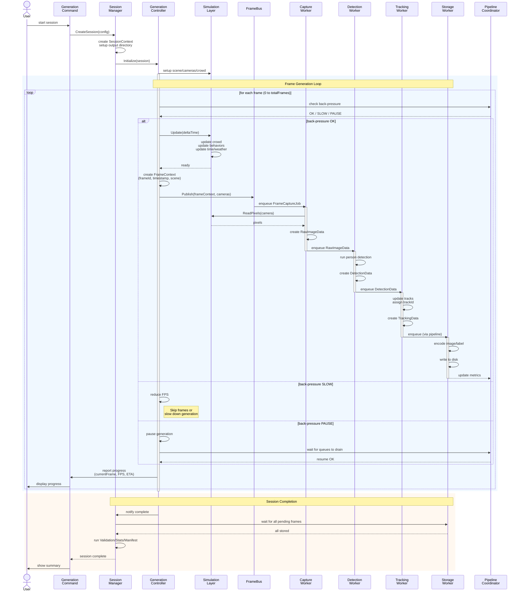

Synthetic Data Generation Engine

---

> **문서 버전:** v2.0 (2025-02-15)
> **변경 이력:**
> - v2.0 (2025-02-15): FrameBus Thread-safety 구체화, Zero-Copy Pipeline 옵션 추가
> - v1.1 (2025-02-14): ReID Dataset Export Stage 반영, 버전 섹션 추가
> - v1.0 (2024-12-01): 초기 작성

## 1. 목적 (Purpose)

본 문서는 CCTV Synthetic Data Generation Engine의 **데이터 파이프라인**을  
구체적으로 정의한다.

- Stage(단계)별 입력/출력/큐/스레드/오류/백프레셔(back-pressure)를 명시한다.
- ID 정책(frame_id, camera_id, global_person_id 등)을 명시한다.
- 디렉터리/파일명/manifest 구조를 정의한다.
- 성능/안정성/운영 관점에서 구현 시 반드시 지켜야 할 규칙을 제공한다.

대상 범위:
- FrameBus → Capture → Detection → Tracking → ReID → Occlusion → LabelAssembler → Encode → Storage → Edge Export → Validation/Stats/Manifest

---

## 2. 전체 파이프라인 개요

### 2.1 단계(Stage)

1. Frame Dispatch (FrameBus)
2. Capture Stage (CaptureWorker)
3. Detection Stage (DetectionWorker)
4. Tracking Stage (TrackingWorker)
5. Occlusion Stage (OcclusionWorker, Phase 2+)
6. Label Assembly Stage (LabelAssembler)
7. Encode Stage (EncodeWorker)
8. Storage Stage (StorageWorker)
9. ReID Export Stage (ReIDExportWorker, Phase 2+)
10. Edge Export Stage (EdgeExportWorker, Phase 3+)
11. Post-processing (ValidationService / StatsService / ManifestService)

각 Stage는 **Worker + 입력 Queue**로 구성되며,  
Stage 간에는 데이터 모델(DataModel v2)을 통해 전달된다.

### 2.2 데이터 모델 흐름

**기본 방식 (Phase 1-2):**
- FrameContext (+ CameraMeta)
  → RawImageData[]
  → DetectionData
  → TrackingData
  → OcclusionData (optional)
  → LabeledFrame
  → EncodedFrame
  → Files (이미지/라벨) + EdgeExportArtifacts (옵션)

각 Stage가 새 객체 생성 (불변성 보장, Thread-safe)

**Zero-Copy 방식 (Phase 2+ 옵션):**
```csharp
class FramePipelineContext {
    public FrameContext Frame { get; init; }
    public RawImageData[] Images { get; set; }
    public DetectionData Detection { get; set; }
    public TrackingData Tracking { get; set; }
    public LabeledFrame Label { get; set; }
    public EncodedFrame Encoded { get; set; }
}

// 단일 FramePipelineContext 객체가 파이프라인 전체를 통과
// 메모리 복사 최소화, GC 부담 감소
```

**Trade-off:**
| 항목 | 기본 방식 | Zero-Copy 방식 |
|------|----------|---------------|
| 메모리 사용 | 높음 (복사 발생) | 낮음 (재사용) |
| Thread-safety | 높음 (불변 객체) | 낮음 (공유 상태) |
| 디버깅 | 쉬움 (각 Stage 분리) | 어려움 (상태 추적 복잡) |
| 적용 시점 | Phase 1 기본 | Phase 2+ 성능 측정 후 |

**선택 기준:**
```
IF (메모리 사용량 > 8GB AND GC 시간 > 10%)
THEN Zero-Copy 방식 고려
ELSE 기본 방식 유지 (단순성 우선)
```

**별도 흐름 (ReID Export):**
- RawImageData + TrackingData → ReID Crop Images (person_id 기반 디렉토리)

### 2.3 Frame Generation Sequence Diagram



---

## 3. ID 정책 (ID Policy)

### 3.1 Session ID

- `session_id`는 세션 단위로 유일한 문자열.
- Config에 명시되지 않을 경우, UUID 또는 날짜 기반으로 생성.

### 3.2 Frame ID

- `frame_id`는 세션 내에서 0부터 시작하는 증가형 정수.
- 모든 Stage에서 frame_id는 변경되지 않는다.
- FrameContext에 포함되며, 파이프라인 전 구간에서 ID의 기준이 된다.

### 3.3 Camera ID

- `camera_id`는 Config에서 정의하는 문자열(예: "cam01", "cam02").
- 세션 전체에서 동일 카메라는 동일 camera_id를 유지.
- 디렉터리 및 파일명에 camera_id를 포함해 사용한다.

### 3.4 Global Person ID

- `global_person_id`는 Session 전체에서 동일 인물에 대해 불변인 정수.
- CrowdService 초기화 시 할당하거나 Agent 생성 시 부여.
- Tracking/ReID/Occlusion 전 단계를 통틀어 동일 ID를 유지해야 한다.

### 3.5 Track ID

- `track_id`는 (session_id, camera_id) 범위 내에서 유일한 정수.
- 각 카메라별로 독립적인 Track ID 시퀀스를 가진다.
- 동일 카메라 내에서 같은 인물(같은 global_person_id)은 같은 track_id를 유지하는 것이 기본 정책.
  (끊겼다가 다시 등장하는 경우 정책은 TrackingWorker에서 정의.)

---

## 4. Stage별 상세 스펙

각 Stage는 아래 정보를 가진다:

- Input
- Output
- Queue / 동시성
- 순서 보장 정책
- 에러 처리
- 성능 목표(지향)

---

### 4.1 Frame Dispatch – FrameBus

역할:
- Simulation(Main Thread)에서 생성된 FrameContext + Camera 메타를 파이프라인으로 전달.

Input:
- FrameContext (session_id, frame_id, sceneName, timestamp 등)
- Active Cameras (SimCamera 리스트 또는 CameraMeta 리스트)

Output:
- CaptureWorker 입력 큐에 전달될 메시지:
  - FrameContext
  - CameraMeta 리스트

Queue:
- 내부적으로 thread-safe queue 사용.
- Publish: Main Thread (GenerationController)
- Consume: CaptureWorker Thread

**Thread-safety 구현 (구체화):**

```csharp
public class FrameBus : IFrameBus {
    // Thread-safe queue (lock-free)
    private readonly ConcurrentQueue<FrameJob> _queue = new();

    // Semaphore for blocking wait (메모리 효율)
    private readonly SemaphoreSlim _signal = new(0);

    // Cancellation for graceful shutdown
    private readonly CancellationTokenSource _cts = new();

    // Back-pressure tracking
    private int _queueLength = 0;
    private const int QUEUE_CAPACITY = 512;

    // Unity Main Thread에서 호출
    public bool Publish(FrameContext frame, List<CameraMeta> cameras) {
        // Back-pressure 체크
        var currentLength = Interlocked.Increment(ref _queueLength);

        if (currentLength > QUEUE_CAPACITY) {
            Interlocked.Decrement(ref _queueLength);
            _logger.LogWarning($"FrameBus queue full ({QUEUE_CAPACITY}), dropping frame {frame.FrameId}");
            return false;
        }

        var job = new FrameJob {
            Frame = frame,
            Cameras = cameras,
            PublishedAt = DateTime.UtcNow
        };

        _queue.Enqueue(job);
        _signal.Release(); // Worker 쓰레드 깨우기

        return true;
    }

    // Worker Thread에서 호출
    public async Task<FrameJob> ConsumeAsync(CancellationToken ct) {
        // Semaphore 대기 (CPU 점유 없이 blocking)
        await _signal.WaitAsync(ct);

        if (_queue.TryDequeue(out var job)) {
            Interlocked.Decrement(ref _queueLength);

            // 대기 시간 모니터링
            var latency = DateTime.UtcNow - job.PublishedAt;
            if (latency > TimeSpan.FromSeconds(1)) {
                _logger.LogWarning($"Frame {job.Frame.FrameId} latency: {latency.TotalMilliseconds}ms");
            }

            return job;
        }

        throw new InvalidOperationException("Semaphore released but queue empty (race condition)");
    }

    // 현재 큐 길이 (모니터링용)
    public int GetQueueLength() => _queueLength;

    // Graceful shutdown
    public async Task Shutdown() {
        _cts.Cancel();

        // 남은 작업 처리 대기 (최대 5초)
        var timeout = Task.Delay(TimeSpan.FromSeconds(5));
        while (_queueLength > 0 && !timeout.IsCompleted) {
            await Task.Delay(100);
        }

        _logger.LogInfo($"FrameBus shutdown, {_queueLength} frames dropped");
    }
}
```

**동시성 안전성 분석:**

| 항목 | 전략 | 이유 |
|------|------|------|
| **Queue 구조** | `ConcurrentQueue<T>` | Lock-free, MPSC(Multi-Producer-Single-Consumer) 최적화 |
| **Blocking** | `SemaphoreSlim` | `Thread.Sleep` 대비 CPU 점유 최소화 |
| **Counter** | `Interlocked` | Atomic 연산으로 정확한 큐 길이 추적 |
| **Back-pressure** | Capacity 초과 시 Publish 거부 | OOM 방지 |

순서:
- FrameContext는 frame_id 순으로 publish된다.
- CaptureWorker는 frame_id 순서를 **가능한 유지**하지만,
  파이프라인은 전체적으로 "frame 단위 작업 완료 순서"에 제한을 두지 않는다.

에러:
- FrameBus에서 에러 발생 시(메모리 부족 등), 해당 frame을 drop하고 경고 로그 남김.
- 치명적 에러 시 세션 중단.

성능 목표:
- FrameBus 자체는 병목이 되지 않을 것 (복잡한 연산 금지).
- Publish/Consume 각각 < 1ms (lock contention 최소화)

---

### 4.2 Capture Stage – CaptureWorker

역할:
- 각 카메라의 이미지 캡처 → RawImageData 생성.

Input:
- FrameContext
- CameraMeta 리스트

Output:
- RawImageData[] (각 camera_id별 1개)

Queue:
- 입력 큐: `Queue<FrameCaptureJob>`
- 큐 크기 제한: 기본 512 Frame (설정 가능)
- 큐가 가득 찰 경우:
  - PipelineCoordinator에 back-pressure 신호 전달

동시성:
- CaptureWorker Thread 1개 (Phase 1)
- Phase 2+: 필요 시 2개 이상으로 확장 가능하나, Unity Render/Readback 제약 고려.

순서:
- 입력 frame_id 순서로 처리되도록 노력하되, 타 Stage는 순서에 의존하지 않도록 설계.

에러 처리:
- 개별 카메라 캡처 실패:
  - 최대 N회 재시도 (기본 3회)
  - 실패 시 해당 카메라 이미지는 누락, 로그 기록
- 모든 카메라 캡처 실패:
  - 해당 frame 전체를 skip
- 반복적 실패(연속 X 프레임 이상) 시 세션 중단 옵션(설정) 제공.

성능 목표:
- 카메라 수 3~6 기준, 전체 파이프라인 FPS 목표를 만족하도록
  이미지 캡처 시간(frame당) 최소화.

---

### 4.3 Detection Stage – DetectionWorker

역할:
- RawImageData에 대해 사람 bbox + confidence 생성.

Input:
- RawImageData[]

Output:
- DetectionData (frame_id, camera_id별 detection 리스트)

Queue:
- 입력 큐: `Queue<RawImageData[]>`
- 기본 큐 크기: 512
- 큐 풀 시:
  - CaptureWorker로 back-pressure: 더 이상 enqueue하지 않고 대기.

동시성:
- DetectionWorker Thread: 1~N (configurable)
- Stage 내부에서 batch 처리 가능 (예: 여러 frame을 한 번에 inference).

순서:
- Frame별 독립 처리. 순서 유지 필요 없음.

에러 처리:
- 모델 inference 실패:
  - 해당 frame에 대해 detection 없음으로 처리 (빈 리스트)
  - 경고 로그
- 반복 실패 시(모든 frame detection 실패 지속) 세션 중단 가능.

성능 목표:
- 1080p 기준 카메라 N개 합산 FPS가 전체 목표 FPS(예: 5~15 FPS)에 걸리지 않도록 모델/설정 선택.

---

### 4.4 Tracking Stage – TrackingWorker

역할:
- Detection 결과 기반으로 카메라별 Tracking 수행.
- Simulation Layer의 PersonState와 매칭하여 Global Person ID 할당

Input:
- DetectionData
- FrameContext (PersonState 포함)

Output:
- TrackingData (track_id + global_person_id 포함)

Queue:
- 입력 큐: `Queue<DetectionData>`
- 기본 큐 크기: 2048

동시성:
- TrackingWorker Thread: 1 (기본), 필요 시 카메라별 분리 가능.

순서:
- 같은 camera_id에 대해서는 frame_id 순서를 보장하는 것이 이상적.
- 구현 상 out-of-order 발생 시, 유실/재정렬 정책은 TrackingWorker 내부에서 정의.

에러 처리:
- 특정 frame tracking 실패:
  - 이전 frame 상태 기반 계속 진행하거나, 해당 frame만 detection-only 취급.
- 상태 초기화 필요 시:
  - 해당 카메라의 track state를 reset하고 이후 frame에서 새 track_id 생성.

성능 목표:
- Detection보다 가볍게 유지.
- Tracking 연산이 전체 파이프라인의 병목이 되지 않도록 설계.

---

### 4.5 Occlusion Stage – OcclusionWorker (Phase 2+)

역할:
- VisibilityService meta + TrackingData 기반으로 occlusion/visibility 계산.

Input:
- VisibilityMeta (Simulation layer에서 제공)
- TrackingData

Output:
- OcclusionData 리스트

Queue:
- 입력 큐: `Queue<OcclusionJob>`
- 기본 큐 크기: 1024

동시성:
- OcclusionWorker Thread: 1 (기본)

에러 처리:
- 계산 실패 시 해당 객체의 occlusion/visibility를 기본값(예: 0 또는 null)로 두고 경고 로그.

성능 목표:
- Depth/Geometry 계산 정책에 따라 적절히 튜닝.
- 파이프라인 병목이 되지 않아야 한다.

---

### 4.6 Label Assembly Stage – LabelAssembler

역할:
- TrackingData + OcclusionData를 하나의 LabeledFrame으로 조합.

Input:
- TrackingData
- OcclusionData (optional)

Output:
- LabeledFrame

Queue:
- 입력 큐: `Queue<LabelAssemblyJob>`
- 기본 큐 크기: 2048

동시성:
- LabelAssembler Thread: 1 (권장)

**Join 로직 상세 구현 (구체화):**

```csharp
public class LabelAssembler {
    // Frame별 부분 데이터를 임시 저장
    private readonly ConcurrentDictionary<long, PartialFrameData> _pendingFrames = new();

    // 타임아웃 설정 (Config 가능)
    private readonly TimeSpan _joinTimeout = TimeSpan.FromSeconds(5);
    private readonly int _maxPendingFrames = 100; // 메모리 제한

    public async Task AssembleAsync(CancellationToken ct) {
        while (!ct.IsCancellationRequested) {
            // 주기적으로 타임아웃 체크 (100ms마다)
            await Task.Delay(100, ct);

            var now = DateTime.UtcNow;
            var completedFrames = new List<long>();

            foreach (var (frameId, partial) in _pendingFrames) {
                // 1. 모든 필수 데이터 도착 → 즉시 조립
                if (partial.HasTracking) {
                    var labeled = BuildLabeledFrame(partial);
                    OnLabeled?.Invoke(labeled);
                    completedFrames.Add(frameId);
                    continue;
                }

                // 2. 타임아웃 발생 → partial data로 진행
                if (now - partial.CreatedAt > _joinTimeout) {
                    _logger.LogWarning($"Frame {frameId} timeout after {_joinTimeout.TotalSeconds}s, " +
                                     $"assembling with partial data (hasTracking={partial.HasTracking})");

                    if (partial.HasTracking) {
                        var labeled = BuildLabeledFrame(partial);
                        OnLabeled?.Invoke(labeled);
                    } else {
                        _logger.LogError($"Frame {frameId} missing critical data (Tracking), skipping");
                    }

                    completedFrames.Add(frameId);
                }
            }

            // 완료된 프레임 정리
            foreach (var frameId in completedFrames) {
                _pendingFrames.TryRemove(frameId, out _);
            }

            // 3. 메모리 제한 초과 시 오래된 프레임 강제 제거
            if (_pendingFrames.Count > _maxPendingFrames) {
                var oldestFrames = _pendingFrames
                    .OrderBy(kvp => kvp.Value.CreatedAt)
                    .Take(_pendingFrames.Count - _maxPendingFrames)
                    .Select(kvp => kvp.Key)
                    .ToList();

                foreach (var frameId in oldestFrames) {
                    _logger.LogError($"Frame {frameId} evicted (memory limit), data lost");
                    _pendingFrames.TryRemove(frameId, out _);
                }
            }
        }
    }

    public void OnTrackingReceived(TrackingData tracking) {
        var partial = _pendingFrames.GetOrAdd(tracking.FrameId, _ => new PartialFrameData {
            FrameId = tracking.FrameId,
            CreatedAt = DateTime.UtcNow
        });

        partial.Tracking = tracking;
        partial.HasTracking = true;
    }

    public void OnOcclusionReceived(List<OcclusionData> occlusion) {
        var frameId = occlusion.FirstOrDefault()?.FrameId ?? 0;
        if (frameId == 0) return;

        var partial = _pendingFrames.GetOrAdd(frameId, _ => new PartialFrameData {
            FrameId = frameId,
            CreatedAt = DateTime.UtcNow
        });

        partial.Occlusion = occlusion;
    }

    private LabeledFrame BuildLabeledFrame(PartialFrameData partial) {
        return new LabeledFrame {
            Frame = new FrameContext { FrameId = partial.FrameId },
            CameraLabels = new List<CameraLabelData> {
                new CameraLabelData {
                    Tracking = partial.Tracking?.ToRecords() ?? new List<TrackingRecord>(),
                    Occlusion = partial.Occlusion // nullable
                }
            }
        };
    }
}

class PartialFrameData {
    public long FrameId { get; set; }
    public DateTime CreatedAt { get; set; }

    public TrackingData Tracking { get; set; }
    public List<OcclusionData> Occlusion { get; set; }

    public bool HasTracking { get; set; }
}
```

**타임아웃 정책 (수치화):**

| 항목 | 값 | 설명 |
|------|------|------|
| **Join Timeout** | 5초 | Tracking 데이터 대기 최대 시간 |
| **Polling Interval** | 100ms | 타임아웃 체크 주기 |
| **Max Pending Frames** | 100 | 메모리 제한 (Frame별 평균 10KB 기준 1MB) |
| **필수 데이터** | TrackingData | 없으면 Frame skip |
| **선택 데이터** | OcclusionData | 없어도 진행 (Phase 2+) |

**타임아웃 발생 시나리오:**

1. **OcclusionWorker 지연** (정상):
   - TrackingData 있음, OcclusionData 없음
   - → Occlusion 없이 LabeledFrame 생성 (경고 로그)

2. **TrackingWorker 장애** (비정상):
   - TrackingData 없음
   - → Frame 전체 skip (에러 로그)

3. **메모리 제한 초과**:
   - 100개 초과 Frame 대기 중
   - → 가장 오래된 Frame 강제 제거 (데이터 손실)

순서:
- frame_id 단위로 join 수행.
- 각 Stage 결과가 도착하는 시점이 다를 수 있으므로,
  타임아웃 내에 도착한 데이터만 조합.

에러 처리:
- 일부 데이터 누락(Occlusion 없는 경우):
  - 해당 필드 없이 LabeledFrame 생성 (optional 필드로 설계)
- TrackingData 자체 없음:
  - Frame 전체 skip (에러 로그)

---

### 4.8 Encode Stage – EncodeWorker

역할:
- RawImageData + LabeledFrame → 이미지/라벨 포맷으로 인코딩.

Input:
- LabeledFrame
- RawImageData[]

Output:
- EncodedFrame (이미지 bytes + 라벨 텍스트)

Queue:
- 입력 큐: `Queue<EncodeJob>`
- 기본 큐 크기: 2048

동시성:
- EncodeWorker Thread: 1~N
- 이미지/라벨 인코딩 분리 또는 배치 처리 가능.

에러 처리:
- 이미지 인코딩 실패:
  - 해당 frame의 이미지 누락, 라벨만 저장 옵션 or frame 전체 skip (설정)
- 라벨 포맷 변환 실패:
  - 해당 포맷만 건너뛰고 나머지 포맷 저장 (예: YOLO 변환 실패, JSON은 유지)

성능 목표:
- 디스크 I/O와 맞물리므로, 지나치게 무거운 인코딩 설정(고품질, 무손실 등)은 피한다.
- 기본 값은 JPG(중간 품질) + JSON 라벨.

---

### 4.9 Storage Stage – StorageWorker

역할:
- EncodedFrame의 이미지/라벨을 파일 시스템에 저장.

Input:
- EncodedFrame

Output:
- 실제 파일 (이미지/라벨)
- 성공/실패 결과 (StoredResult)

Queue:
- 입력 큐: `Queue<EncodedFrame>`
- 기본 큐 크기: 4096
- 디스크 I/O 병목 시 back-pressure 발생.

동시성:
- StorageWorker Thread: 1~N (기본 2~4)
- 동시 쓰기 수 제한을 둬서 디스크 thrash 방지.

에러 처리:
- 단일 파일 쓰기 실패:
  - N회 재시도 후 실패 시 해당 frame에 대한 저장 실패로 기록.
- 디스크 풀 또는 권한 오류:
  - 세션 즉시 중단 + 상태 “DiskFull/Error”로 마킹.
  - 사용자 알림 필수.

성능 목표:
- SSD 기준, 전체 pipeline FPS 목표를 만족할 수 있도록 thread/버퍼 크기 조절.
- 파일 open/close 최소화, 필요 시 batch / 버퍼링.

---

### 4.10 ReID Export Stage – ReIDExportWorker (Phase 2+)

역할:
- ReID 모델 학습에 필요한 person crop dataset을 export

Input:
- RawImageData
- TrackingData

Output:
- ReIDExportResult (저장된 crop 파일 경로)

Queue:
- 입력 큐: `Queue<ReIDExportJob>`
- 기본 큐 크기: 1024

Export 디렉토리 구조:
```
/output/reid_dataset/
  person_0001/
    cam01_frame_000123.jpg
    cam02_frame_000456.jpg
  person_0002/
    cam01_frame_000789.jpg
    ...
```

파일명 규칙:
- `{cameraId}_frame_{frameId:06d}.jpg`

메타데이터:
- 별도 `metadata.json` 생성:
```json
{
  "person_0001": {
    "images": [
      {"camera": "cam01", "frame": 123, "path": "person_0001/cam01_frame_000123.jpg"},
      {"camera": "cam02", "frame": 456, "path": "person_0001/cam02_frame_000456.jpg"}
    ]
  }
}
```

동시성:
- ReIDExportWorker Thread: 1~2 (I/O bound)

에러 처리:
- Crop 실패: 해당 person/frame skip, 로그 기록
- 디스크 공간 부족: 세션 중단

성능 목표:
- Export는 선택적 기능이므로 전체 파이프라인 FPS에 영향 최소화
- 필요 시 별도 세션으로 분리하여 post-processing으로 실행 가능

---

### 4.11 Edge Export Stage – EdgeExportWorker (Phase 3+)

역할:
- Edge 디바이스 학습/추론 파이프라인을 위한 TFLite/ONNX/Custom Binary 라벨을 생성.
- EncodeWorker/StorageWorker가 생성한 데이터를 바탕으로 `.record`, `.npz`, `.bin`, `edge_manifest.json` 등을 만든다.

Input:
- `EncodedFrame` 참조(이미지 bytes, 파일 경로)
- `LabeledFrame` 또는 `EdgeLabelSummary` (bbox, track_id, occlusion 등)
- SessionConfig의 `edgeExport` 섹션 (출력 포맷/모델/버전 정보)

Output:
- `EdgeExportArtifact`(포맷, 파일 경로, checksum)
- Session 종료 시 EdgeExportService로 전달되어 `edge_packages/{format}/`에 저장

Queue:
- 입력 큐: `Queue<EdgeExportJob>`
- 기본 큐 크기: 1024 (디폴트), 메모리 사용량에 따라 Config 조정

동시성:
- EdgeExportWorker Thread: 1 (GPU 기반 모델 변환 시) ~ N (단순 패키징 시)
- 포맷별 파이프라인을 분리해 병렬 처리 가능

에러 처리:
- 특정 포맷 실패 시 해당 artifact만 건너뛰고 경고 로그 남김.
- 모델 변환 실패/권한 오류/디스크 부족 발생 시 세션 상태에 경고를 추가하고 manifest `edgeArtifacts[].status` 필드를 `failed`로 설정.

디렉터리 구조:
```
edge_packages/
  tflite/
    data.record
    labels.bin
    tflite_manifest.json
  onnx/
    tensors.npz
    metadata.json
  visibility_binary/
    frame_000123.bin
```

manifest 확장:
```json
"edgeArtifacts": [
  {"format": "tflite-record", "path": "edge_packages/tflite/data.record", "checksum": "sha256:...", "status": "ready"},
  {"format": "onnx-bundle", "path": "edge_packages/onnx/", "status": "failed"}
]
```

---

### 4.12 Post-processing – Validation / Stats / Manifest

역할:
- 세션 종료 후 정합성/품질/통계/메타데이터를 집계.

Input:
- SessionContext
- 생성된 파일들(디렉터리 스캔)

Output:
- ValidationReport
- DatasetStatistics
- manifest.json

수행 시점:
- Session 정상 종료 혹은 비정상 종료 후(가능한 범위 내에서) 실행.

에러 처리:
- 파일 일부 누락/손상 발견:
  - ValidationReport에 기록
  - manifest.json에 품질 경고 표시

---

## 5. Back-pressure & Queue 정책

### 5.1 기본 원칙

- 각 Stage는 입력 Queue 최대 크기를 가진다.
- Queue가 일정 수준을 넘으면 PipelineCoordinator가 back-pressure 신호를 생성한다.
- back-pressure 신호는 GenerationController에 전달되어:
  - FPS 감소
  - frame skip
  - 일시정지
  중 하나 또는 복합 전략을 사용하도록 한다.

### 5.2 Queue 임계값 예시

- CaptureQueue: 512
- DetectionQueue: 512
- TrackingQueue: 2048
- OcclusionQueue: 1024
- LabelAssemblyQueue: 2048
- EncodeQueue: 2048
- StorageQueue: 4096
- ReIDExportQueue: 1024 (Phase 2+, optional)
- EdgeExportQueue: 1024 (Phase 3+, optional)

각 Stage별 임계값은 Config로 조정 가능.

### 5.3 back-pressure 행동 예시

- Level 1 (주의): 특정 Queue가 70% 이상 → 세션 FPS 10~20% 감소.
- Level 2 (경고): 90% 이상 → frame skip(예: N 프레임 건너뛰기).
- Level 3 (심각): 100% 지속 → 세션 일시정지, 사용자 알림.

---

## 6. 디렉토리/파일 구조

### 6.1 기본 디렉토리 구조

- `output_root/`
  - `session_{session_id}/`
    - `images/`
      - `cam01/`
        - `000000.jpg`
        - `000001.jpg`
        - ...
      - `cam02/`
        - ...
    - `labels/`
      - `json/`
        - `cam01/000000.json`
        - `cam01/000001.json`
        - ...
      - `yolo/` (Phase 2+)
      - `coco/` (Phase 2+)
    - `meta/`
      - `manifest.json`
      - `validation_report.json`
      - `stats.json` (선택 또는 manifest에 포함)
    - `edge_packages/` (Phase 3+)
      - `tflite/`, `onnx/`, `custom_binary/` 등 Config 기반 하위 디렉터리

### 6.2 파일명 규칙

- 이미지:
  - `{frame_id:06d}.jpg` 또는 `{frame_id:06d}.png`
- 라벨(JSON):
  - `{frame_id:06d}.json`
- 라벨(YOLO/COCO):
  - YOLO: 동일 파일명, 확장자 `.txt`
  - COCO: 세션 단위 `coco_annotations.json` 한 개도 가능 (옵션)

### 6.3 manifest.json 최소 필드

- version
- session_id
- created_at
- session_config 요약
- scene 목록
- camera 목록
- frame_count
- detection_count
- person_count
- validation_summary
- stats_summary
- edgeArtifacts (포맷, 경로, checksum, 상태)

---

## 7. 모니터링 / 메트릭

각 Worker는 `IWorkerMonitor` 인터페이스를 통해 다음 정보를 제공한다:

- 현재 Queue 길이
- 누적 처리 frame 수
- 평균 처리 시간(ms/frame)
- 실패 카운트

PipelineCoordinator는 이를 기반으로:

- ProgressInfo 계산
- Back-pressure 판단
- 로그/알람 트리거

ProgressReporter로 전달되는 정보:

- current_frame / total_frames
- overall FPS (최근 N초 평균)
- 예상 완료 시간
- 누적 에러/경고 수

---

## 8. 성능/안정성 목표 요약

- 파이프라인은 **Frame 단위 비동기 처리**를 통해 CPU/GPU/I/O 부하를 분산시킨다.
- LabelWorker를 Detection/Tracking/ReID/Occlusion/Assembler로 분할함으로써 병목을 줄인다.
- Queue + Back-pressure 정책으로 메모리 폭주를 방지한다.
- Validation/Stats/Manifest를 통해 Dataset 품질을 보장한다.
- Config 기반으로 각 Stage의 동시성/큐 크기/Export 설정을 튜닝 가능하도록 한다.
