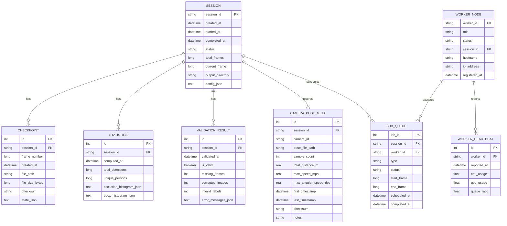
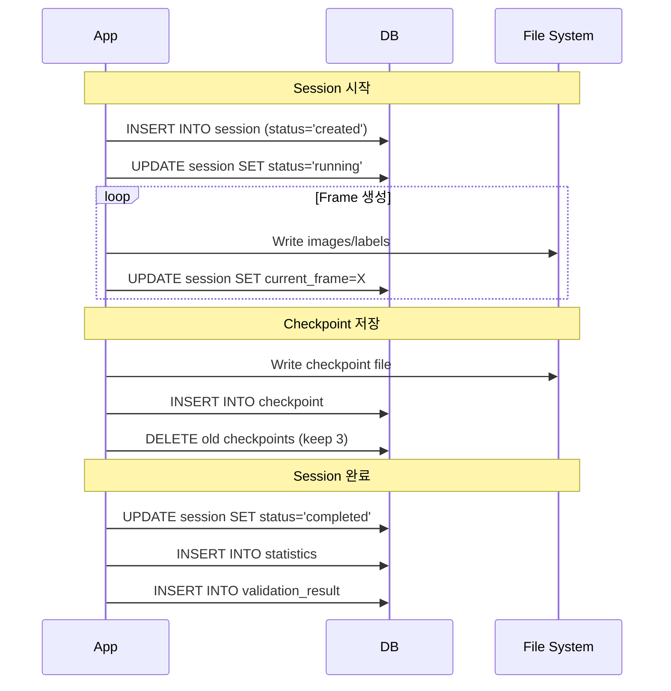

## 1. 목적 (Purpose)

본 문서는 Forge의 **데이터베이스 스키마**를 정의한다.

**필요성:**
1. **Session 메타데이터 관리**: 파일 기반만으로 부족한 검색/필터링 요구사항
2. **Checkpoint 관리**: 빠른 복구를 위한 인덱싱
3. **Statistics 집계**: 대규모 Session의 통계 쿼리
4. **Multi-Session 관리**: 동시 실행 Session 추적
5. **Audit Trail**: 생성 이력 추적

**범위:**
- Phase 1: 필수 메타데이터만 (Session, Checkpoint)
- Phase 2: Statistics, Validation 결과 저장
- Phase 3: 분산 환경 지원 (Worker 상태, Job Queue)

---

## 2. 데이터베이스 선택

### 2.1 요구사항 분석

| 항목 | 요구사항 | 비고 |
|------|----------|------|
| **규모** | Session당 메타 < 10MB | 실제 이미지는 파일 시스템 |
| **동시성** | 읽기 많음, 쓰기 적음 | Session 시작/종료 시만 쓰기 |
| **검색** | Session ID, 날짜, 상태 | 인덱스 필요 |
| **트랜잭션** | ACID 필요 | Checkpoint 일관성 |
| **배포** | 단일 파일 또는 Embedded | 간단한 설치 |

### 2.2 권장 DB: SQLite

**Phase 1-2: SQLite**
- ✅ 단일 파일, 설치 불필요
- ✅ .NET 기본 지원 (Microsoft.Data.Sqlite)
- ✅ ACID 트랜잭션
- ✅ 인덱스/쿼리 성능 충분
- ❌ 동시 쓰기 제한 (단, 읽기는 무제한)

**Phase 3: PostgreSQL (옵션)**
- 분산 환경에서 다중 Worker 조율 시 고려
- SQLite → PostgreSQL 마이그레이션 경로 제공

**보안/Config 필터링 교차 참조**:
- `docs/design/10_Security_and_Compliance.md` “Config/Log 민감 정보 필터링 표”에 정의된 규칙을 그대로 적용한다.
- `docs/design/5_API Specification.md` 설정/상태 API에서도 동일한 필터링/마스킹 규칙을 사용해 일관성을 유지한다.

---

## 3. 데이터베이스 구조

### 3.1 ERD (Entity Relationship Diagram)



---

## 4. 테이블 스키마

### 4.1 SESSION 테이블

역할: 세션 단위 메타데이터 저장

```sql
CREATE TABLE IF NOT EXISTS session (
    -- 식별자
    session_id TEXT PRIMARY KEY NOT NULL,

    -- 타임스탬프
    created_at DATETIME NOT NULL DEFAULT CURRENT_TIMESTAMP,
    started_at DATETIME,
    completed_at DATETIME,
    last_updated_at DATETIME NOT NULL DEFAULT CURRENT_TIMESTAMP,

    -- 상태
    status TEXT NOT NULL DEFAULT 'created',
        -- 'created', 'running', 'paused', 'completed', 'failed', 'cancelled'

    -- 진행률
    total_frames INTEGER NOT NULL,
    current_frame INTEGER NOT NULL DEFAULT 0,
    progress_percentage REAL GENERATED ALWAYS AS (
        CAST(current_frame AS REAL) / total_frames * 100
    ) VIRTUAL,

    -- 경로
    output_directory TEXT NOT NULL,

    -- 설정 (JSON)
    config_json TEXT NOT NULL,
        -- SessionConfig 전체를 JSON으로 저장
        -- 저장 전에 API Key/Bearer Token/사용자 경로 등 민감 필드는 제거 또는 마스킹해야 함 (보안 가이드 연계)

    -- 메타
    engine_version TEXT NOT NULL,
    created_by TEXT,

    -- 제약
    CHECK (status IN ('created', 'running', 'paused', 'completed', 'failed', 'cancelled')),
    CHECK (current_frame >= 0),
    CHECK (current_frame <= total_frames)
);

-- 인덱스
CREATE INDEX idx_session_status ON session(status);
CREATE INDEX idx_session_created_at ON session(created_at DESC);
CREATE INDEX idx_session_completed_at ON session(completed_at DESC);
```

보안 지침:
- `config_json`은 인증키, 토큰, 사용자 홈 디렉터리 등 민감 필드를 포함하지 않도록 사전에 필터링/마스킹한다.
- 꼭 필요한 비밀(예: API Key)을 보관해야 한다면 별도 보안 저장소(환경 변수/OS 키체인/암호화 컬럼)에 보관하고, DB에는 참조 키만 저장한다.
- 로그/감사 목적에도 민감 필드를 남기지 않도록 DAO/Repository 레이어에서 공통 Sanitizer를 적용한다.

---

### 4.2 CHECKPOINT 테이블

역할: Checkpoint 파일 메타데이터 및 빠른 검색

```sql
CREATE TABLE IF NOT EXISTS checkpoint (
    -- 식별자
    id INTEGER PRIMARY KEY AUTOINCREMENT,
    session_id TEXT NOT NULL,

    -- Checkpoint 정보
    frame_number INTEGER NOT NULL,
    created_at DATETIME NOT NULL DEFAULT CURRENT_TIMESTAMP,

    -- 파일 정보
    file_path TEXT NOT NULL UNIQUE,
    file_size_bytes INTEGER NOT NULL,
    checksum TEXT NOT NULL,
        -- SHA256 체크섬

    -- 상태 요약 (JSON)
    state_json TEXT,
        -- CrowdState, TrackingState 등 요약

    -- 메타
    checkpoint_version TEXT NOT NULL,
    engine_version TEXT NOT NULL,

    -- 외래키
    FOREIGN KEY (session_id) REFERENCES session(session_id)
        ON DELETE CASCADE,

    -- 제약
    UNIQUE(session_id, frame_number),
    CHECK (frame_number >= 0)
);

-- 인덱스
CREATE INDEX idx_checkpoint_session ON checkpoint(session_id, frame_number DESC);
CREATE INDEX idx_checkpoint_created_at ON checkpoint(created_at DESC);
```

---

### 4.3 STATISTICS 테이블

역할: 세션별 통계 데이터 저장

```sql
CREATE TABLE IF NOT EXISTS statistics (
    -- 식별자
    id INTEGER PRIMARY KEY AUTOINCREMENT,
    session_id TEXT NOT NULL,

    -- 타임스탬프
    computed_at DATETIME NOT NULL DEFAULT CURRENT_TIMESTAMP,

    -- 기본 통계
    total_frames INTEGER NOT NULL,
    total_detections INTEGER NOT NULL,
    unique_persons INTEGER NOT NULL,

    avg_detections_per_frame REAL,
    avg_persons_per_frame REAL,

    -- 히스토그램 (JSON)
    occlusion_histogram_json TEXT,
        -- {"0-0.2": 1000, "0.2-0.4": 500, ...}

    bbox_size_histogram_json TEXT,
        -- {"small": 300, "medium": 600, "large": 100}

    behavior_distribution_json TEXT,
        -- {"walk": 800, "idle": 200}

    -- 외래키
    FOREIGN KEY (session_id) REFERENCES session(session_id)
        ON DELETE CASCADE,

    -- 제약
    UNIQUE(session_id)  -- 1 session : 1 statistics
);

-- 인덱스
CREATE INDEX idx_statistics_session ON statistics(session_id);

#### 4.3-A 통계 저장 포맷 / JSONB 가이드

- SQLite 단계에서는 히스토그램/분포 데이터를 `TEXT`(JSON) 컬럼으로 저장한다. PostgreSQL 마이그레이션 시에는 `JSONB`로 전환하고, 다음 인덱스를 생성한다:
  ```sql
  -- PostgreSQL 전용
  CREATE INDEX idx_statistics_occlusion_path
      ON statistics
      USING GIN ((occlusion_histogram_json) jsonb_path_ops);
  ```
- `behavior_distribution_json` 등 반복 구조는 `stats_distribution(session_id, key, value)` 형태의 정규화된 테이블로 분해할 수도 있으나, 초기 구현에서는 JSON 단일 컬럼을 사용하고 ETL 파이프라인에서 파싱/집계를 담당한다.
- Validation/Manifest 서비스는 `StatisticsRepository`가 제공하는 DTO를 통해 JSON 필드를 읽을 뿐 DB 스키마에 직접 의존하지 않도록 하여, 향후 JSONB→정규 테이블 변경 시 영향 범위를 최소화한다.
- 1회 당 최소 단위:
  - `occlusion_histogram_json`: bucket 최대 10개
  - `bbox_size_histogram_json`: `{"tiny","small","medium","large"}` 4개 키
  - `behavior_distribution_json`: Config에서 정의한 Behavior ID 수(보통 <10)
- 대용량 세션에서 통계 크기가 커지는 것을 방지하기 위해 `stats_max_bucket_count`(Config) 기본값을 16으로 제한하고, Validation 단계에서 초과 bucket이 존재하면 병합한다.
```

---

### 4.4 VALIDATION_RESULT 테이블

역할: 검증 결과 저장

```sql
CREATE TABLE IF NOT EXISTS validation_result (
    -- 식별자
    id INTEGER PRIMARY KEY AUTOINCREMENT,
    session_id TEXT NOT NULL,

    -- 타임스탬프
    validated_at DATETIME NOT NULL DEFAULT CURRENT_TIMESTAMP,

    -- 검증 결과
    is_valid BOOLEAN NOT NULL,

    -- 오류 카운트
    missing_frames INTEGER NOT NULL DEFAULT 0,
    corrupted_images INTEGER NOT NULL DEFAULT 0,
    invalid_labels INTEGER NOT NULL DEFAULT 0,

    -- 상세 오류 (JSON)
    error_messages_json TEXT,
        -- [{"frame_id": 123, "error": "missing_label"}, ...]

    -- 외래키
    FOREIGN KEY (session_id) REFERENCES session(session_id)
        ON DELETE CASCADE,

    -- 제약
    UNIQUE(session_id)  -- 1 session : 1 validation
);

-- 인덱스
CREATE INDEX idx_validation_session ON validation_result(session_id);
CREATE INDEX idx_validation_is_valid ON validation_result(is_valid);
```

---

### 4.5 CAMERA_POSE_META 테이블 (Phase 2+)

역할:  
- `type=mobile` 카메라 pose 파일 경로와 품질 요약(샘플 수, 이동 거리, 속도)을 저장하여 Manifest/API/Resume 로직이 동일한 소스를 참조하게 한다.

```sql
CREATE TABLE IF NOT EXISTS camera_pose_meta (
    id INTEGER PRIMARY KEY AUTOINCREMENT,
    session_id TEXT NOT NULL,
    camera_id TEXT NOT NULL,
    pose_file_path TEXT NOT NULL,
    sample_count INTEGER NOT NULL,
    total_distance_m REAL NOT NULL,
    max_speed_mps REAL NOT NULL,
    max_angular_speed_dps REAL NOT NULL,
    first_timestamp DATETIME NOT NULL,
    last_timestamp DATETIME NOT NULL,
    checksum TEXT,
    notes TEXT,
    FOREIGN KEY (session_id) REFERENCES session(session_id)
        ON DELETE CASCADE
);

CREATE INDEX idx_pose_session ON camera_pose_meta(session_id);
CREATE INDEX idx_pose_camera ON camera_pose_meta(camera_id);
```

저장 규칙:
- PoseRecorder flush 직후 1행 per camera upsert.
- `notes` 필드는 Validation 결과(허용 편차 초과 등)를 요약하여 `/status`와 manifest quality 항목과 일치시킨다.
- Resume 시 MobileCameraController는 `pose_file_path`와 `last_timestamp`를 조회하여 pose CSV 이어쓰기 위치를 결정한다.

---

### 4.6 WORKER_NODE 테이블 (Phase 3)

역할: 분산 환경에서 Master가 Worker 상태/용량/할당을 추적한다.

```sql
CREATE TABLE IF NOT EXISTS worker_node (
    worker_id TEXT PRIMARY KEY NOT NULL,
    role TEXT NOT NULL,                         -- 'master', 'worker'
    status TEXT NOT NULL DEFAULT 'registered',  -- 'registered','ready','busy','offline'
    session_id TEXT,
    hostname TEXT,
    ip_address TEXT,
    capabilities_json TEXT,                     -- GPU/메모리/지원 버전
    current_load REAL DEFAULT 0,                -- 0~1
    assigned_id_range_start INTEGER,
    assigned_id_range_end INTEGER,
    registered_at DATETIME NOT NULL DEFAULT CURRENT_TIMESTAMP,
    updated_at DATETIME NOT NULL DEFAULT CURRENT_TIMESTAMP,
    FOREIGN KEY (session_id) REFERENCES session(session_id)
        ON DELETE SET NULL,
    CHECK (current_load >= 0 AND current_load <= 1)
);

CREATE INDEX idx_worker_status ON worker_node(status);
CREATE INDEX idx_worker_session ON worker_node(session_id);
```

---

### 4.7 WORKER_HEARTBEAT 테이블 (Phase 3)

역할: Worker의 실시간 자원 사용량과 큐 상태를 수집하여 장애 감지/알림에 활용한다.

```sql
CREATE TABLE IF NOT EXISTS worker_heartbeat (
    id INTEGER PRIMARY KEY AUTOINCREMENT,
    worker_id TEXT NOT NULL,
    reported_at DATETIME NOT NULL DEFAULT CURRENT_TIMESTAMP,
    cpu_usage REAL,
    gpu_usage REAL,
    memory_usage_mb REAL,
    queue_ratio REAL,
    error_count INTEGER DEFAULT 0,
    FOREIGN KEY (worker_id) REFERENCES worker_node(worker_id)
        ON DELETE CASCADE
);

CREATE INDEX idx_worker_heartbeat_worker ON worker_heartbeat(worker_id);
CREATE INDEX idx_worker_heartbeat_time ON worker_heartbeat(reported_at DESC);

보존 정책:
- Heartbeat는 시계열 데이터이므로 기본적으로 7일만 유지한다. SQLite에서는 주기적 배치 작업으로 `DELETE FROM worker_heartbeat WHERE reported_at < datetime('now', '-7 days')`를 수행한다.
- PostgreSQL 전환 시 `PARTITION BY RANGE (reported_at)` 또는 `timescaledb` 같은 확장을 통해 자동 파티셔닝/TTL을 적용할 수 있다.
- 대시보드/알람 서비스는 최신 24시간 데이터를 주로 사용하므로 Repository 레이어에서 `reported_at >= datetime('now', '-1 day')` 조건을 기본으로 붙인다.
```

---

### 4.8 JOB_QUEUE 테이블 (Phase 3)

역할: 분산 아키텍처의 ScenarioTask/FrameRange 작업을 관리한다.

```sql
CREATE TABLE IF NOT EXISTS job_queue (
    job_id INTEGER PRIMARY KEY AUTOINCREMENT,
    session_id TEXT NOT NULL,
    worker_id TEXT,
    type TEXT NOT NULL,                 -- 'scenario','replay','cleanup'
    status TEXT NOT NULL DEFAULT 'pending',
        -- 'pending','assigned','running','completed','failed','cancelled'
    start_frame INTEGER NOT NULL,
    end_frame INTEGER NOT NULL,
    payload_json TEXT,
    scheduled_at DATETIME NOT NULL DEFAULT CURRENT_TIMESTAMP,
    assigned_at DATETIME,
    completed_at DATETIME,
    retry_count INTEGER NOT NULL DEFAULT 0,
    FOREIGN KEY (session_id) REFERENCES session(session_id)
        ON DELETE CASCADE,
    FOREIGN KEY (worker_id) REFERENCES worker_node(worker_id)
        ON DELETE SET NULL,
    CHECK (start_frame <= end_frame),
    CHECK (retry_count >= 0)
);

CREATE INDEX idx_job_status ON job_queue(status);
CREATE INDEX idx_job_worker ON job_queue(worker_id);
CREATE INDEX idx_job_session ON job_queue(session_id);
```

---

### 4.9 SENSOR_ARTIFACT 테이블 (Phase 4)

역할: Robotics Extension에 의해 생성되는 센서 Export(로봇 pose, LiDAR, IMU, wheel odom, depth)에 대한 메타데이터와 품질 정보를 저장한다. manifest.sensorArtifacts[]와 1:1로 매핑되어 품질 보고 및 사고 대응 근거를 제공한다.

```sql
CREATE TABLE IF NOT EXISTS sensor_artifact (
    id INTEGER PRIMARY KEY AUTOINCREMENT,
    session_id TEXT NOT NULL,
    frame_id INTEGER NOT NULL,
    sensor_type TEXT NOT NULL,
        -- 'robot_pose','lidar','imu','wheel_odom','depth'
    format TEXT NOT NULL,
        -- 'tum','kitti','forge-custom'
    file_path TEXT NOT NULL,
    file_size_bytes INTEGER NOT NULL,
    checksum TEXT NOT NULL,
    quality_metadata TEXT,
        -- JSON: {"noiseStd":0.02,"syncDriftMs":3,"dropReason":"timeout"}
    status TEXT NOT NULL DEFAULT 'completed',
        -- 'completed','dropped','failed'
    created_at DATETIME NOT NULL DEFAULT CURRENT_TIMESTAMP,

    FOREIGN KEY (session_id) REFERENCES session(session_id) ON DELETE CASCADE,
    CHECK (frame_id >= 0)
);

CREATE INDEX idx_sensor_artifact_session ON sensor_artifact(session_id, sensor_type);
CREATE INDEX idx_sensor_artifact_frame ON sensor_artifact(frame_id);
```

보안/품질 지침:
- `file_path`는 세션 출력 루트(`/output/<session>/sensors/...`)만 허용하며, Repository 계층에서 경로 정규화/검증을 수행한다.
- `quality_metadata`에는 사용자 이름, 시스템 경로 등 민감 정보가 포함되지 않도록 `Security_and_Compliance.md` §2.4의 필터링 규칙을 재사용한다.

### 4.10 ROBOTICS_SYNC_STATE 테이블 (Phase 4)

역할: MultiSimSyncCoordinator가 Unity ↔ Isaac 간 동기화 상태를 기록해 재시작 및 성능 분석에 활용한다.

```sql
CREATE TABLE IF NOT EXISTS robotics_sync_state (
    id INTEGER PRIMARY KEY AUTOINCREMENT,
    session_id TEXT NOT NULL,
    frame_id INTEGER NOT NULL,
    unity_frame_timestamp REAL NOT NULL,
    robotics_frame_timestamp REAL NOT NULL,
    sync_offset_ms REAL NOT NULL,
    policy_max_delay_ms REAL NOT NULL,
    policy_timeout_ms REAL NOT NULL,
    policy_on_timeout TEXT NOT NULL,
        -- 'skip','abort'
    status TEXT NOT NULL,
        -- 'in_sync','delayed','timeout','dropped'
    notes TEXT,
    created_at DATETIME NOT NULL DEFAULT CURRENT_TIMESTAMP,

    FOREIGN KEY (session_id) REFERENCES session(session_id) ON DELETE CASCADE,
    CHECK (frame_id >= 0)
);

CREATE INDEX idx_robotics_sync_session ON robotics_sync_state(session_id);
CREATE INDEX idx_robotics_sync_status ON robotics_sync_state(status);
```

활용 시나리오:
- Checkpoint 복구 시 마지막으로 동기화된 frame_id와 sync_offset을 조회해 Isaac 재시작 지점을 계산.
- Validation/Manifest에서 `sensorDriftWarning` 계산 시 해당 테이블을 집계해 보고.
- Incident Response에서 특정 시간대의 Isaac 장애 상태를 트레이싱.

---

## 5. 데이터 흐름 (Data Flow)

### 5.1 Session 생명주기



Phase 3 분산 모드에서는 다음 단계가 추가된다:
- Master Node가 세션/시나리오를 분배하기 위해 `worker_node`에 Worker를 등록하고 `job_queue`에 작업을 삽입한다.
- Worker Node는 작업을 수락할 때 `job_queue.status`를 `assigned`/`running`으로 업데이트하고, 주기적으로 `worker_heartbeat`에 상태를 남겨 장애 감지에 활용한다.
- Heartbeat 지연이나 상태 이상이 감지되면 Master는 Worker를 `status='offline'`으로 표시하고, 미완료 Job을 다른 Worker에 다시 할당한다.

### 5.2 쿼리 예시

#### 5.2.1 실행 중인 Session 조회
```sql
SELECT
    session_id,
    current_frame,
    total_frames,
    progress_percentage,
    (total_frames - current_frame) AS remaining_frames
FROM session
WHERE status = 'running'
ORDER BY created_at DESC;
```

#### 5.2.2 최근 Checkpoint 조회
```sql
SELECT
    c.session_id,
    c.frame_number,
    c.file_path,
    c.created_at,
    s.status AS session_status
FROM checkpoint c
JOIN session s ON c.session_id = s.session_id
WHERE c.session_id = ?
ORDER BY c.frame_number DESC
LIMIT 1;
```

#### 5.2.3 실패한 Session 목록
```sql
SELECT
    s.session_id,
    s.created_at,
    s.current_frame,
    v.missing_frames,
    v.error_messages_json
FROM session s
LEFT JOIN validation_result v ON s.session_id = v.session_id
WHERE s.status = 'failed'
ORDER BY s.created_at DESC;
```

#### 5.2.4 Worker 심박 조회 (Phase 3)

```sql
SELECT
    w.worker_id,
    w.status,
    w.current_load,
    w.session_id,
    hb.reported_at AS last_seen,
    hb.cpu_usage,
    hb.gpu_usage,
    hb.queue_ratio
FROM worker_node w
LEFT JOIN worker_heartbeat hb
    ON hb.worker_id = w.worker_id
    AND hb.reported_at = (
        SELECT MAX(reported_at)
        FROM worker_heartbeat
        WHERE worker_id = w.worker_id
    )
ORDER BY w.status, w.worker_id;
```

#### 5.2.5 대기 Job 조회 (Phase 3)

```sql
SELECT
    job_id,
    session_id,
    start_frame,
    end_frame,
    status,
    scheduled_at
FROM job_queue
WHERE status IN ('pending', 'assigned')
ORDER BY scheduled_at ASC
LIMIT 50;
```

---

## 6. 구현 예시 (C#)

### 6.1 SessionRepository

```csharp
public class SessionRepository {
    private readonly string _dbPath;

    public SessionRepository(string dbPath) {
        _dbPath = dbPath;
        InitializeDatabase();
    }

    private void InitializeDatabase() {
        using var connection = new SqliteConnection($"Data Source={_dbPath}");
        connection.Open();

        // 테이블 생성
        var createTablesSql = File.ReadAllText("schema.sql");
        using var command = connection.CreateCommand();
        command.CommandText = createTablesSql;
        command.ExecuteNonQuery();
    }

    public void CreateSession(SessionContext context) {
        using var connection = new SqliteConnection($"Data Source={_dbPath}");
        connection.Open();

        using var command = connection.CreateCommand();
        command.CommandText = @"
            INSERT INTO session (
                session_id, total_frames, output_directory,
                config_json, engine_version, status
            ) VALUES (
                @session_id, @total_frames, @output_directory,
                @config_json, @engine_version, 'created'
            )
        ";

        command.Parameters.AddWithValue("@session_id", context.Config.SessionId);
        command.Parameters.AddWithValue("@total_frames", context.Config.TotalFrames);
        command.Parameters.AddWithValue("@output_directory", context.SessionDirectory);
        command.Parameters.AddWithValue("@config_json", JsonSerializer.Serialize(context.Config));
        command.Parameters.AddWithValue("@engine_version", "0.1.0");

        command.ExecuteNonQuery();
    }

    public void UpdateProgress(string sessionId, long currentFrame) {
        using var connection = new SqliteConnection($"Data Source={_dbPath}");
        connection.Open();

        using var command = connection.CreateCommand();
        command.CommandText = @"
            UPDATE session
            SET current_frame = @current_frame,
                last_updated_at = CURRENT_TIMESTAMP
            WHERE session_id = @session_id
        ";

        command.Parameters.AddWithValue("@session_id", sessionId);
        command.Parameters.AddWithValue("@current_frame", currentFrame);

        command.ExecuteNonQuery();
    }

    public void SaveCheckpoint(string sessionId, long frameNumber, string filePath, string checksum) {
        using var connection = new SqliteConnection($"Data Source={_dbPath}");
        connection.Open();

        using var transaction = connection.BeginTransaction();

        try {
            // Checkpoint 저장
            using var insertCmd = connection.CreateCommand();
            insertCmd.CommandText = @"
                INSERT INTO checkpoint (
                    session_id, frame_number, file_path,
                    file_size_bytes, checksum, checkpoint_version, engine_version
                ) VALUES (
                    @session_id, @frame_number, @file_path,
                    @file_size, @checksum, '1.0.0', '0.1.0'
                )
            ";

            var fileInfo = new FileInfo(filePath);
            insertCmd.Parameters.AddWithValue("@session_id", sessionId);
            insertCmd.Parameters.AddWithValue("@frame_number", frameNumber);
            insertCmd.Parameters.AddWithValue("@file_path", filePath);
            insertCmd.Parameters.AddWithValue("@file_size", fileInfo.Length);
            insertCmd.Parameters.AddWithValue("@checksum", checksum);

            insertCmd.ExecuteNonQuery();

            // 오래된 Checkpoint 삭제 (최근 3개만 유지)
            using var deleteCmd = connection.CreateCommand();
            deleteCmd.CommandText = @"
                DELETE FROM checkpoint
                WHERE session_id = @session_id
                AND frame_number NOT IN (
                    SELECT frame_number
                    FROM checkpoint
                    WHERE session_id = @session_id
                    ORDER BY frame_number DESC
                    LIMIT 3
                )
            ";
            deleteCmd.Parameters.AddWithValue("@session_id", sessionId);
            deleteCmd.ExecuteNonQuery();

            transaction.Commit();
        }
        catch {
            transaction.Rollback();
            throw;
        }
    }

    public string GetLatestCheckpoint(string sessionId) {
        using var connection = new SqliteConnection($"Data Source={_dbPath}");
        connection.Open();

        using var command = connection.CreateCommand();
        command.CommandText = @"
            SELECT file_path
            FROM checkpoint
            WHERE session_id = @session_id
            ORDER BY frame_number DESC
            LIMIT 1
        ";

        command.Parameters.AddWithValue("@session_id", sessionId);

        return command.ExecuteScalar() as string;
    }
}
```

### 6.2 Migration/Repository 지침 (Phase 3)
- 초기 마이그레이션 스크립트가 `worker_node`, `worker_heartbeat`, `job_queue` 테이블을 포함해야 분산 모드가 동작한다.
- Repository 시그니처 예:
  - `WorkerNodeRepository.Register(workerId, capabilities)`
  - `WorkerNodeRepository.UpdateStatus(workerId, status, currentLoad)`
  - `JobQueueRepository.Enqueue(sessionId, startFrame, endFrame, type)`
  - `JobQueueRepository.MarkPending(jobId)` (장애 시 재할당)
  - `HeartbeatRepository.Insert(workerId, cpu, gpu, queueRatio)`
- 분산 모드가 비활성화된 경우에도 마이그레이션은 항상 실행하되, API/서비스 레이어에서 기능을 비활성화한다.

---

## 7. 마이그레이션 전략

### 7.1 버전 관리

```sql
CREATE TABLE IF NOT EXISTS schema_version (
    version INTEGER PRIMARY KEY,
    applied_at DATETIME NOT NULL DEFAULT CURRENT_TIMESTAMP,
    description TEXT
);

INSERT INTO schema_version (version, description)
VALUES (1, 'Initial schema');
```

### 7.2 마이그레이션 예시 (v1 → v2)

```sql
-- v2: ReID Export 추가
ALTER TABLE statistics ADD COLUMN total_reid_crops INTEGER DEFAULT 0;

INSERT INTO schema_version (version, description)
VALUES (2, 'Add ReID export statistics');
```

---

## 8. 백업 및 복구

### 8.1 백업 전략

**자동 백업:**
```csharp
public void BackupDatabase(string backupPath) {
    using var source = new SqliteConnection($"Data Source={_dbPath}");
    using var backup = new SqliteConnection($"Data Source={backupPath}");

    source.Open();
    backup.Open();

    source.BackupDatabase(backup);
}
```

**빈도:**
- Session 완료 시마다 자동 백업
- 일일 1회 스케줄 백업 (Phase 2+)

### 8.2 복구

```bash
# SQLite 파일 복사만으로 복구 가능
cp sessions_backup.db sessions.db
```

---

## 9. 성능 최적화

### 9.1 인덱스 전략

- ✅ `session(status)`: 실행 중 Session 필터링
- ✅ `session(created_at)`: 최근 Session 조회
- ✅ `checkpoint(session_id, frame_number)`: Composite index
- ✅ `statistics(session_id)`: 1:1 관계
- ✅ `sensor_artifact(session_id, sensor_type)` / `sensor_artifact(frame_id)`: Robotics/SLAM 조회용
- 권장: PostgreSQL 도입 시 `sensor_artifact(session_id, frame_id)` 복합 인덱스를 추가해 특정 프레임 범위 조회를 최적화하고, `job_queue(status, scheduled_at)`에 파티션 또는 partial index를 적용해 대량 작업 큐에서도 성능을 보장한다.
- `camera_pose_meta(session_id, camera_id)`에 대한 복합 인덱스를 두어 Resume/Diagnostics 시 빠른 lookup을 보장한다.

### 9.2 쿼리 최적화

```sql
-- EXPLAIN QUERY PLAN으로 확인
EXPLAIN QUERY PLAN
SELECT * FROM session WHERE status = 'running';

-- 결과: idx_session_status 사용 확인
```

### 9.3 Write-Ahead Logging (WAL)

```sql
PRAGMA journal_mode = WAL;
-- 읽기/쓰기 동시 처리 향상
```

---

## 10. Phase별 구현 계획

### Phase 1 (MVP)
- ✅ SESSION 테이블
- ✅ CHECKPOINT 테이블
- ✅ 기본 CRUD 연산
- ✅ SessionRepository 구현

### Phase 2
- ✅ STATISTICS 테이블
- ✅ VALIDATION_RESULT 테이블
- ✅ 복잡한 쿼리 (필터링, 집계)
- ✅ 대시보드용 API

### Phase 3
- ✅ 분산 환경 지원 (Worker 상태 테이블)
- ✅ PostgreSQL 마이그레이션 옵션
- ✅ 성능 모니터링 테이블

---

## 부록: 전체 스키마 SQL

```sql
-- schema.sql
PRAGMA foreign_keys = ON;
PRAGMA journal_mode = WAL;

-- 1. SESSION 테이블
CREATE TABLE IF NOT EXISTS session (
    session_id TEXT PRIMARY KEY NOT NULL,
    created_at DATETIME NOT NULL DEFAULT CURRENT_TIMESTAMP,
    started_at DATETIME,
    completed_at DATETIME,
    last_updated_at DATETIME NOT NULL DEFAULT CURRENT_TIMESTAMP,
    status TEXT NOT NULL DEFAULT 'created',
    total_frames INTEGER NOT NULL,
    current_frame INTEGER NOT NULL DEFAULT 0,
    progress_percentage REAL GENERATED ALWAYS AS (
        CAST(current_frame AS REAL) / total_frames * 100
    ) VIRTUAL,
    output_directory TEXT NOT NULL,
    config_json TEXT NOT NULL,
    engine_version TEXT NOT NULL,
    created_by TEXT,
    CHECK (status IN ('created', 'running', 'paused', 'completed', 'failed', 'cancelled')),
    CHECK (current_frame >= 0),
    CHECK (current_frame <= total_frames)
);

CREATE INDEX idx_session_status ON session(status);
CREATE INDEX idx_session_created_at ON session(created_at DESC);
CREATE INDEX idx_session_completed_at ON session(completed_at DESC);

-- 2. CHECKPOINT 테이블
CREATE TABLE IF NOT EXISTS checkpoint (
    id INTEGER PRIMARY KEY AUTOINCREMENT,
    session_id TEXT NOT NULL,
    frame_number INTEGER NOT NULL,
    created_at DATETIME NOT NULL DEFAULT CURRENT_TIMESTAMP,
    file_path TEXT NOT NULL UNIQUE,
    file_size_bytes INTEGER NOT NULL,
    checksum TEXT NOT NULL,
    state_json TEXT,
    checkpoint_version TEXT NOT NULL,
    engine_version TEXT NOT NULL,
    FOREIGN KEY (session_id) REFERENCES session(session_id) ON DELETE CASCADE,
    UNIQUE(session_id, frame_number),
    CHECK (frame_number >= 0)
);

CREATE INDEX idx_checkpoint_session ON checkpoint(session_id, frame_number DESC);
CREATE INDEX idx_checkpoint_created_at ON checkpoint(created_at DESC);

-- 3. STATISTICS 테이블
CREATE TABLE IF NOT EXISTS statistics (
    id INTEGER PRIMARY KEY AUTOINCREMENT,
    session_id TEXT NOT NULL,
    computed_at DATETIME NOT NULL DEFAULT CURRENT_TIMESTAMP,
    total_frames INTEGER NOT NULL,
    total_detections INTEGER NOT NULL,
    unique_persons INTEGER NOT NULL,
    avg_detections_per_frame REAL,
    avg_persons_per_frame REAL,
    occlusion_histogram_json TEXT,
    bbox_size_histogram_json TEXT,
    behavior_distribution_json TEXT,
    FOREIGN KEY (session_id) REFERENCES session(session_id) ON DELETE CASCADE,
    UNIQUE(session_id)
);

CREATE INDEX idx_statistics_session ON statistics(session_id);

-- 4. VALIDATION_RESULT 테이블
CREATE TABLE IF NOT EXISTS validation_result (
    id INTEGER PRIMARY KEY AUTOINCREMENT,
    session_id TEXT NOT NULL,
    validated_at DATETIME NOT NULL DEFAULT CURRENT_TIMESTAMP,
    is_valid BOOLEAN NOT NULL,
    missing_frames INTEGER NOT NULL DEFAULT 0,
    corrupted_images INTEGER NOT NULL DEFAULT 0,
    invalid_labels INTEGER NOT NULL DEFAULT 0,
    error_messages_json TEXT,
    FOREIGN KEY (session_id) REFERENCES session(session_id) ON DELETE CASCADE,
    UNIQUE(session_id)
);

CREATE INDEX idx_validation_session ON validation_result(session_id);
CREATE INDEX idx_validation_is_valid ON validation_result(is_valid);

-- 5. SCHEMA_VERSION 테이블
CREATE TABLE IF NOT EXISTS schema_version (
    version INTEGER PRIMARY KEY,
    applied_at DATETIME NOT NULL DEFAULT CURRENT_TIMESTAMP,
    description TEXT
);

INSERT INTO schema_version (version, description)
VALUES (1, 'Initial schema - Session, Checkpoint, Statistics, Validation');
```

---

**문서 작성일**: 2025-11-15
**다음 업데이트**: Phase 2 구현 시 (Statistics/Validation 구현 후)
