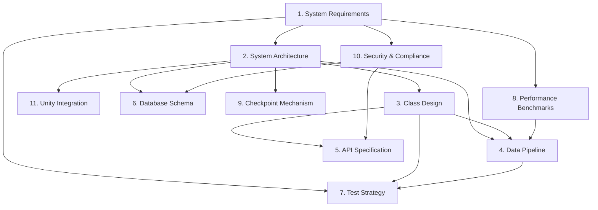

# Forge Design Documents

> **문서 목적**: 설계 문서의 역할과 읽는 순서를 명확히 정의

---

## 📖 문서 개요

Forge는 **3D 시뮬레이션 기반 CCTV Synthetic Dataset 생성 엔진**입니다.

본 디렉토리의 설계 문서는 아키텍처, 요구사항, API, 테스트 전략 등을 정의합니다.

---

## 📚 문서 역할 정의

각 문서는 **명확한 역할**을 가지며, 중복을 최소화합니다.

### 🎯 문서 매트릭스

| 문서 | 역할 | 핵심 질문 | 대상 독자 |
|------|------|----------|----------|
| **0. Repo Structure** | 프로젝트 구조 | "파일을 어디에 둬야 하나?" | 개발자 |
| **1. System Requirements** | 기능/성능 요구사항 | "무엇을 만들어야 하나?" (WHAT) | PM, 개발자, QA |
| **2. System Architecture** | 시스템 구조 | "어떻게 구성되나?" (HOW) | 아키텍트, 개발자 |
| **3. Class Design** | 클래스/인터페이스 상세 | "코드를 어떻게 짜나?" (DETAIL) | 개발자 |
| **4. Data Pipeline** | 파이프라인 스펙 | "데이터가 어떻게 흐르나?" | 파이프라인 개발자 |
| **5. API Specification** | REST API 계약 | "외부와 어떻게 통신하나?" | API 개발자, 통합 팀 |
| **6. Database Schema** | DB 스키마 | "메타데이터를 어떻게 저장하나?" | DB 개발자 |
| **7. Test Strategy** | 테스트 전략 | "어떻게 검증하나?" | QA, 개발자 |
| **8. Performance Benchmarks** | 성능 목표 | "얼마나 빨라야 하나?" | 성능 엔지니어 |
| **9. Checkpoint Mechanism** | 복구 메커니즘 | "중단 시 어떻게 복구하나?" | 안정성 엔지니어 |
| **10. Security & Compliance** | 보안/법규 | "어떻게 안전하게 운영하나?" | 보안팀, 법무팀 |
| **11. Unity Integration** | Unity 통합 방법 | "Unity를 어떻게 실행하나?" | Unity 개발자 |

---

## 🔍 문서 내용 경계

### ✅ "이 내용은 어디에 써야 하나?"

#### 예시 1: "ISimulationGateway 인터페이스"

| 문서 | 포함 내용 | 포함하지 않는 내용 |
|------|----------|------------------|
| **1. System Requirements** | - FR-11: Frame 생성 필수 기능 | - 인터페이스 시그니처 |
| **2. System Architecture** | - Layer 구조<br>- ISimulationGateway 역할<br>- InProcess/Remote 방식 개념 | - 구체적 코드 예시 |
| **3. Class Design** | - 인터페이스 시그니처<br>- 메서드별 입출력 계약<br>- 예외 처리 규칙 | - 구현 알고리즘 |
| **11. Unity Integration** | - InProcessSimulationGateway 구현 예시<br>- Unity 실행 방법 | - 추상 설계 |

**원칙**: 상위 → 하위 흐름
```
Requirements (WHAT) → Architecture (HOW) → Class Design (DETAIL) → Implementation (CODE)
```

---

#### 예시 2: "LabelAssembler Join Timeout"

| 문서 | 포함 내용 |
|------|----------|
| **1. System Requirements** | - FR-29: 품질 모드 (strict/relaxed) |
| **4. Data Pipeline** | - Join Timeout = 5초<br>- Polling Interval = 100ms<br>- 타임아웃 시 동작 (strict: 세션 실패, relaxed: drop) |
| **3. Class Design** | - `LabelAssembler.AssembleAsync()` 시그니처<br>- `PartialFrameData` 구조 |
| **7. Test Strategy** | - Join Timeout 테스트 케이스<br>- 예상 동작 검증 |

---

#### 예시 3: "이동형 카메라 경로 설정"

| 문서 | 포함 내용 |
|------|----------|
| **1. System Requirements** | - FR-05: 이동형 카메라 지원 필수<br>- FR-06: 프레임별 extrinsic 메타데이터 |
| **2. System Architecture** | - MobileCameraController 역할<br>- PathPlanner/MotionController 구성 |
| **3. Class Design** | - `MobileCameraController` 클래스 정의<br>- `PathPlanner.GetPoseAtTime()` 시그니처 |
| **5. API Specification** | - Config JSON 스키마 (`waypoints`, `maxSpeed`) |
| **11. Unity Integration** | - Unity Scene에서 MobileCameraController 배치<br>- 구현 예시 코드 |

---

## 📖 읽는 순서 가이드

### 🆕 신규 팀원 (프로젝트 이해)

```
1. System Requirements      ← "무엇을 만드는가?"
2. System Architecture       ← "어떻게 구성되나?"
3. Unity Integration         ← "Unity를 어떻게 쓰나?"
4. Data Pipeline             ← "데이터가 어떻게 흐르나?"
```

---

### 👨‍💻 개발자 (구현 준비)

#### Unity 개발자
```
1. System Architecture       ← Simulation Layer 이해
2. Unity Integration         ← Unity 실행 방법
3. Class Design (§3.3.x)     ← Unity 관련 클래스
4. Test Strategy (§10)       ← Unity Mock 전략
```

#### C# Pipeline 개발자
```
1. System Architecture       ← Pipeline Layer 이해
2. Data Pipeline             ← Worker/Queue 구조
3. Class Design (§3.4.x)     ← Pipeline 클래스
4. Test Strategy (§5~8)      ← Pipeline 테스트
```

#### API 개발자
```
1. API Specification         ← REST API 계약
2. System Architecture       ← Gateway 개념
3. Unity Integration         ← Remote 모드 이해
```

---

### 🧪 QA 엔지니어 (테스트 설계)

```
1. System Requirements       ← 검증 항목 (FR/NFR)
2. Test Strategy             ← 테스트 전략
3. Performance Benchmarks    ← 성능 목표
4. Data Pipeline             ← 파이프라인 동작
```

---

### 🏗️ 아키텍트 (설계 검토)

```
전체 문서 순서대로 읽기
특히:
- 2. System Architecture (전체 구조)
- 4. Data Pipeline (병렬성)
- 6. Database Schema (메타데이터 설계)
- 10. Security & Compliance (보안 정책)
```

---

## 🔄 문서 간 참조 규칙

### ✅ 올바른 참조

```markdown
# 3_Class_Design_Document.md

## ISimulationGateway

역할: Simulation Layer 추상화 인터페이스 (2_System_Architecture.md §3.3.0 참조)

요구사항: FR-11 Frame 생성 (1_System_Requirements.md 참조)

구현 예시: 11_Unity_Integration_Guide.md §3.3 참조
```

### ❌ 피해야 할 참조

```markdown
# ❌ 잘못된 예: 중복 설명
## ISimulationGateway

역할: Simulation Layer와 Orchestration Layer를 분리하는... (이미 Architecture에 있음)

InProcess 모드에서는 MonoBehaviour로... (이미 Unity Integration에 있음)
```

**원칙**:
- 다른 문서의 내용을 **복사하지 말고 참조**한다
- 각 문서는 **자신의 역할에 집중**한다

---

## 📐 문서 작성 규칙

### 1. 제목 체계

```markdown
# 문서 제목

> **문서 버전:** vX.Y (YYYY-MM-DD)
> **변경 이력:**
> - vX.Y (YYYY-MM-DD): 변경 내용

## 1. 목적
## 2. 범위
## 3. 상세 내용
...
```

### 2. 코드 예시 규칙

```markdown
# 추상 설계 문서 (Architecture/Requirements)
- 코드 예시는 **개념 설명 용도**로만
- 실제 구현과 다를 수 있음

# 상세 설계 문서 (Class Design/Unity Integration)
- 코드 예시는 **구현 가능한 수준**
- 실제 코드와 최대한 일치
```

### 3. 버전 관리

```markdown
# 문서 버전 == 기능 Phase

- v1.0: Phase 1 (MVP)
- v2.0: Phase 2 (확장)
- v3.0: Phase 3 (최적화)

# 수정 시 버전 증가
- 작은 수정 (오타, 명확화): v1.1, v1.2
- 큰 변경 (섹션 추가/삭제): v2.0, v3.0
```

---

## 🛠️ 문서 유지보수

### 문서 업데이트 트리거

| 이벤트 | 업데이트 문서 | 예시 |
|--------|-------------|------|
| **요구사항 변경** | 1 → 2 → 3 순서로 | FR 추가 → Architecture 반영 → Class Design 수정 |
| **아키텍처 변경** | 2 → 3 → 4 순서로 | Layer 구조 변경 → Class 재설계 → Pipeline 수정 |
| **API 변경** | 5 → 3 → 7 순서로 | 엔드포인트 추가 → 클래스 수정 → 테스트 추가 |
| **성능 목표 변경** | 8 → 4 → 2 순서로 | FPS 목표 상향 → Pipeline 최적화 → Architecture 재검토 |

### 문서 리뷰 체크리스트

```markdown
- [ ] 다른 문서와 모순되지 않는가?
- [ ] 역할 경계를 벗어나지 않았는가?
- [ ] 참조가 정확한가? (섹션 번호, 파일명)
- [ ] 코드 예시가 최신인가?
- [ ] 버전 이력이 기록되었는가?
```

---

## 🔗 문서 간 의존성 그래프



---

## 📝 문서 목록

### Core Documents (필수)

| # | 문서명 | 크기 | 상태 | Phase |
|---|--------|------|------|-------|
| 0 | [Repo Structure](0_Repo%20Structure.md) | 122 lines | ✅ Complete | All |
| 1 | [System Requirements](1_System_Requirements.md) | 368 lines | ✅ Complete | 1-3 |
| 2 | [System Architecture](2_System_Architecture.md) | 950+ lines | ✅ Complete | 1-3 |
| 3 | [Class Design Document](3_Class_Design_Document.md) | 2400+ lines | ✅ Complete | 1-3 |
| 4 | [Data Pipeline Specification](4_Data_Pipeline_Specification.md) | 1010 lines | ✅ Complete | 1-3 |

### API & Database

| # | 문서명 | 크기 | 상태 | Phase |
|---|--------|------|------|-------|
| 5 | [API Specification](5_API%20Specification.md) | 600+ lines | ✅ Complete | 2-3 |
| 6 | [Database Schema](6_Database_Schema.md) | 904 lines | ✅ Complete | 1-3 |

### Quality & Operations

| # | 문서명 | 크기 | 상태 | Phase |
|---|--------|------|------|-------|
| 7 | [Test Strategy](7_Test_Strategy.md) | 650+ lines | ✅ Complete | 1-3 |
| 8 | [Performance Benchmarks](8_Performance_Benchmarks.md) | 510 lines | ✅ Complete | 1-3 |
| 9 | [Checkpoint Mechanism](9_Checkpoint_Mechanism.md) | 677 lines | ✅ Complete | 2-3 |
| 10 | [Security & Compliance](10_Security_and_Compliance.md) | 543 lines | ✅ Complete | All |

### Integration

| # | 문서명 | 크기 | 상태 | Phase |
|---|--------|------|------|-------|
| 11 | [Unity Integration Guide](11_Unity_Integration_Guide.md) | 850+ lines | ✅ Complete | 1-3 |

---

## 🚀 다음 단계

### 구현 준비
1. ✅ 모든 설계 문서 완성
2. ✅ Unity Integration Guide 작성
3. ⏭️ Phase 1 구현 시작

### 구현 시작 전 체크리스트
- [ ] 11개 문서 모두 읽음
- [ ] Unity 2021 LTS 설치
- [ ] .NET 8.0 SDK 설치
- [ ] SQLite 설치
- [ ] Repo Structure 생성 완료

---

## 📞 문의

- **설계 문의**: 설계 문서 이슈 등록
- **구현 가이드**: 11_Unity_Integration_Guide.md 참조
- **API 질문**: 5_API Specification.md 참조

---

**마지막 업데이트**: 2025-11-15
